# Case Study 1

## Overview

This case study examines how management zoning and habitat structure
influence abundance and biomass across multiple reef fish functional
groups. It uses full subsets generalised additive mixed models (GAMMs)
implemented in the `FSSgam` package to identify the most important
predictors across multiple response variables.

## Background

Coral reef fish are highly diverse assemblages that provide important
ecosystem services for millions of people (Pratchett et al. 2014). These
services are however threatened by overfishing (Newton et al. 2007;
MacNeil et al. 2015) and a loss of habitat, in particular corals (Wilson
et al. 2006) and the structure they provide (Rogers et al. 2014).
No-take reserves (NTR) promote higher abundance and biomass of fish
(Russ 2002; McClanahan et al. 2009) and conserve ecosystem function
(Graham et al. 2011). It is clear that NTR cannot prevent large scale
disturbances, such as heat stress that cause extensive coral loss and
decline in fish (Jones et al. 2004; Graham et al. 2008), however a
reduction in local pressures in NTR may facilitate greater resilience of
coral reefs (Hughes et al. 2010).

By examining patch reefs of differing habitat quality inside and outside
of NTR within the Ningaloo marine park, Wilson et al. (2012) explored
how habitat degradation and fishing influenced the abundance and biomass
of fish from different functional groups. Explanatory variables in the
original analyses were summarised using the scores from the two axes of
a principal components analysis (PCA), making it impossible to tease
apart the relative importance of variables that were correlated along
the axis. The revised analyses here based on a full subsets multiple
regression approach allows the influence of habitat variables to be
assessed independently.

## Methods

Benthic and fish communities on patch reefs within fished (n=35) and NTR
(n=33) of the Ningaloo lagoon were surveyed to investigate the influence
of habitat and fishing on coral reef fish. On each patch the seascape
level of reef structure (complexity) was assessed using a six point
scale, where 0 represents no vertical relief and 5 represents highly
complex reefs with small overhangs and caves (Polunin and Roberts 1993).
Finer scale physical reef structure (rugosity) was measured as the
linear distance covered by a 3m length of chain fitted to the reef
contour (Risk 1972). Benthic cover was quantified along a 5m line
intercept transect using the categories: high complex corals such as
Branching morphologies (HC), low complexity corals such as massive and
encrusting morphologies (LC), and macroalgae (Macro).

Abundance and size of adult fish was estimated by a diver using a point
count method. Large mobile fish were initially counted from the
perimeter of the patch, after which the entire patch was surveyed for
smaller site attached species. Fish were placed into broad functional
groups based on their diets and biomass calculated from length weight
relationships (Froese and Pauly 2011).

## Data analysis

A generalised additive model with full subsets analyses was used to
determine if fishing, habitat or interactions between these variables
best explained variance in abundance and biomass of functional fish
groups.

### R packages

``` r

library(FSSgam)
library(mgcv)
library(MuMIn)
library(car)
library(doBy)
library(gplots)
library(RColorBrewer)
library(dplyr)
library(tidyr)
library(purrr)
```

### Data preparation

In the original analysis PCA was used to summarise habitat information
and scores from principal components 1 and 2 were included in the full
subsets analysis. Principal component 1 was positively correlated with
complexity and rugosity, but negatively correlated with percent
macroalgal cover, while principal component 2 was positively correlated
with HC, but negatively correlated with LC. In the revised analysis
scores from both principal components (Score1 and Score2) were again
included as explanatory variables, along with percent cover estimates
from line intercept transects (HC, LC, Macro), complexity and rugosity
measures. Zone (fished or NTR) was included as an assessment of fishing
pressure. The motivation for including the original PCA scores in the
revised analysis was that this should provide a means of comparing if
the raw habitat predictors have a stronger relationship with the fish
abundance and biomass variables than the PCA aggregate.

``` r

data("case_study1")
```

Some transformations were applied to ensure the predictors were
relatively evenly distribution without their range. This is important to
obtain stable results from FSSgam.

``` r

case_study1$SQRTSA     <- case_study1$SA
case_study1$sqrt.rug   <- sqrt(case_study1$rugosity)
case_study1$sqrtLC     <- sqrt(case_study1$LC)
case_study1$sqrtHC     <- sqrt(case_study1$HC)
case_study1$sqrtMacro <- sqrt(case_study1$macro)

case_study1$site <- as.factor(case_study1$site)
```

### Outlier handling

FFSgam can also be very sensitive to outliers. In this case these were a
small number of very large schools of fish, that would be unlikely to be
closely linked to the habitat variables in any case.

``` r

case_study1$Piscivore.abundance[case_study1$Piscivore.abundance > 150] <- NA
case_study1$Piscivore.biomass[case_study1$Piscivore.biomass > 40000] <- NA
case_study1$Invertivore.biomass[case_study1$Invertivore.biomass > 40000] <- NA
```

### Predictor specification

The categorical predictors and continuous predictors are passed to
FSSgam via two separate vectors:

``` r

cat.preds  <- "ZONE"
null.vars  <- c("depth", "site", "SQRTSA")

cont.preds <- c(
  "complexity", "sqrt.rug", "sqrtLC", "sqrtHC",
  "sqrtMacro", "SCORE1", "SCORE2"
)
```

It is useful to have a look at the distribution of the continuous
predictors to ensure they are well distributed (following the
transformation above).

``` r

for(p in 1:length(cont.preds)){
par(mfrow=c(2,1))
 hist(case_study1[,cont.preds[p]],main=cont.preds[p])
 plot(jitter(case_study1[,cont.preds[p]]))
 }
```

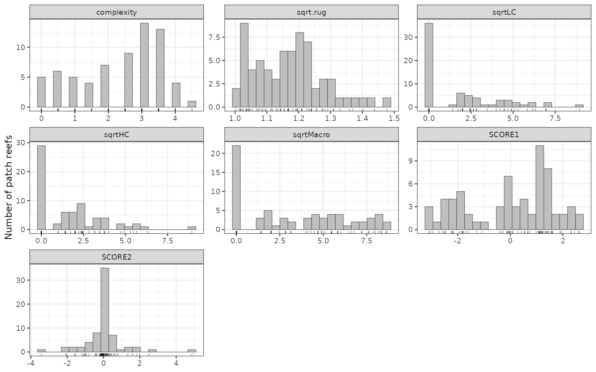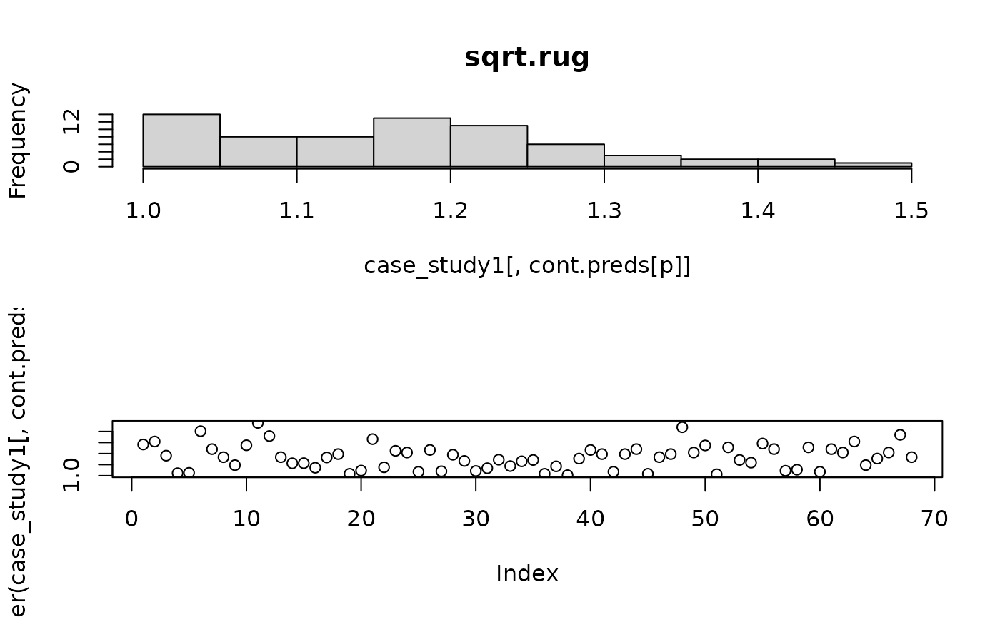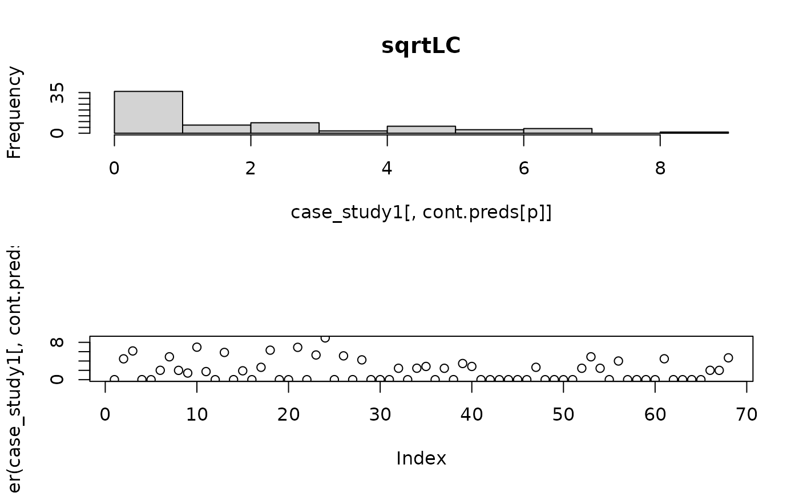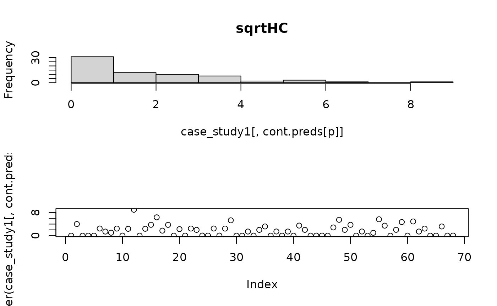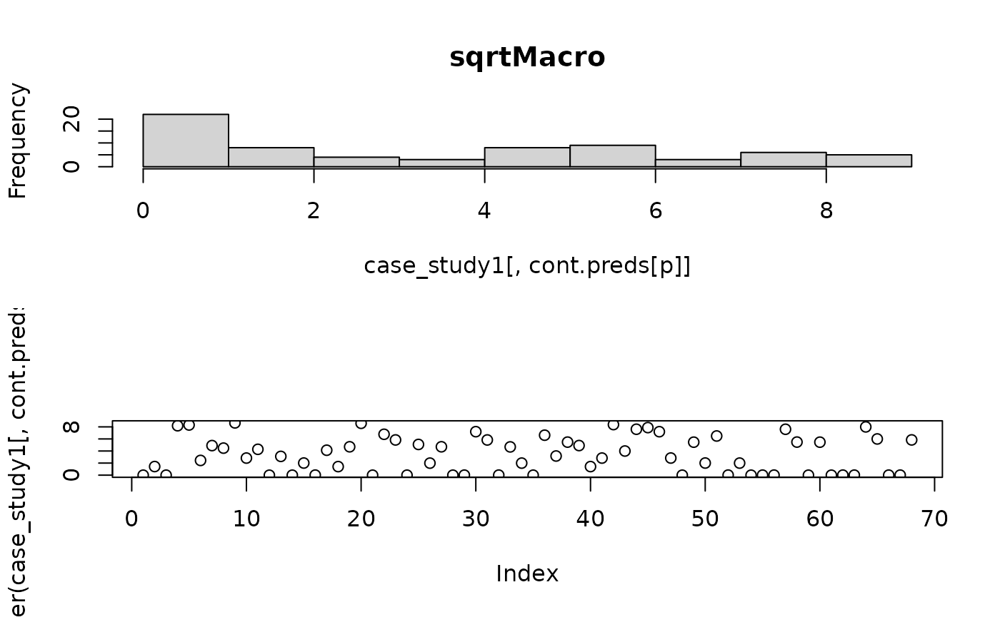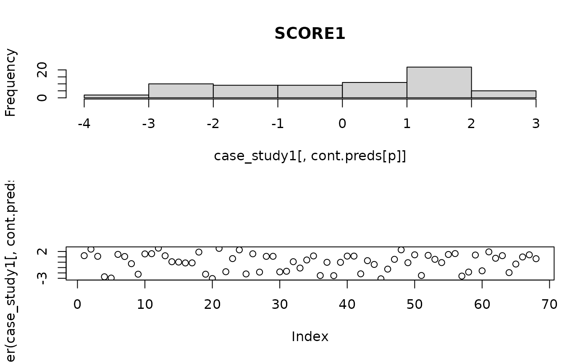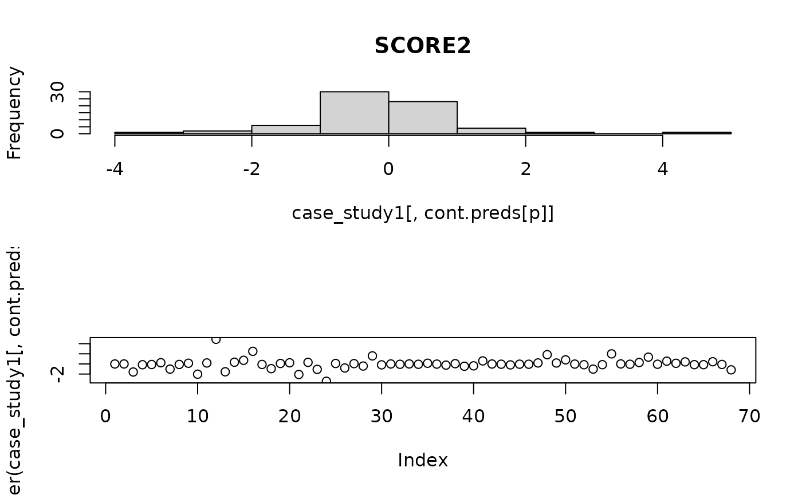

### Full subsets GAMM analysis

Both abundance and biomass data were modelled using a tweedie
distribution, passed to FFSgam via a list.

``` r

resp.vars.fams <- list(
  Herbivore.abundance    = tw(),
  Invertivore.abundance = tw(),
  Piscivore.abundance   = tw(),
  Planktivore.abundance = tw(),
  Herbivore.biomass     = tw(),
  Invertivore.biomass   = tw(),
  Piscivore.biomass     = tw(),
  Planktivore.biomass   = tw()
)

resp.vars <- names(resp.vars.fams)
```

It is always a good idea to look at the response variables, and make
sure they suit the distribution.

``` r

for(r in 1:length(resp.vars)){
par(mfrow=c(2,1))
 hist(case_study1[,resp.vars[r]],main=resp.vars[r])
 plot(jitter(case_study1[,resp.vars[r]]))
}
```

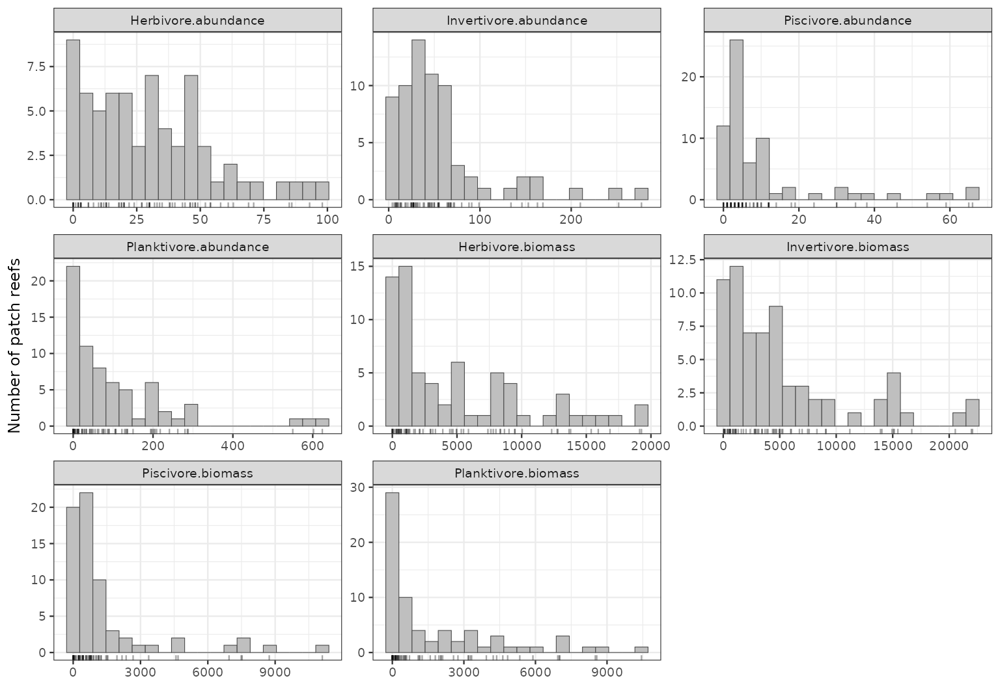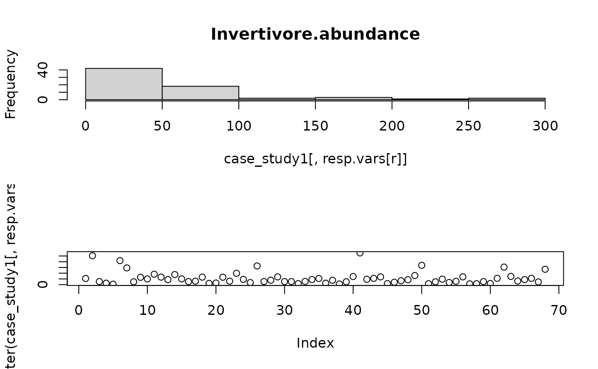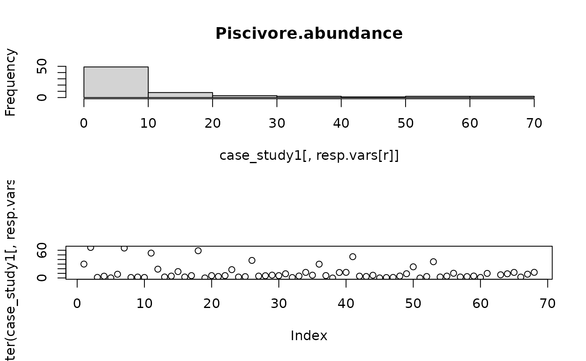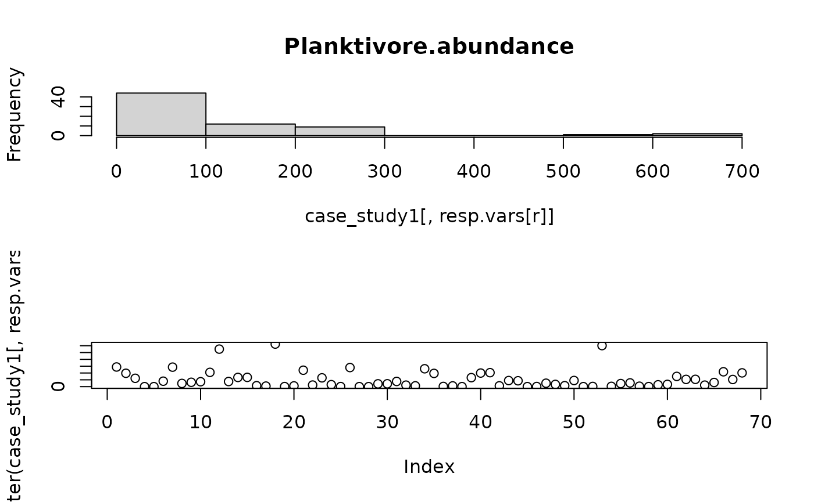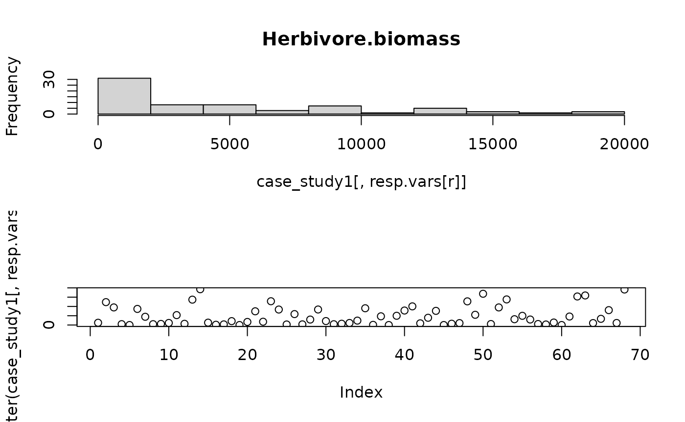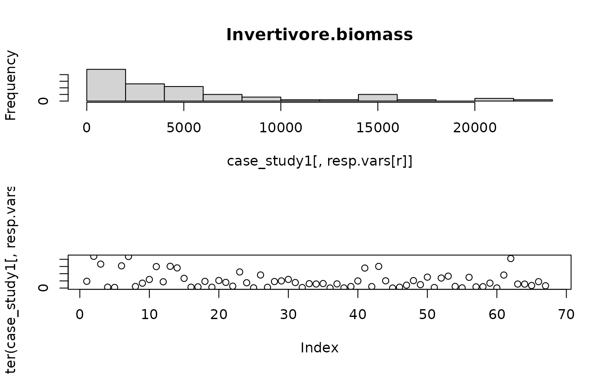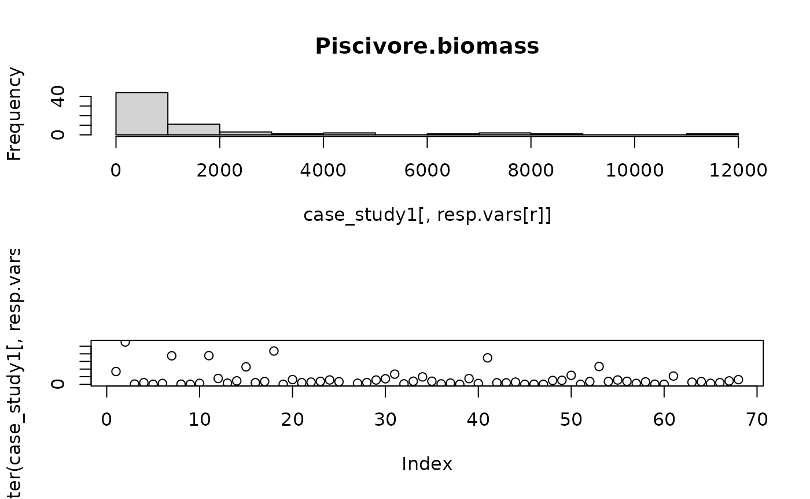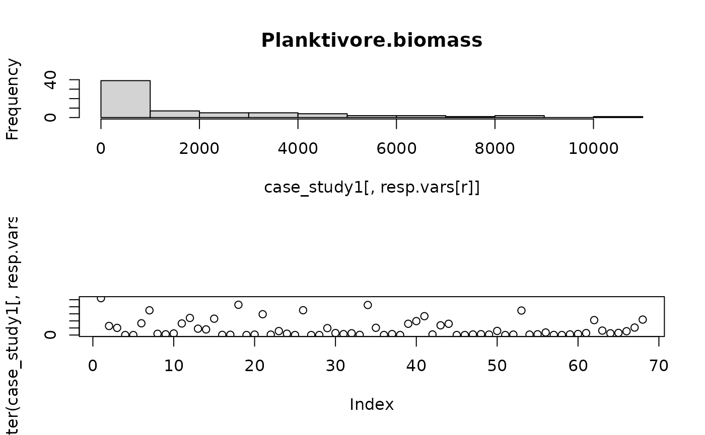
The models are then implemented via a call to gam (mgcv) with the random
effect of site included using the bs=’re’ specification. Smoothers to
both square-route surface area of the patch reef as well as depth were
included in all models (and as part of the null model) via the
null.terms argument of the full subsets gam function.

Given the complexity of the null model, the maximum number of additional
predictors were limited to only an additional two terms
(max.predictors=2) and k was limited to 3 to enforce strictly monotonic
relationships.

``` r

out.all <- list()
var.imp <- list()
fss.all <- list()

for (rv in resp.vars) {

  use.dat <- na.omit(case_study1[, c(null.vars, cont.preds, cat.preds, rv)])
  use.dat$response <- use.dat[, rv]

  base.mod <- gam(
    response ~
      s(complexity, k = 4, bs = "cr") +
      s(SQRTSA, k = 4, bs = "cr") +
      s(site, bs = "re"),
    family = tw(),
    data = use.dat
  )

  model.set <- generate_model_set(
    use.dat = use.dat,
    test.fit = base.mod,
    max.predictors = 2,
    k = 3,
    pred.vars.cont = cont.preds,
    pred.vars.fact = cat.preds,
    null.terms = "s(SQRTSA,bs='cr',k=3)+s(site,bs='re')+s(depth,bs='cr',k=3)"
  )

  out.list <- fit_model_set(model.set, parallel = FALSE)

  var.imp[[rv]] <- out.list$variable.importance$aic$variable.weights.raw
  out.all[[rv]] <- out.list$mod.data.out
  fss.all[[rv]] <- out.list
}
```

    ##   |                                                                              |                                                                      |   0%  |                                                                              |==                                                                    |   4%  |                                                                              |=====                                                                 |   7%  |                                                                              |========                                                              |  11%  |                                                                              |==========                                                            |  14%  |                                                                              |============                                                          |  18%  |                                                                              |===============                                                       |  21%  |                                                                              |==================                                                    |  25%  |                                                                              |====================                                                  |  29%  |                                                                              |======================                                                |  32%  |                                                                              |=========================                                             |  36%  |                                                                              |============================                                          |  39%  |                                                                              |==============================                                        |  43%  |                                                                              |================================                                      |  46%  |                                                                              |===================================                                   |  50%  |                                                                              |======================================                                |  54%  |                                                                              |========================================                              |  57%  |                                                                              |==========================================                            |  61%  |                                                                              |=============================================                         |  64%  |                                                                              |================================================                      |  68%  |                                                                              |==================================================                    |  71%  |                                                                              |====================================================                  |  75%  |                                                                              |=======================================================               |  79%  |                                                                              |==========================================================            |  82%  |                                                                              |============================================================          |  86%  |                                                                              |==============================================================        |  89%  |                                                                              |=================================================================     |  93%  |                                                                              |====================================================================  |  96%  |                                                                              |======================================================================| 100%
    ##   |                                                                              |                                                                      |   0%  |                                                                              |==                                                                    |   4%  |                                                                              |=====                                                                 |   7%  |                                                                              |========                                                              |  11%  |                                                                              |==========                                                            |  14%  |                                                                              |============                                                          |  18%  |                                                                              |===============                                                       |  21%  |                                                                              |==================                                                    |  25%  |                                                                              |====================                                                  |  29%  |                                                                              |======================                                                |  32%  |                                                                              |=========================                                             |  36%  |                                                                              |============================                                          |  39%  |                                                                              |==============================                                        |  43%  |                                                                              |================================                                      |  46%  |                                                                              |===================================                                   |  50%  |                                                                              |======================================                                |  54%  |                                                                              |========================================                              |  57%  |                                                                              |==========================================                            |  61%  |                                                                              |=============================================                         |  64%  |                                                                              |================================================                      |  68%  |                                                                              |==================================================                    |  71%  |                                                                              |====================================================                  |  75%  |                                                                              |=======================================================               |  79%  |                                                                              |==========================================================            |  82%  |                                                                              |============================================================          |  86%  |                                                                              |==============================================================        |  89%  |                                                                              |=================================================================     |  93%  |                                                                              |====================================================================  |  96%  |                                                                              |======================================================================| 100%
    ##   |                                                                              |                                                                      |   0%  |                                                                              |==                                                                    |   4%  |                                                                              |=====                                                                 |   7%  |                                                                              |========                                                              |  11%  |                                                                              |==========                                                            |  14%  |                                                                              |============                                                          |  18%  |                                                                              |===============                                                       |  21%  |                                                                              |==================                                                    |  25%  |                                                                              |====================                                                  |  29%  |                                                                              |======================                                                |  32%  |                                                                              |=========================                                             |  36%  |                                                                              |============================                                          |  39%  |                                                                              |==============================                                        |  43%  |                                                                              |================================                                      |  46%  |                                                                              |===================================                                   |  50%  |                                                                              |======================================                                |  54%  |                                                                              |========================================                              |  57%  |                                                                              |==========================================                            |  61%  |                                                                              |=============================================                         |  64%  |                                                                              |================================================                      |  68%  |                                                                              |==================================================                    |  71%  |                                                                              |====================================================                  |  75%  |                                                                              |=======================================================               |  79%  |                                                                              |==========================================================            |  82%  |                                                                              |============================================================          |  86%  |                                                                              |==============================================================        |  89%  |                                                                              |=================================================================     |  93%  |                                                                              |====================================================================  |  96%  |                                                                              |======================================================================| 100%
    ##   |                                                                              |                                                                      |   0%  |                                                                              |==                                                                    |   4%  |                                                                              |=====                                                                 |   7%  |                                                                              |========                                                              |  11%  |                                                                              |==========                                                            |  14%  |                                                                              |============                                                          |  18%  |                                                                              |===============                                                       |  21%  |                                                                              |==================                                                    |  25%  |                                                                              |====================                                                  |  29%  |                                                                              |======================                                                |  32%  |                                                                              |=========================                                             |  36%  |                                                                              |============================                                          |  39%  |                                                                              |==============================                                        |  43%  |                                                                              |================================                                      |  46%  |                                                                              |===================================                                   |  50%  |                                                                              |======================================                                |  54%  |                                                                              |========================================                              |  57%  |                                                                              |==========================================                            |  61%  |                                                                              |=============================================                         |  64%  |                                                                              |================================================                      |  68%  |                                                                              |==================================================                    |  71%  |                                                                              |====================================================                  |  75%  |                                                                              |=======================================================               |  79%  |                                                                              |==========================================================            |  82%  |                                                                              |============================================================          |  86%  |                                                                              |==============================================================        |  89%  |                                                                              |=================================================================     |  93%  |                                                                              |====================================================================  |  96%  |                                                                              |======================================================================| 100%
    ##   |                                                                              |                                                                      |   0%  |                                                                              |==                                                                    |   4%  |                                                                              |=====                                                                 |   7%  |                                                                              |========                                                              |  11%  |                                                                              |==========                                                            |  14%  |                                                                              |============                                                          |  18%  |                                                                              |===============                                                       |  21%  |                                                                              |==================                                                    |  25%  |                                                                              |====================                                                  |  29%  |                                                                              |======================                                                |  32%  |                                                                              |=========================                                             |  36%  |                                                                              |============================                                          |  39%  |                                                                              |==============================                                        |  43%  |                                                                              |================================                                      |  46%  |                                                                              |===================================                                   |  50%  |                                                                              |======================================                                |  54%  |                                                                              |========================================                              |  57%  |                                                                              |==========================================                            |  61%  |                                                                              |=============================================                         |  64%  |                                                                              |================================================                      |  68%  |                                                                              |==================================================                    |  71%  |                                                                              |====================================================                  |  75%  |                                                                              |=======================================================               |  79%  |                                                                              |==========================================================            |  82%  |                                                                              |============================================================          |  86%  |                                                                              |==============================================================        |  89%  |                                                                              |=================================================================     |  93%  |                                                                              |====================================================================  |  96%  |                                                                              |======================================================================| 100%
    ##   |                                                                              |                                                                      |   0%  |                                                                              |==                                                                    |   4%  |                                                                              |=====                                                                 |   7%  |                                                                              |========                                                              |  11%  |                                                                              |==========                                                            |  14%  |                                                                              |============                                                          |  18%  |                                                                              |===============                                                       |  21%  |                                                                              |==================                                                    |  25%  |                                                                              |====================                                                  |  29%  |                                                                              |======================                                                |  32%  |                                                                              |=========================                                             |  36%  |                                                                              |============================                                          |  39%  |                                                                              |==============================                                        |  43%  |                                                                              |================================                                      |  46%  |                                                                              |===================================                                   |  50%  |                                                                              |======================================                                |  54%  |                                                                              |========================================                              |  57%  |                                                                              |==========================================                            |  61%  |                                                                              |=============================================                         |  64%  |                                                                              |================================================                      |  68%  |                                                                              |==================================================                    |  71%  |                                                                              |====================================================                  |  75%  |                                                                              |=======================================================               |  79%  |                                                                              |==========================================================            |  82%  |                                                                              |============================================================          |  86%  |                                                                              |==============================================================        |  89%  |                                                                              |=================================================================     |  93%  |                                                                              |====================================================================  |  96%  |                                                                              |======================================================================| 100%
    ##   |                                                                              |                                                                      |   0%  |                                                                              |==                                                                    |   4%  |                                                                              |=====                                                                 |   7%  |                                                                              |========                                                              |  11%  |                                                                              |==========                                                            |  14%  |                                                                              |============                                                          |  18%  |                                                                              |===============                                                       |  21%  |                                                                              |==================                                                    |  25%  |                                                                              |====================                                                  |  29%  |                                                                              |======================                                                |  32%  |                                                                              |=========================                                             |  36%  |                                                                              |============================                                          |  39%  |                                                                              |==============================                                        |  43%  |                                                                              |================================                                      |  46%  |                                                                              |===================================                                   |  50%  |                                                                              |======================================                                |  54%  |                                                                              |========================================                              |  57%  |                                                                              |==========================================                            |  61%  |                                                                              |=============================================                         |  64%  |                                                                              |================================================                      |  68%  |                                                                              |==================================================                    |  71%  |                                                                              |====================================================                  |  75%  |                                                                              |=======================================================               |  79%  |                                                                              |==========================================================            |  82%  |                                                                              |============================================================          |  86%  |                                                                              |==============================================================        |  89%  |                                                                              |=================================================================     |  93%  |                                                                              |====================================================================  |  96%  |                                                                              |======================================================================| 100%
    ##   |                                                                              |                                                                      |   0%  |                                                                              |==                                                                    |   4%  |                                                                              |=====                                                                 |   7%  |                                                                              |========                                                              |  11%  |                                                                              |==========                                                            |  14%  |                                                                              |============                                                          |  18%  |                                                                              |===============                                                       |  21%  |                                                                              |==================                                                    |  25%  |                                                                              |====================                                                  |  29%  |                                                                              |======================                                                |  32%  |                                                                              |=========================                                             |  36%  |                                                                              |============================                                          |  39%  |                                                                              |==============================                                        |  43%  |                                                                              |================================                                      |  46%  |                                                                              |===================================                                   |  50%  |                                                                              |======================================                                |  54%  |                                                                              |========================================                              |  57%  |                                                                              |==========================================                            |  61%  |                                                                              |=============================================                         |  64%  |                                                                              |================================================                      |  68%  |                                                                              |==================================================                    |  71%  |                                                                              |====================================================                  |  75%  |                                                                              |=======================================================               |  79%  |                                                                              |==========================================================            |  82%  |                                                                              |============================================================          |  86%  |                                                                              |==============================================================        |  89%  |                                                                              |=================================================================     |  93%  |                                                                              |====================================================================  |  96%  |                                                                              |======================================================================| 100%

### Variable importance

``` r

all.var.imp <- do.call(rbind, var.imp)

heatmap.2(
  all.var.imp,
  dendrogram = "none",
  Rowv = FALSE,
  Colv = FALSE,
  col = colorRampPalette(c("white", "yellow", "orange", "red"))(30),
  trace = "none",
  margins = c(12, 14),
  key.title = ""
)
```

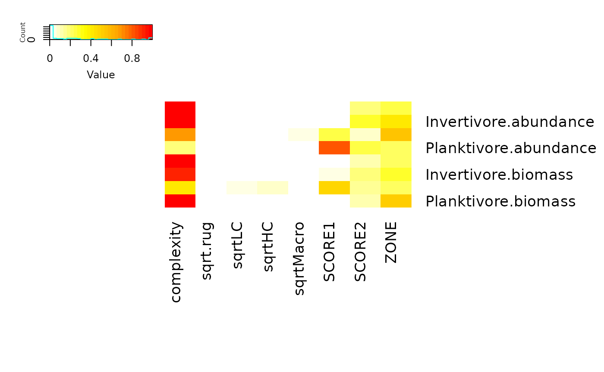

### Top model table

``` r

all.models <- imap_dfr(
  out.all,
  ~ .x %>% mutate(response = .y)
)

top.models <- all.models %>%
  group_by(response) %>%
  mutate(delta_AICc = AICc - min(AICc, na.rm = TRUE)) %>%
  filter(delta_AICc <= 2) %>%
  arrange(response, AICc) %>%
  ungroup() |> 
  select(
    response,
    modname,
    edf,
    AICc,
    delta_AICc,
    wi.AICc)
```

``` r

knitr::kable(
  top.models,
  digits = 3,
  caption = "Top FSSgam models within ΔAICc ≤ 2, ordered best to worst within each response"
)
```

| response | modname | edf | AICc | delta_AICc | wi.AICc |
|:---|:---|---:|---:|---:|---:|
| Herbivore.abundance | complexity | 6.22 | 517.577 | 0.000 | 0.545 |
| Herbivore.biomass | complexity | 6.20 | 1193.357 | 0.000 | 0.648 |
| Invertivore.abundance | complexity | 8.58 | 609.964 | 0.000 | 0.318 |
| Invertivore.abundance | complexity+ZONE | 9.04 | 610.091 | 0.127 | 0.298 |
| Invertivore.abundance | complexity+SCORE2 | 9.35 | 610.185 | 0.221 | 0.284 |
| Invertivore.biomass | complexity | 6.42 | 1236.194 | 0.000 | 0.490 |
| Piscivore.abundance | complexity+ZONE | 6.01 | 457.410 | 0.000 | 0.241 |
| Piscivore.abundance | complexity | 5.64 | 457.424 | 0.014 | 0.239 |
| Piscivore.abundance | complexity.by.ZONE+ZONE | 7.00 | 458.609 | 1.199 | 0.132 |
| Piscivore.abundance | SCORE1.by.ZONE+ZONE | 7.86 | 458.616 | 1.206 | 0.132 |
| Piscivore.biomass | SCORE1 | 5.05 | 1023.292 | 0.000 | 0.290 |
| Piscivore.biomass | complexity | 5.00 | 1023.699 | 0.407 | 0.236 |
| Planktivore.abundance | SCORE1 | 6.72 | 686.784 | 0.000 | 0.453 |
| Planktivore.biomass | complexity+ZONE | 9.65 | 1011.661 | 0.000 | 0.471 |
| Planktivore.biomass | complexity | 9.31 | 1012.086 | 0.425 | 0.381 |

Top FSSgam models within ΔAICc ≤ 2, ordered best to worst within each
response {.table}

### Predictor correlations

It can also be a good idea to check your predictor correlations.

``` r

knitr::kable(
  model.set$predictor.correlations,
  digits = 2,
  caption = "Predictor correlations",
  row.names = FALSE
)
```

| complexity | sqrt.rug | sqrtLC | sqrtHC | sqrtMacro | SCORE1 | SCORE2 | ZONE |
|-----------:|---------:|-------:|-------:|----------:|-------:|-------:|-----:|
|       1.00 |     0.75 |   0.51 |   0.32 |     -0.62 |   0.89 |  -0.12 | 0.01 |
|       0.75 |     1.00 |   0.33 |   0.40 |     -0.58 |   0.85 |   0.10 | 0.09 |
|       0.51 |     0.33 |   1.00 |  -0.07 |     -0.37 |   0.57 |  -0.66 | 0.14 |
|       0.32 |     0.40 |  -0.07 |   1.00 |     -0.48 |   0.48 |   0.73 | 0.01 |
|      -0.62 |    -0.58 |  -0.37 |  -0.48 |      1.00 |  -0.82 |  -0.15 | 0.03 |
|       0.89 |     0.85 |   0.57 |   0.48 |     -0.82 |   1.00 |   0.00 | 0.07 |
|      -0.12 |     0.10 |  -0.66 |   0.73 |     -0.15 |   0.00 |   1.00 | 0.10 |
|       0.01 |     0.09 |   0.14 |   0.01 |      0.03 |   0.07 |   0.10 | 1.00 |

Predictor correlations {.table}

### Pretty plots

``` r

case_study1 <- case_study1 |> 
  mutate(ZONE=factor(ZONE))
zones=levels(case_study1$ZONE)
par(mfcol=c(4,2),mar=c(4,4,0.5,0.5),oma=c(2,0.5,0.5,0.5),bty="l")
for(r in 1:length(resp.vars)){
      tab.r<-out.all[[resp.vars[r]]] |> 
        arrange(desc(wi.AICc))
      top.mods.r<-tab.r[1,]
      mod.r.m<-as.character(top.mods.r[1,"modname"])
      mod.m<-fss.all[[resp.vars[r]]]$success.models[[mod.r.m]]
      mod.vars<-unique(unlist(strsplit(unlist(strsplit(mod.r.m,split="+",fixed=T)),
                       split=".by.")))
      # which continuous predictor is the variable included?
      plot.var<-as.character(na.omit(mod.vars[match(cont.preds,mod.vars)]))
      # plot that variables, with symbol colours for zone
      plot(case_study1[,plot.var],case_study1[,resp.vars[r]],pch=16,
         ylab=resp.vars[r],xlab=plot.var,col=case_study1$ZONE)
      legend("topleft",legend=paste("(",LETTERS[r],")",sep=""),
             bty="n")
      range.v<-range(case_study1[,plot.var])
      seq.v<-seq(range.v[1],range.v[2],length=20)
      newdat.list<-list(seq.v,# across the range of the included variable
                       mean(use.dat$depth), # for a median depth
                       mean(use.dat$SQRTSA),# for a median SQRTSA
                       "MANGROVE", # pick the first site, except don't predict on
                               # this by setting terms=c(plot.var,"ZONE")
                       zones)  # for each zone
      names(newdat.list)<-c(plot.var,"depth","SQRTSA","site","ZONE")
      pred.vals<-predict(mod.m,newdata=expand.grid(newdat.list),
                     type="response",se=T,exclude=c("site","SQRTSA","depth"))
      for(z in 1:length(zones)){
       zone.index<-which(expand.grid(newdat.list)$ZONE==zones[z])
       lines(seq.v,pred.vals$fit[zone.index],col=z)
       lines(seq.v,pred.vals$fit[zone.index]+pred.vals$se[zone.index]*1.96,lty=3,col=z)
       lines(seq.v,pred.vals$fit[zone.index]-pred.vals$se[zone.index]*1.96,lty=3,col=z)}
}
legend("bottom",legend= zones,bty="n",ncol=2,col=c(1,2),pch=c(16,16),
   inset=-0.61,xpd=NA,cex=.8)
```

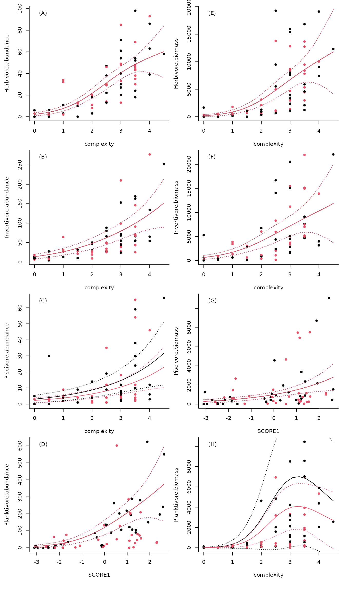

## Results and discussion

Seascape measures of patch reef complexity were generally the best
predictor of both fish abundance and biomass (see the model comparison
table above). Fish abundance and biomass were low on reefs with no
relief and were higher on structurally complex reefs (see the predictor
plots above). These findings are consistent with other studies that show
measures of seascape complexity are positively correlated with fish
abundance, and often outperform other measures of complexity (Wilson et
al. 2007; Collins et al. 2016). The results generally support the
original findings of Wilson et al. (2012) that there are strong
relationships with habitat and only weak evidence for an effect of the
zoning status. However, here we were able to tease apart the influence
of correlated habitat variables. For example, the revised analysis found
herbivore abundance was positively correlated with complexity, which is
similar to recent studies at Ningaloo that also found abundance of these
fish is not closely related to macroalgal cover (Wilson et al. 2014) and
is better explained by reef structure (Downie et al. 2013). Conversely,
Wilson et al. (2012) identified scores from principal component 1 as the
best predictor of herbivore abundances, which inferred a positive effect
of both rugosity and complexity and a negative effect of macroalgal
cover.

Interestingly, the abundance of planktivores and piscivores was
positively related to scores from principal component 1 (see the
variable importance heatmap and predictor plots above), suggesting
summarised metrics of habitat from PCA may still be relevant to some
components of the fish assemblage. A habitat descriptor that
incorporates multiple correlated factors may be more important if there
is a diverse array of habitat associations among fish within a trophic
guild. For example, the planktivores include small bodied damselfish
that have close associations with complex corals (Coker et al. 2014),
cardinalfish that are often found in caves or branching corals (Marnane
and Bellwood 2002), and larger fish that are likely transient and more
associated with seascape measures of habitat (Friedlander and Parrish
1998). As large bodied fish also typically contribute more to community
biomass than their small counterparts (Ackerman and Bellwood 2000) it is
not surprising that planktivore biomass is more closely aligned with
seascape complexity than other measures of habitat.

Overall the results of the revised analysis are similar to those from
the original study based on the use of data-reduction via PCA. However,
by including the underlying habitat information, the new analysis
provides a clearer picture of which elements of the benthic assemblage
are most important to fish. This additional information is useful for
building scientific hypotheses and parametric functional models for how
such fishes may be influenced by changes in habitat (such as is expected
due to ocean warming and climate change, see (Pratchett et al. 2015)),
as well as informing which elements of the habitat should be a focus for
management targets.

This example demonstrates how full subsets GAMMs can be used to
synthesise drivers across multiple response variables in ecological
datasets.

## References

Ackerman, J. L., and D. R. Bellwood. 2000. “Reef Fish Assemblages: A
Re-Evaluation Using Enclosed Rotenone Stations.” *Marine Ecology
Progress Series* 206: 11–18.

Coker, D. J., S. K. Wilson, and M. S. Pratchett. 2014. “Importance of
Live Coral Habitat for Reef Fishes.” *Reviews in Fish Biology and
Fisheries* 24: 89–126.

Collins, D. L., T. J. Langlois, T. Bond, et al. 2016. “A Novel
Stereo-Video Method to Investigate Fish-Habitat Relationships.” *Methods
in Ecology and Evolution* 8: 116–25.

Downie, R. A., R. C. Babcock, D. P. Thomson, and M. A. Vanderklift.
2013. “Density of Herbivorous Fish and Intensity of Herbivory Are
Influenced by Proximity to Coral Reefs.” *Marine Ecology Progress
Series* 482: 217–25.

Friedlander, A. M., and J. D. Parrish. 1998. “Habitat Characteristics
Affecting Fish Assemblages on a Hawaiian Coral Reef.” *Journal of
Experimental Marine Biology and Ecology* 224: 1–30.

Froese, R., and D. Pauly. 2011. *FishBase*.

Graham, N. A. J., T. D. Ainsworth, A. H. Baird, et al. 2011. “From
Microbes to People: Tractable Benefits of No-Take Areas for Coral
Reefs.” *Oceanography and Marine Biology-an Annual Review* 49: 105.

Graham, N. A. J., T. R. McClanahan, M. A. MacNeil, et al. 2008. “Climate
Warming, Marine Protected Areas and the Ocean-Scale Integrity of Coral
Reef Ecosystems.” *PLoS ONE* 3: e3039.

Hughes, T. P., N. A. J. Graham, J. B. C. Jackson, P. J. Mumby, and R. S.
Steneck. 2010. “Rising to the Challenge of Sustaining Coral Reef
Resilience.” *Trends in Ecology & Evolution* 25: 633–42.

Jones, G. P., M. I. McCormick, M. Srinivasan, and J. V. Eagle. 2004.
“Coral Decline Threatens Fish Biodiversity in Marine Reserves.”
*Proceedings of the National Academy of Sciences of the United States of
America* 101: 8251–53.

MacNeil, M. A., N. A. J. Graham, J. E. Cinner, et al. 2015. “Recovery
Potential of the World’s Coral Reef Fishes.” *Nature* 520: 341–44.

Marnane, M. J., and D. R. Bellwood. 2002. “Diet and Nocturnal Foraging
in Cardinalfishes (Apogonidae) at One Tree Reef, Great Barrier Reef,
Australia.” *Marine Ecology Progress Series* 231: 261–68.

McClanahan, T. R., N. A. J. Graham, S. K. Wilson, Y. Letourneur, and R.
Fisher. 2009. “Effects of Fisheries Closure Size, Age, and History of
Compliance on Coral Reef Fish Communities in the Western Indian Ocean.”
*Marine Ecology Progress Series* 396: 99–109.

Newton, K., I. M. Côté, G. M. Pilling, S. Jennings, and N. K. Dulvy.
2007. “Current and Future Sustainability of Island Coral Reef
Fisheries.” *Current Biology* 17: 655–58.

Polunin, N., and C. M. Roberts. 1993. “Greater Biomass and Value of
Target Coral-Reef Fishes in Two Small Caribbean Marine Reserves.”
*Marine Ecology Progress Series* 100: 167–76.

Pratchett, M. S., A. S. Hoey, and S. K. Wilson. 2014. “Reef Degradation
and the Loss of Critical Ecosystem Goods and Services Provided by Coral
Reef Fishes.” *Current Opinion in Environmental Sustainability* 7:
37–43.

Pratchett, M. S., S. K. Wilson, and P. L. Munday. 2015. “Effects of
Climate Change on Coral Reef Fishes.” In *Ecology of Fishes on Coral
Reefs*. Cambridge University Press.

Risk, M. J. 1972. “Fish Diversity on a Coral Reef in the Virgin
Islands.” *Atoll Research Bulletin* 153: 1–6.

Rogers, A., J. L. Blanchard, and P. J. Mumby. 2014. “Vulnerability of
Coral Reef Fisheries to a Loss of Structural Complexity.” *Current
Biology* 24: 1000–1005.

Russ, G. R. 2002. “Yet Another Review of Marine Reserves as Reef Fishery
Management Tools.” In *Coral Reef Fishes*. Elsevier Science.

Wilson, S. K., R. C. Babcock, R. Fisher, T. H. Holmes, J. A. Y. Moore,
and D. P. Thomson. 2012. “Relative and Combined Effects of Habitat and
Fishing on Reef Fish Communities Across a Limited Fishing Gradient at
Ningaloo.” *Marine Environmental Research* 81: 1–11.

Wilson, S. K., C. J. Fulton, M. Depczynski, et al. 2014. “Seasonal
Changes in Habitat Structure Underpin Shifts in Macroalgae-Associated
Tropical Fish Communities.” *Marine Biology* 161: 2597–607.

Wilson, S. K., N. A. J. Graham, and N. V. C. Polunin. 2007. “Appraisal
of Visual Assessments of Habitat Complexity and Benthic Composition on
Coral Reefs.” *Marine Biology* 151: 1069–76.

Wilson, S. K., N. Graham, and M. S. Pratchett. 2006. “Multiple
Disturbances and the Global Degradation of Coral Reefs: Are Reef Fishes
at Risk or Resilient?” *Global Change Biology* 12: 2220–34.
