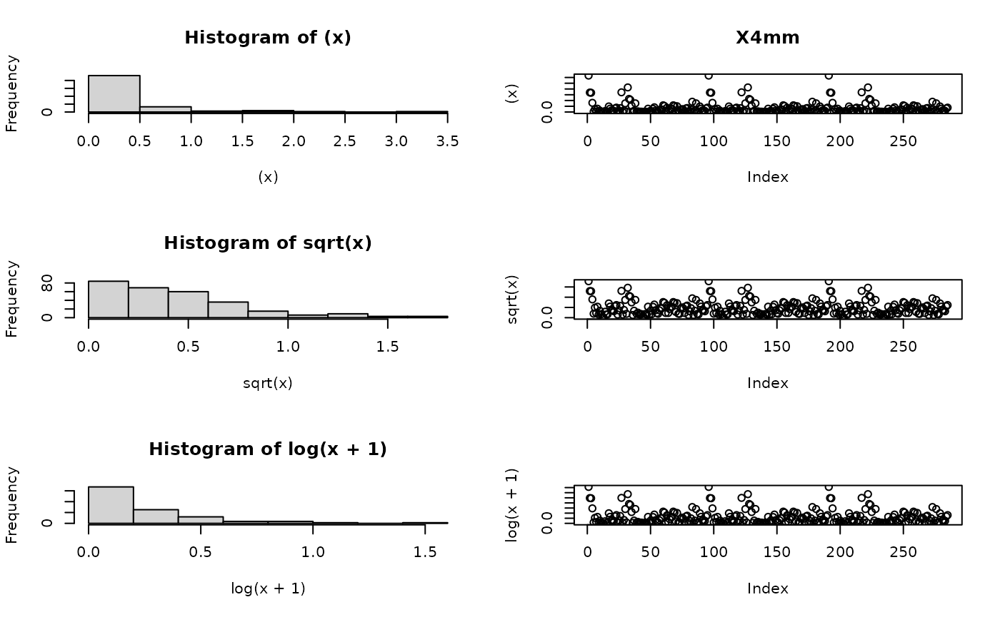
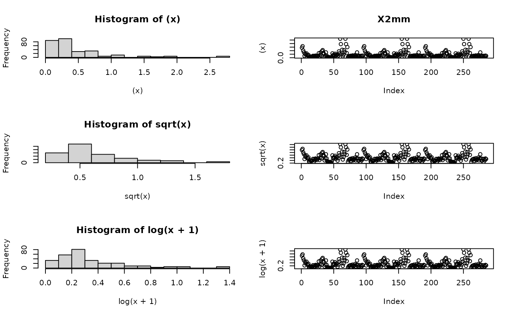
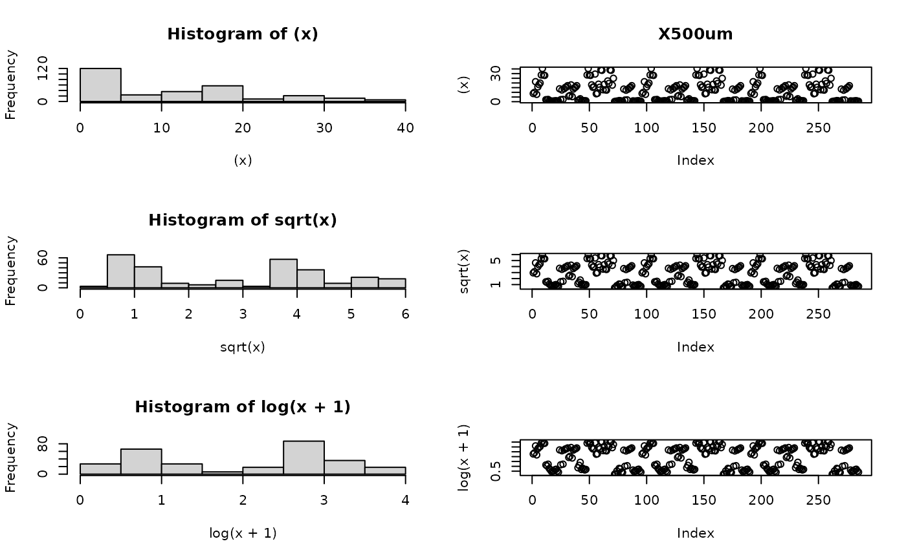
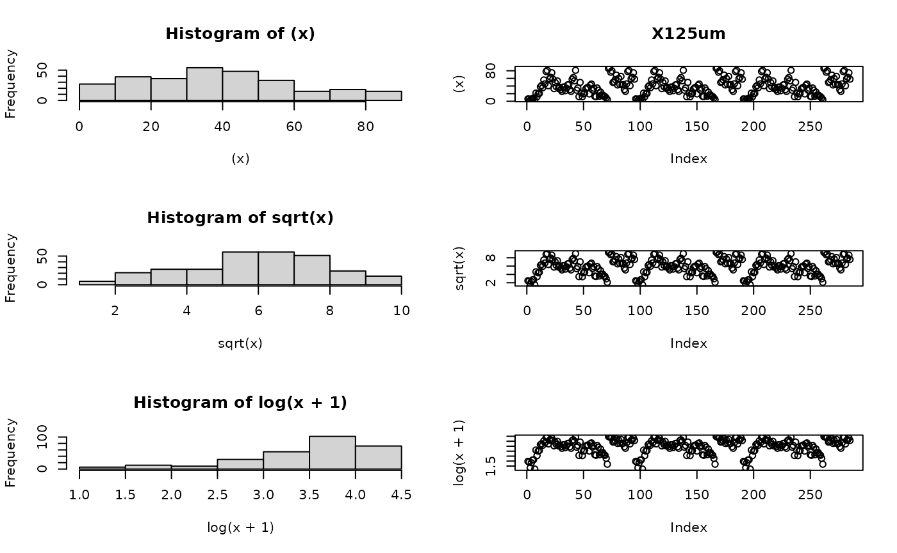
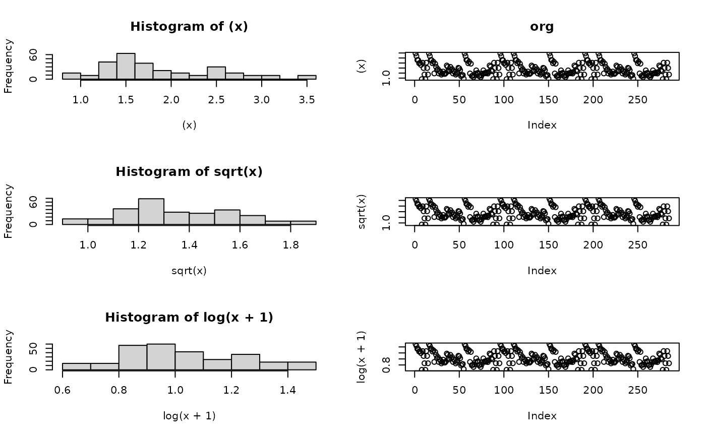
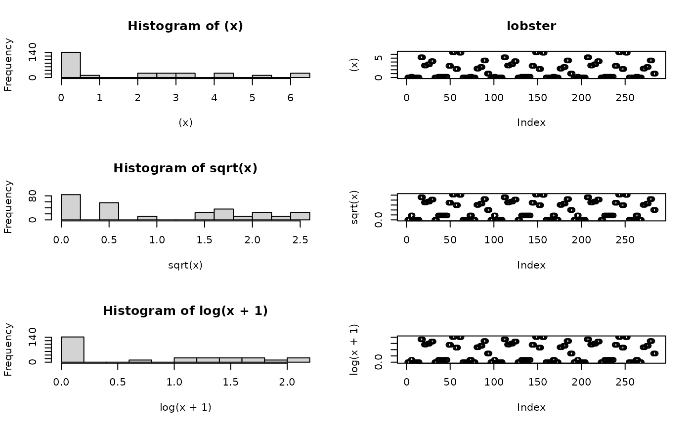
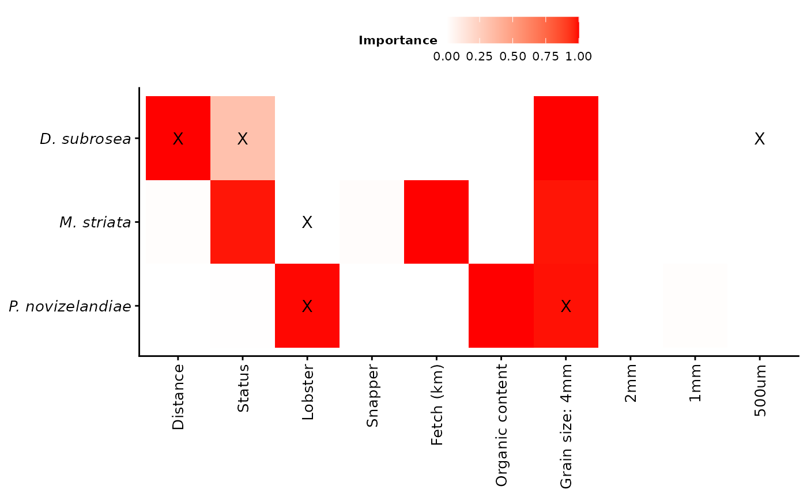
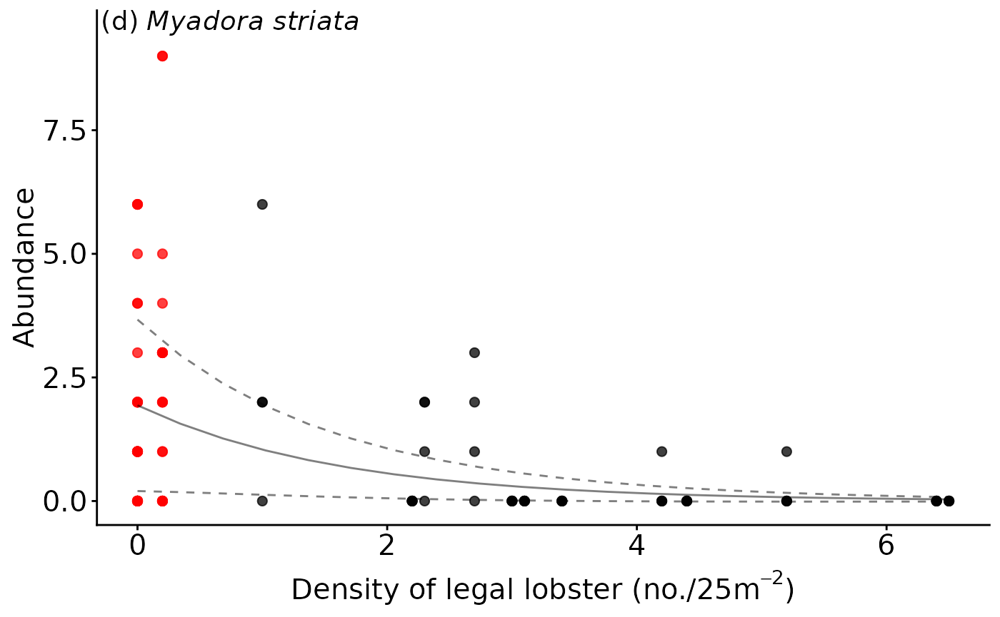
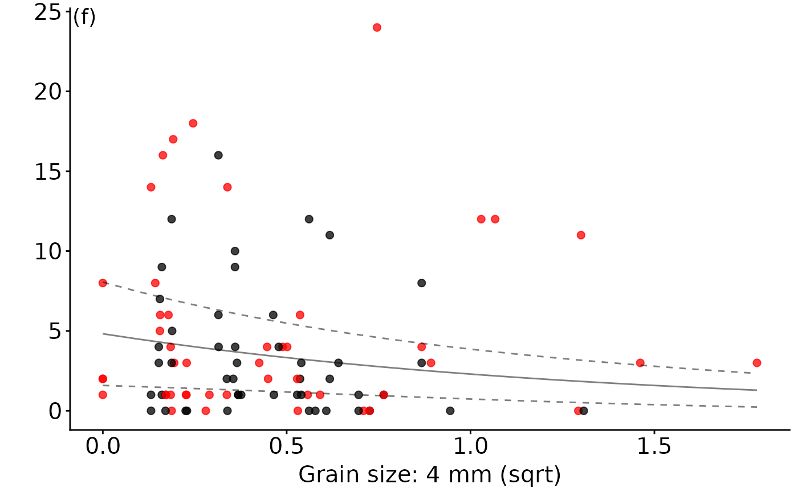

# Case Study 2

## Overview

This case study reanalyses data from **Langlois et al. (2005)** to
examine whether large reef-associated predators (rock lobster and
snapper) structure adjacent soft‑sediment communities. The analysis
demonstrates the use of **full subsets GAMMs** in the `FSSgam` package,
accounting for nested random effects and zero‑inflated abundance data.

## Background

In temperate reef ecosystems, reduced densities of soft‑sediment infauna
have been observed adjacent to reefs, forming so‑called *infaunal
haloes*. These patterns are hypothesised to arise from foraging by
reef‑associated predators such as snapper (*Pagrus auratus*) and rock
lobster (*Jasus edwardsii*), which occur at higher densities inside
no‑take reserves.

The original analysis of Langlois et al. (2005) relied on mixed‑model
ANOVA and multivariate approaches that could not fully incorporate
environmental covariates or flexible error structures. Here, we revisit
these data using full subsets GAMMs to disentangle the relative
importance of predator density, distance from reef, reserve status, and
environmental characteristics.

\*\* note \*\* This example was updated on the 11th Oct 2018 to
demonstrate usage of the replacement functions generate.model.set and
fit.model.set that have now superseded full.subsets.gam in package
FSSgam Between them these functions carry out the same analysis, take
the same arguments and return the same outputs as full.subsets.gam with
the only difference being that the model set generation and model
fitting procedures are separated into two steps. This was done to make
the function easier to use, because the model set can be interrogated,
along with the correlation matrix of the predictors before model fitting
is even attempted.

It has since been updated with minimal changes on the 29th April 2026 to
ensure reproducibility and to convert it to a .Rmd file for the vignette
format for githubio.

## Script information

### Part 1-FSS modeling

This script is designed to work with long format data - where response
variables are stacked one upon each other (see
<http://tidyr.tidyverse.org/>)

There are two random factors, Site and NTR location We have used a
Tweedie error distribution to account for the high occurence of zero
values in the dataset. We have implemented the ramdom effects and
Tweedie error distribution using the mgcv() package

### Part 2 - custom plot of importance scores

Using ggplot2()

### Part 3 - plots of the most parsimonious models

Here we use plots of the raw response variables and fitted
relationships - to allow for the plotting of interactions between
continous predictor variables and factors with levels again using
ggplot2()

## R packages

``` r

library(tidyr)
library(dplyr)
library(mgcv)
library(MuMIn)
library(car)
library(doBy)
library(gplots)
library(ggplot2)
library(RColorBrewer)
library(gamm4)
library(FSSgam)
library(gridExtra)
library(grid)
```

## Part 1-FSS modeling

### Data preparation

``` r

dat <-case_study2 %>%
  rename(response=Abundance)%>%
  #   Transform variables
  mutate(sqrt.X4mm=sqrt(X4mm))%>%
  mutate(sqrt.X2mm=sqrt(X2mm))%>%
  mutate(sqrt.X1mm=sqrt(X1mm))%>%
  mutate(sqrt.X500um=sqrt(X500um))%>%
  na.omit()%>%
  mutate(Location=factor(Location)) |> 
  mutate(Site=factor(Site)) |> 
  mutate(Status=factor(Status)) |> 
  glimpse()
```

    ## Rows: 285
    ## Columns: 25
    ## $ sediment    <dbl> -3.2625005, -3.4838280, -4.6855602, -3.2486536, -3.4328005…
    ## $ Location    <fct> Hahei, Hahei, Hahei, Hahei, Hahei, Hahei, Hahei, Hahei, Ha…
    ## $ Status      <fct> Fished, Fished, Fished, Fished, Fished, Fished, Fished, Fi…
    ## $ Site        <fct> Cooks Beach Inner, Cooks Beach Inner, Cooks Beach Inner, C…
    ## $ Distance    <int> 2, 5, 15, 30, 2, 5, 30, 2, 5, 15, 30, 2, 5, 15, 30, 2, 5, …
    ## $ depth       <int> 12, 12, 12, 12, 9, 9, 9, 10, 10, 12, 12, 10, 10, 11, 11, 1…
    ## $ X4mm        <dbl> 3.16462, 1.69129, 1.67228, 0.79670, 0.03768, 0.23887, 0.05…
    ## $ X2mm        <dbl> 1.41119, 1.62811, 1.01193, 0.77126, 0.25556, 0.57024, 0.41…
    ## $ X1mm        <dbl> 3.88962, 4.86726, 3.97180, 1.82919, 2.09768, 3.42348, 2.96…
    ## $ X500um      <dbl> 8.69694, 9.92831, 21.37884, 7.81927, 15.76419, 18.22572, 1…
    ## $ X250um      <dbl> 70.31984, 69.18594, 64.74207, 78.20548, 67.41767, 62.77750…
    ## $ X125um      <dbl> 6.19663, 5.70317, 2.75041, 5.26789, 7.21756, 7.48086, 2.31…
    ## $ X63um       <dbl> 6.25038, 6.92941, 4.42267, 5.27693, 7.08857, 7.17101, 3.47…
    ## $ fetch       <dbl> 2232582.5, 2232582.5, 2232582.5, 2232582.5, 1027166.9, 102…
    ## $ org         <dbl> 3.45785, 3.19104, 2.80046, 2.78881, 2.47510, 2.52552, 2.30…
    ## $ snapper     <dbl> 0.0, 0.0, 0.0, 0.0, 0.0, 0.0, 0.0, 0.0, 0.0, 0.0, 0.0, 0.0…
    ## $ lobster     <dbl> 0.0, 0.0, 0.0, 0.0, 0.2, 0.2, 0.2, 0.0, 0.0, 0.0, 0.0, 0.0…
    ## $ InPreds     <dbl> 0.0000000, 0.0000000, 0.0000000, 0.3333333, 0.0000000, 1.0…
    ## $ BioTurb     <dbl> 0.1666667, 0.1666667, 0.8333333, 0.3333333, 0.3333333, 0.1…
    ## $ Taxa        <chr> "BDS", "BDS", "BDS", "BDS", "BDS", "BDS", "BDS", "BDS", "B…
    ## $ response    <int> 0, 1, 0, 1, 6, 5, 1, 0, 0, 0, 0, 0, 0, 1, 3, 0, 4, 0, 2, 0…
    ## $ sqrt.X4mm   <dbl> 1.7789379, 1.3004961, 1.2931667, 0.8925805, 0.1941134, 0.4…
    ## $ sqrt.X2mm   <dbl> 1.1879352, 1.2759741, 1.0059473, 0.8782141, 0.5055294, 0.7…
    ## $ sqrt.X1mm   <dbl> 1.9722120, 2.2061868, 1.9929375, 1.3524755, 1.4483370, 1.8…
    ## $ sqrt.X500um <dbl> 2.9490575, 3.1509221, 4.6237258, 2.7962958, 3.9704143, 4.2…

### Predictor selection

``` r

pred.vars=c("depth","X4mm","X2mm","X1mm","X500um","X250um","X125um","X63um",
            "fetch","org","snapper","lobster") 

factor.vars <- c("Status")
```

Predictor variables Removed at first pass included: broad.Sponges and
broad.Octocoral.Black and broad.Consolidated , “InPreds”,“BioTurb” are
too rare

Check for correalation of predictor variables- remove anything highly
correlated (\>0.95)—

``` r

round(cor(dat[,pred.vars]),2)
```

    ##         depth  X4mm  X2mm  X1mm X500um X250um X125um X63um fetch   org snapper
    ## depth    1.00  0.24  0.05 -0.01   0.02   0.10  -0.08  0.03  0.21  0.05   -0.16
    ## X4mm     0.24  1.00  0.52  0.21   0.03   0.13  -0.20  0.48  0.03  0.23   -0.11
    ## X2mm     0.05  0.52  1.00  0.91   0.58   0.10  -0.51  0.01  0.28  0.13    0.08
    ## X1mm    -0.01  0.21  0.91  1.00   0.80   0.09  -0.60 -0.17  0.38  0.06    0.14
    ## X500um   0.02  0.03  0.58  0.80   1.00   0.21  -0.74 -0.13  0.46  0.00    0.07
    ## X250um   0.10  0.13  0.10  0.09   0.21   1.00  -0.80  0.07  0.16  0.10   -0.22
    ## X125um  -0.08 -0.20 -0.51 -0.60  -0.74  -0.80   1.00 -0.05 -0.37 -0.09    0.10
    ## X63um    0.03  0.48  0.01 -0.17  -0.13   0.07  -0.05  1.00 -0.23  0.11   -0.11
    ## fetch    0.21  0.03  0.28  0.38   0.46   0.16  -0.37 -0.23  1.00  0.15    0.16
    ## org      0.05  0.23  0.13  0.06   0.00   0.10  -0.09  0.11  0.15  1.00    0.16
    ## snapper -0.16 -0.11  0.08  0.14   0.07  -0.22   0.10 -0.11  0.16  0.16    1.00
    ## lobster  0.09 -0.10  0.03  0.11   0.12  -0.24   0.10 -0.04  0.11  0.14    0.54
    ##         lobster
    ## depth      0.09
    ## X4mm      -0.10
    ## X2mm       0.03
    ## X1mm       0.11
    ## X500um     0.12
    ## X250um    -0.24
    ## X125um     0.10
    ## X63um     -0.04
    ## fetch      0.11
    ## org        0.14
    ## snapper    0.54
    ## lobster    1.00

Note that nothing is highly correlated

Plot of likely transformations - thanks to Anna Cresswell for this loop!

``` r

par(mfrow=c(3,2))
for (i in pred.vars) {
  x<-dat[ ,i]
  x = as.numeric(unlist(x))
  hist((x))#Looks best
  plot((x),main = paste(i))
  hist(sqrt(x))
  plot(sqrt(x))
  hist(log(x+1))
  plot(log(x+1))
}
```



Review of individual predictors - we have to make sure they have an even
distribution.

If the data are squewed to low numbers try sqrt\>log or if skewed to
high numbers try ^2 of ^3 Decided that X4mm, X2mm, X1mm and X500um
needed a sqrt transformation

Decided Depth, x63um, InPreds and BioTurb were not informative
variables.

Re-set the predictors for modeling.

``` r

pred.vars=c("sqrt.X4mm","sqrt.X2mm","sqrt.X1mm","sqrt.X500um",
            "fetch","org","snapper","lobster") 
```

### Screening taxa

Check to make sure Response vector has not more than 80% zeros

``` r

unique.vars=unique(as.character(dat$Taxa))
unique.vars.use=character()
for(i in 1:length(unique.vars)){
  temp.dat=dat[which(dat$Taxa==unique.vars[i]),]
  if(length(which(temp.dat$response==0))/nrow(temp.dat)<0.8){
    unique.vars.use=c(unique.vars.use,unique.vars[i])}
}
unique.vars.use  
```

    ## [1] "BDS" "BMS" "CPN"

“BDS” bivalve Dosina subrosea

“BMS” bivalve Myadora striata

“CPN” crustacean Pagrus novaezelandiae

### Full subsets GAMM analysis

### Extract Model fits and importance

``` r

names(out.all)=resp.vars
names(var.imp)=resp.vars
all.mod.fits=do.call("rbind",out.all)
all.var.imp=do.call("rbind",var.imp)
```

``` r

knitr::kable(
  all.mod.fits,
  digits = 3,
  caption = "Summary of all fitted FSSgam models"
)
```

|  | modname | formula | AICc | BIC | r2.vals | r2.vals.unique | edf | edf.less.1 | delta.AICc | delta.BIC | wi.AICc | wi.BIC | sqrt.X4mm | sqrt.X2mm | sqrt.X1mm | sqrt.X500um | fetch | org | snapper | lobster | Status | Distance | cumsum.wi |
|:---|:---|:---|---:|---:|---:|---:|---:|---:|---:|---:|---:|---:|---:|---:|---:|---:|---:|---:|---:|---:|---:|---:|---:|
| BDS.Distance+sqrt.X4mm | Distance+sqrt.X4mm | s(sqrt.X4mm, k = 3, bs = “cr”) + Distance + s(Location, Site, bs = “re”) | 276.405 | 321.906 | 0.529 | NA | 23.24 | 0 | 0.000 | 0.000 | 0.677 | 0.721 | 1 | 0 | 0 | 0 | 0 | 0 | 0 | 0 | 0 | 1 | 0.677 |
| BDS.Distance.t.Status+sqrt.X4mm+Status | Distance.t.Status+sqrt.X4mm+Status | s(sqrt.X4mm, k = 3, bs = “cr”) + Distance + Status + s(Location, Site, bs = “re”) + Distance:Status | 277.884 | 323.807 | 0.517 | NA | 23.82 | 0 | 1.480 | 1.901 | 0.323 | 0.279 | 1 | 0 | 0 | 0 | 0 | 0 | 0 | 0 | 1 | 1 | 1.000 |
| BMS.fetch.by.Status+sqrt.X4mm+Status | fetch.by.Status+sqrt.X4mm+Status | s(sqrt.X4mm, k = 3, bs = “cr”) + s(fetch, by = Status, k = 3, bs = “cr”) + Status + s(Location, Site, bs = “re”) | 157.220 | 195.278 | 0.114 | NA | 15.70 | 0 | 0.000 | 0.000 | 0.630 | 0.909 | 1 | 0 | 0 | 0 | 1 | 0 | 0 | 0 | 1 | 0 | 0.630 |
| BMS.fetch.by.Status+sqrt.X4mm.by.Status+Status | fetch.by.Status+sqrt.X4mm.by.Status+Status | s(fetch, by = Status, k = 3, bs = “cr”) + s(sqrt.X4mm, by = Status, k = 3, bs = “cr”) + Status + s(Location, Site, bs = “re”) | 158.379 | 199.933 | 0.116 | NA | 17.70 | 0 | 1.159 | 4.655 | 0.353 | 0.089 | 1 | 0 | 0 | 0 | 1 | 0 | 0 | 0 | 1 | 0 | 0.983 |
| CPN | lobster+org+sqrt.X4mm | s(lobster, k = 3, bs = “cr”) + s(org, k = 3, bs = “cr”) + s(sqrt.X4mm, k = 3, bs = “cr”) + s(Location, Site, bs = “re”) | 399.262 | 446.531 | 0.481 | NA | 24.75 | 0 | 0.000 | 0.000 | 0.988 | 0.983 | 1 | 0 | 0 | 0 | 0 | 1 | 0 | 1 | 0 | 0 | 0.988 |

Summary of all fitted FSSgam models {.table}

``` r

knitr::kable(
  all.var.imp,
  digits = 3,
  caption = "Variable importance scores across response variables"
)
```

|  | sqrt.X4mm | sqrt.X2mm | sqrt.X1mm | sqrt.X500um | fetch | org | snapper | lobster | Status | Distance |
|:---|---:|---:|---:|---:|---:|---:|---:|---:|---:|---:|
| BDS | 1.000 | 0 | 0.000 | 0 | 0 | 0.000 | 0.000 | 0.000 | 0.323 | 1.000 |
| BMS | 0.984 | 0 | 0.000 | 0 | 1 | 0.000 | 0.017 | 0.000 | 0.983 | 0.013 |
| CPN | 0.988 | 0 | 0.013 | 0 | 0 | 1.001 | 0.000 | 0.996 | 0.005 | 0.000 |

Variable importance scores across response variables {.table
style="width:100%;"}

### Variable importance

``` r

heatmap.2(
  all.var.imp,
  dendrogram = "none",
  col = colorRampPalette(c("white", "yellow", "red"))(10),
  trace = "none",
  key = TRUE,
  notecol = "black",
  sepcolor = "black",
  margins = c(6, 4),
  Rowv = FALSE,
  Colv = FALSE
)
```


## Part 2 - custom plot of importance scores

``` r

dat.taxa <- all.var.imp |>
  as.data.frame() |>
  tibble::rownames_to_column("resp.var") |>
  pivot_longer(
    cols = -resp.var,
    names_to = "predictor",
    values_to = "importance"
  ) |>
  glimpse()
```

    ## Rows: 30
    ## Columns: 3
    ## $ resp.var   <chr> "BDS", "BDS", "BDS", "BDS", "BDS", "BDS", "BDS", "BDS", "BD…
    ## $ predictor  <chr> "sqrt.X4mm", "sqrt.X2mm", "sqrt.X1mm", "sqrt.X500um", "fetc…
    ## $ importance <dbl> 1.000, 0.000, 0.000, 0.000, 0.000, 0.000, 0.000, 0.000, 0.3…

``` r

gg.importance.scores
```



## Part 3 - plots of the most parsimonious models

Make an suitable theme

``` r

Theme1 <- theme(
  panel.grid.major = element_blank(),
  panel.grid.minor = element_blank(),
  legend.background = element_blank(),
  legend.key = element_blank(),
  legend.text = element_text(size = 15),
  legend.title = element_blank(),
  legend.position = c(0.2, 0.8),
  text = element_text(size = 15),
  strip.text.y = element_text(size = 15, angle = 0),
  axis.title.x = element_text(vjust = 0.3, size = 15),
  axis.title.y = element_text(vjust = 0.6, angle = 90, size = 15),
  axis.text.x = element_text(size = 15),
  axis.text.y = element_text(size = 15),
  axis.line.x = element_line(colour = "black", linewidth = 0.5, linetype = "solid"),
  axis.line.y = element_line(colour = "black", linewidth = 0.5, linetype = "solid"),
  strip.background = element_blank()
)
name<-"clams"
```

Manually make the most parsimonious GAM models for each taxa

### MODEL Bivalve.Dosina.subrosea 500um + Distance x Status

``` r

dat.bds<-dat%>%filter(Taxa=="BDS")
gamm=gam(response~s(sqrt.X500um,k=3,bs='cr')+s(Distance,k=1,bs='cr', by=Status)+ s(Location,Site,bs="re")+ Status, family=tw(),data=dat.bds)
```

Predict - status from MODEL Bivalve.Dosina.subrosea—-

``` r

mod<-gamm
testdata <- expand.grid(Distance=mean(mod$model$Distance),
                        sqrt.X500um=mean(mod$model$sqrt.X500um),
                        Location=(mod$model$Location),
                        Site=(mod$model$Site),
                        Status = c("Fished","No-take"))%>%
  distinct()%>%
  glimpse()
```

    ## Rows: 144
    ## Columns: 5
    ## $ Distance    <dbl> 12.97895, 12.97895, 12.97895, 12.97895, 12.97895, 12.97895…
    ## $ sqrt.X500um <dbl> 2.855525, 2.855525, 2.855525, 2.855525, 2.855525, 2.855525…
    ## $ Location    <fct> Hahei, Leigh, Tawharanui, Hahei, Leigh, Tawharanui, Hahei,…
    ## $ Site        <fct> Cooks Beach Inner, Cooks Beach Inner, Cooks Beach Inner, C…
    ## $ Status      <fct> Fished, Fished, Fished, Fished, Fished, Fished, Fished, Fi…

``` r

fits <- predict.gam(mod, newdata=testdata, type='response', se.fit=T)

predicts.bds.status = testdata%>%data.frame(fits)%>%
  group_by(Status)%>% #only change here
  summarise(response=mean(fit),se.fit=mean(se.fit))%>%
  ungroup()

predicts.bds.status %>%
  glimpse()
```

    ## Rows: 2
    ## Columns: 3
    ## $ Status   <fct> Fished, No-take
    ## $ response <dbl> 2.8646047, 0.7276123
    ## $ se.fit   <dbl> 2.390011, 0.619802

predict - Distance.x.status from MODEL Bivalve.Dosina.subrosea—-

``` r

mod<-gamm
testdata <- expand.grid(Distance=seq(min(dat$Distance),max(dat$Distance),length.out = 20),
                        sqrt.X500um=mean(mod$model$sqrt.X500um),
                        Location=(mod$model$Location),
                        Site=(mod$model$Site),
                        Status = c("Fished","No-take"))%>%
  distinct()%>%
  glimpse()
```

    ## Rows: 2,880
    ## Columns: 5
    ## $ Distance    <dbl> 2.000000, 3.473684, 4.947368, 6.421053, 7.894737, 9.368421…
    ## $ sqrt.X500um <dbl> 2.855525, 2.855525, 2.855525, 2.855525, 2.855525, 2.855525…
    ## $ Location    <fct> Hahei, Hahei, Hahei, Hahei, Hahei, Hahei, Hahei, Hahei, Ha…
    ## $ Site        <fct> Cooks Beach Inner, Cooks Beach Inner, Cooks Beach Inner, C…
    ## $ Status      <fct> Fished, Fished, Fished, Fished, Fished, Fished, Fished, Fi…

``` r

fits <- predict.gam(mod, newdata=testdata, type='response', se.fit=T)

predicts.bds.Distance.x.status = testdata%>%data.frame(fits)%>%
  group_by(Distance,Status)%>% 
  summarise(response=mean(fit),se.fit=mean(se.fit))%>%
  ungroup()
predicts.bds.Distance.x.status |> 
  glimpse()
```

    ## Rows: 40
    ## Columns: 4
    ## $ Distance <dbl> 2.000000, 2.000000, 3.473684, 3.473684, 4.947368, 4.947368, 6…
    ## $ Status   <fct> Fished, No-take, Fished, No-take, Fished, No-take, Fished, No…
    ## $ response <dbl> 2.0505723, 0.4356395, 2.1446873, 0.4666912, 2.2431218, 0.4999…
    ## $ se.fit   <dbl> 1.7306685, 0.3823930, 1.8058795, 0.4073529, 1.8848049, 0.4341…

Predict 500um from MODEL Bivalve.Dosina.subrosea—-

``` r

mod<-gamm
testdata <- expand.grid(sqrt.X500um=seq(min(dat$sqrt.X500um),max(dat$sqrt.X500um),length.out = 20),
                        Distance=mean(mod$model$Distance),
                        Location=(mod$model$Location),
                        Site=(mod$model$Site),
                        Status = c("Fished","No-take"))%>%
  distinct()%>%
  glimpse()
```

    ## Rows: 2,880
    ## Columns: 5
    ## $ sqrt.X500um <dbl> 0.4630875, 0.7521858, 1.0412841, 1.3303825, 1.6194808, 1.9…
    ## $ Distance    <dbl> 12.97895, 12.97895, 12.97895, 12.97895, 12.97895, 12.97895…
    ## $ Location    <fct> Hahei, Hahei, Hahei, Hahei, Hahei, Hahei, Hahei, Hahei, Ha…
    ## $ Site        <fct> Cooks Beach Inner, Cooks Beach Inner, Cooks Beach Inner, C…
    ## $ Status      <fct> Fished, Fished, Fished, Fished, Fished, Fished, Fished, Fi…

``` r

fits <- predict.gam(mod, newdata=testdata, type='response', se.fit=T)

predicts.bds.500um = testdata%>%data.frame(fits)%>%
  group_by(sqrt.X500um)%>% 
  summarise(response=mean(fit),se.fit=mean(se.fit))%>%
  ungroup()
predicts.bds.500um %>%
  glimpse()
```

    ## Rows: 20
    ## Columns: 3
    ## $ sqrt.X500um <dbl> 0.4630875, 0.7521858, 1.0412841, 1.3303825, 1.6194808, 1.9…
    ## $ response    <dbl> 4.6448757, 4.1410544, 3.6918819, 3.2914306, 2.9344158, 2.6…
    ## $ se.fit      <dbl> 4.0647102, 3.5813495, 3.1606276, 2.7942131, 2.4748134, 2.1…

### MODEL Bivalve.Myadora.striata Lobster

``` r

dat.bms<-dat%>%filter(Taxa=="BMS")
head(dat.bms,2)
```

    ##    sediment Location Status              Site Distance depth    X4mm    X2mm
    ## 1 -3.262500    Hahei Fished Cooks Beach Inner        2    12 3.16462 1.41119
    ## 2 -3.483828    Hahei Fished Cooks Beach Inner        5    12 1.69129 1.62811
    ##      X1mm  X500um   X250um  X125um   X63um   fetch     org snapper lobster
    ## 1 3.88962 8.69694 70.31984 6.19663 6.25038 2232582 3.45785       0       0
    ## 2 4.86726 9.92831 69.18594 5.70317 6.92941 2232582 3.19104       0       0
    ##   InPreds   BioTurb Taxa response sqrt.X4mm sqrt.X2mm sqrt.X1mm sqrt.X500um
    ## 1       0 0.1666667  BMS        6  1.778938  1.187935  1.972212    2.949057
    ## 2       0 0.1666667  BMS        4  1.300496  1.275974  2.206187    3.150922

``` r

gamm=gam(response~s(lobster,k=3,bs='cr')+ s(Location,Site,bs="re"), family=tw(),data=dat.bms)

# predict - lobster from model for Bivalve.Myadora.striata ----
mod<-gamm
testdata <- expand.grid(lobster=seq(min(dat$lobster),max(dat$lobster),length.out = 20),
                        Location=(mod$model$Location),
                        Site=(mod$model$Site),
                        Status = c("Fished","No-take"))%>%
  distinct()%>%
  glimpse()
```

    ## Rows: 2,880
    ## Columns: 4
    ## $ lobster  <dbl> 0.0000000, 0.3421053, 0.6842105, 1.0263158, 1.3684211, 1.7105…
    ## $ Location <fct> Hahei, Hahei, Hahei, Hahei, Hahei, Hahei, Hahei, Hahei, Hahei…
    ## $ Site     <fct> Cooks Beach Inner, Cooks Beach Inner, Cooks Beach Inner, Cook…
    ## $ Status   <fct> Fished, Fished, Fished, Fished, Fished, Fished, Fished, Fishe…

``` r

fits <- predict.gam(mod, newdata=testdata, type='response', se.fit=T)
predicts.bms.lobster = testdata%>%data.frame(fits)%>%
  group_by(lobster)%>% 
  summarise(response=mean(fit),se.fit=mean(se.fit))%>%
  ungroup()

predicts.bms.lobster %>%
  glimpse()
```

    ## Rows: 20
    ## Columns: 3
    ## $ lobster  <dbl> 0.0000000, 0.3421053, 0.6842105, 1.0263158, 1.3684211, 1.7105…
    ## $ response <dbl> 1.93534254, 1.56507086, 1.26563993, 1.02349643, 0.82768005, 0…
    ## $ se.fit   <dbl> 1.73352921, 1.38496562, 1.11267638, 0.89887748, 0.72994634, 0…

### MODEL Decapod.P.novazelandiae 4mm + Lobster

``` r

dat.cpn<-dat%>%filter(Taxa=="CPN")
head(dat.cpn,2)
```

    ##    sediment Location Status              Site Distance depth    X4mm    X2mm
    ## 1 -3.262500    Hahei Fished Cooks Beach Inner        2    12 3.16462 1.41119
    ## 2 -3.483828    Hahei Fished Cooks Beach Inner        5    12 1.69129 1.62811
    ##      X1mm  X500um   X250um  X125um   X63um   fetch     org snapper lobster
    ## 1 3.88962 8.69694 70.31984 6.19663 6.25038 2232582 3.45785       0       0
    ## 2 4.86726 9.92831 69.18594 5.70317 6.92941 2232582 3.19104       0       0
    ##   InPreds   BioTurb Taxa response sqrt.X4mm sqrt.X2mm sqrt.X1mm sqrt.X500um
    ## 1       0 0.1666667  CPN        3  1.778938  1.187935  1.972212    2.949057
    ## 2       0 0.1666667  CPN       11  1.300496  1.275974  2.206187    3.150922

``` r

gamm=gam(response~s(sqrt.X4mm,k=3,bs='cr')+s(lobster,k=3,bs='cr')+ s(Location,Site,bs="re"), family=tw(),data=dat.cpn)
```

Predict - sqrt.X4mm from model for Decapod.P.novazelandiae —-

``` r

mod<-gamm
testdata <- expand.grid(sqrt.X4mm=seq(min(dat$sqrt.X4mm),max(dat$sqrt.X4mm),length.out = 20),
                        lobster=mean(mod$model$lobster),
                        Location=(mod$model$Location),
                        Site=(mod$model$Site),
                        Status = c("Fished","No-take"))%>%
  distinct()%>%
  glimpse()
```

    ## Rows: 2,880
    ## Columns: 5
    ## $ sqrt.X4mm <dbl> 0.00000000, 0.09362831, 0.18725662, 0.28088493, 0.37451324, …
    ## $ lobster   <dbl> 1.909474, 1.909474, 1.909474, 1.909474, 1.909474, 1.909474, …
    ## $ Location  <fct> Hahei, Hahei, Hahei, Hahei, Hahei, Hahei, Hahei, Hahei, Hahe…
    ## $ Site      <fct> Cooks Beach Inner, Cooks Beach Inner, Cooks Beach Inner, Coo…
    ## $ Status    <fct> Fished, Fished, Fished, Fished, Fished, Fished, Fished, Fish…

``` r

fits <- predict.gam(mod, newdata=testdata, type='response', se.fit=T)
predicts.cpn.4mm = testdata%>%data.frame(fits)%>%
  group_by(sqrt.X4mm)%>% #only change here
  summarise(response=mean(fit),se.fit=mean(se.fit))%>%
  ungroup()
predicts.cpn.4mm %>%
  glimpse()
```

    ## Rows: 20
    ## Columns: 3
    ## $ sqrt.X4mm <dbl> 0.00000000, 0.09362831, 0.18725662, 0.28088493, 0.37451324, …
    ## $ response  <dbl> 4.822420, 4.499149, 4.197548, 3.916164, 3.653641, 3.408715, …
    ## $ se.fit    <dbl> 3.235051, 2.979428, 2.751207, 2.547690, 2.366325, 2.204703, …

Predict - lobster from model for Decapod.P.novazelandiae —-

``` r

mod<-gamm
testdata <- expand.grid(lobster=seq(min(dat$lobster),max(dat$lobster),length.out = 20),
                        sqrt.X4mm=mean(mod$model$sqrt.X4mm),
                        Location=(mod$model$Location),
                        Site=(mod$model$Site),
                        Status = c("Fished","No-take"))%>%
  distinct()%>%
  glimpse()
```

    ## Rows: 2,880
    ## Columns: 5
    ## $ lobster   <dbl> 0.0000000, 0.3421053, 0.6842105, 1.0263158, 1.3684211, 1.710…
    ## $ sqrt.X4mm <dbl> 0.4572685, 0.4572685, 0.4572685, 0.4572685, 0.4572685, 0.457…
    ## $ Location  <fct> Hahei, Hahei, Hahei, Hahei, Hahei, Hahei, Hahei, Hahei, Hahe…
    ## $ Site      <fct> Cooks Beach Inner, Cooks Beach Inner, Cooks Beach Inner, Coo…
    ## $ Status    <fct> Fished, Fished, Fished, Fished, Fished, Fished, Fished, Fish…

``` r

fits <- predict.gam(mod, newdata=testdata, type='response', se.fit=T)
predicts.cpn.lobster = testdata%>%data.frame(fits)%>%
  group_by(lobster)%>% 
  summarise(response=mean(fit),se.fit=mean(se.fit))%>%
  ungroup()
predicts.cpn.lobster %>%
  glimpse()
```

    ## Rows: 20
    ## Columns: 3
    ## $ lobster  <dbl> 0.0000000, 0.3421053, 0.6842105, 1.0263158, 1.3684211, 1.7105…
    ## $ response <dbl> 4.560408, 4.334946, 4.120627, 3.916900, 3.723238, 3.539142, 3…
    ## $ se.fit   <dbl> 3.038395, 2.857564, 2.693471, 2.544742, 2.410040, 2.288081, 2…

### PLOTS for Bivalve.Dosina.subrosea 500um + Distance x Status

``` r

ggmod.bds.status<- ggplot(aes(x=Status,y=response,fill=Status,colour=Status), data=predicts.bds.status) +
  ylab(" ")+
  xlab('Status')+
  scale_fill_manual(labels = c("Fished", "No-take"),values=c("red", "black"))+
  scale_colour_manual(labels = c("Fished", "No-take"),values=c("red", "black"))+
  scale_x_discrete(limits = rev(levels(predicts.bds.status$Status)))+
  geom_bar(stat = "identity")+
  geom_errorbar(aes(ymin = response-se.fit,ymax = response+se.fit),width = 0.5) +
  theme_classic()+
  Theme1+
  annotate("text", x = -Inf, y=Inf, label = "(a)",vjust = 1, hjust = -.1,size=5)+
  annotate("text", x = -Inf, y=Inf, label = "   Dosinia subrosea",vjust = 1, hjust = -.1,size=5,fontface="italic")
ggmod.bds.status
```


``` r

ggmod.bds.Distance.x.status<- ggplot(aes(x=Distance,y=response,colour=Status), data=dat.bds) +
  ylab(" ")+
  xlab('Distance (m)')+
  scale_color_manual(labels = c("Fished", "No-take"),values=c("red", "black"))+
  geom_jitter(width = 0.25,height = 0,alpha=0.75, size=2,show.legend=FALSE)+
  # geom_point(alpha=0.75, size=2)+
  geom_line(data=predicts.bds.Distance.x.status,show.legend=FALSE)+
  geom_line(data=predicts.bds.Distance.x.status,aes(y=response - se.fit),linetype="dashed",show.legend=FALSE)+
  geom_line(data=predicts.bds.Distance.x.status,aes(y=response + se.fit),linetype="dashed",show.legend=FALSE)+
  theme_classic()+
  Theme1+
  annotate("text", x = -Inf, y=Inf, label = "(b)",vjust = 1, hjust = -.1,size=5)
ggmod.bds.Distance.x.status
```


``` r

ggmod.bds.500um<- ggplot() +
  ylab(" ")+
  xlab('Grain size: 500 um (sqrt)')+
  scale_color_manual(labels = c("Fished", "No-take"),values=c("red", "black"))+
  geom_point(data=dat.bds,aes(x=sqrt.X500um,y=response,colour=Status),  alpha=0.75, size=2,show.legend=FALSE)+
  geom_line(data=predicts.bds.500um,aes(x=sqrt.X500um,y=response),alpha=0.5)+
  geom_line(data=predicts.bds.500um,aes(x=sqrt.X500um,y=response - se.fit),linetype="dashed",alpha=0.5)+
  geom_line(data=predicts.bds.500um,aes(x=sqrt.X500um,y=response + se.fit),linetype="dashed",alpha=0.5)+
  theme_classic()+
  Theme1+
  annotate("text", x = -Inf, y=Inf, label = "(c)",vjust = 1, hjust = -.1,size=5)
ggmod.bds.500um
```


### PLOTS Bivalve M.striata lobster

``` r

ggmod.bms.lobster<- ggplot() +
  ylab("Abundance")+
  xlab(bquote('Density of legal lobster (no./25' *m^-2*')'))+
  scale_color_manual(labels = c("Fished", "SZ"),values=c("red", "black"))+
  geom_point(data=dat.bms,aes(x=lobster,y=response,colour=Status),  alpha=0.75, size=2,show.legend=FALSE)+
  geom_line(data=predicts.bms.lobster,aes(x=lobster,y=response),alpha=0.5)+
  geom_line(data=predicts.bms.lobster,aes(x=lobster,y=response - se.fit),linetype="dashed",alpha=0.5)+
  geom_line(data=predicts.bms.lobster,aes(x=lobster,y=response + se.fit),linetype="dashed",alpha=0.5)+
  theme_classic()+
  Theme1+
  annotate("text", x = -Inf, y=Inf, label = "(d)",vjust = 1, hjust = -.1,size=5)+
  annotate("text", x = -Inf, y=Inf, label = "   Myadora striata",vjust = 1, hjust = -.1,size=5,fontface="italic")+
  geom_blank(data=dat.bms,aes(x=lobster,y=response*1.05))#to nudge data off annotations
ggmod.bms.lobster
```



### PLOTS Decapod.P.novazelandiae 4mm + lobster

``` r

ggmod.cpn.lobster<- ggplot() +
  ylab(" ")+
  xlab(bquote('Density of legal lobster (no./25' *m^-2*')'))+
  scale_color_manual(labels = c("Fished", "SZ"),values=c("red", "black"))+
  geom_point(data=dat.cpn,aes(x=lobster,y=response,colour=Status),  alpha=0.75, size=2,show.legend=FALSE)+
  geom_line(data=predicts.cpn.lobster,aes(x=lobster,y=response),alpha=0.5)+
  geom_line(data=predicts.cpn.lobster,aes(x=lobster,y=response - se.fit),linetype="dashed",alpha=0.5)+
  geom_line(data=predicts.cpn.lobster,aes(x=lobster,y=response + se.fit),linetype="dashed",alpha=0.5)+
  theme_classic()+
  Theme1+
  annotate("text", x = -Inf, y=Inf, label = "(e)",vjust = 1, hjust = -.1,size=5)+
  annotate("text", x = -Inf, y=Inf, label = "  Pagurus novizelandiae",vjust = 1, hjust = -.1,size=5,fontface="italic")+
  geom_blank(data=dat.cpn,aes(x=lobster,y=response*1.05))#to nudge data off annotations
ggmod.cpn.lobster
```


``` r

ggmod.cpn.4mm<- ggplot() +
  ylab(" ")+
  xlab('Grain size: 4 mm (sqrt)')+
  scale_color_manual(labels = c("Fished", "No-take"),values=c("red", "black"))+
  geom_point(data=dat.cpn,aes(x=sqrt.X4mm,y=response,colour=Status),  alpha=0.75, size=2,show.legend=FALSE)+
  geom_line(data=predicts.cpn.4mm,aes(x=sqrt.X4mm,y=response),alpha=0.5)+
  geom_line(data=predicts.cpn.4mm,aes(x=sqrt.X4mm,y=response - se.fit),linetype="dashed",alpha=0.5)+
  geom_line(data=predicts.cpn.4mm,aes(x=sqrt.X4mm,y=response + se.fit),linetype="dashed",alpha=0.5)+
  theme_classic()+
  Theme1+
  annotate("text", x = -Inf, y=Inf, label = "(f)",vjust = 1, hjust = -.1,size=5)+
  annotate("text", x = -Inf, y=Inf, label = " ",vjust = 1, hjust = -.1,size=5,fontface="italic")
ggmod.cpn.4mm
```



Combined.plot using grid() and gridExtra()

To see what they will look like use grid.arrange() - make sure Plot
window is large enough! - or will error!

``` r

blank <- grid.rect(gp=gpar(col="white"))
```


``` r

grid.arrange(ggmod.bds.status,ggmod.bds.Distance.x.status,ggmod.bds.500um,
             ggmod.bms.lobster,blank,blank,
             ggmod.cpn.lobster,ggmod.cpn.4mm,blank,nrow=3,ncol=3)
```


Use arrangeGrob ONLY - as we can pass this to ggsave! Note use of raw
ggplot’s

``` r

combine.plot<-arrangeGrob(ggmod.bds.status,ggmod.bds.Distance.x.status,ggmod.bds.500um,
                          ggmod.bms.lobster,blank,blank,
                          ggmod.cpn.lobster,ggmod.cpn.4mm,blank,nrow=3,ncol=3)


combine.plot
```

    ## TableGrob (3 x 3) "arrange": 9 grobs
    ##   z     cells    name                grob
    ## 1 1 (1-1,1-1) arrange      gtable[layout]
    ## 2 2 (1-1,2-2) arrange      gtable[layout]
    ## 3 3 (1-1,3-3) arrange      gtable[layout]
    ## 4 4 (2-2,1-1) arrange      gtable[layout]
    ## 5 5 (2-2,2-2) arrange rect[GRID.rect.299]
    ## 6 6 (2-2,3-3) arrange rect[GRID.rect.299]
    ## 7 7 (3-3,1-1) arrange      gtable[layout]
    ## 8 8 (3-3,2-2) arrange      gtable[layout]
    ## 9 9 (3-3,3-3) arrange rect[GRID.rect.299]
