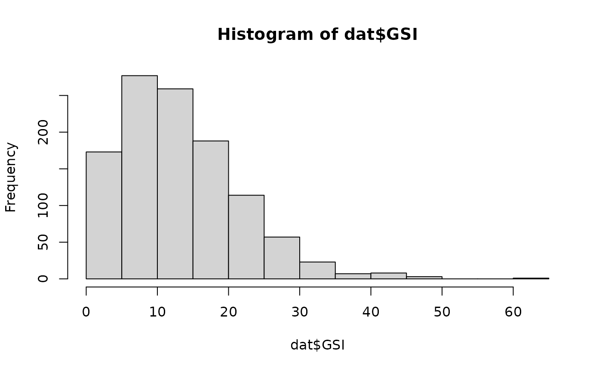
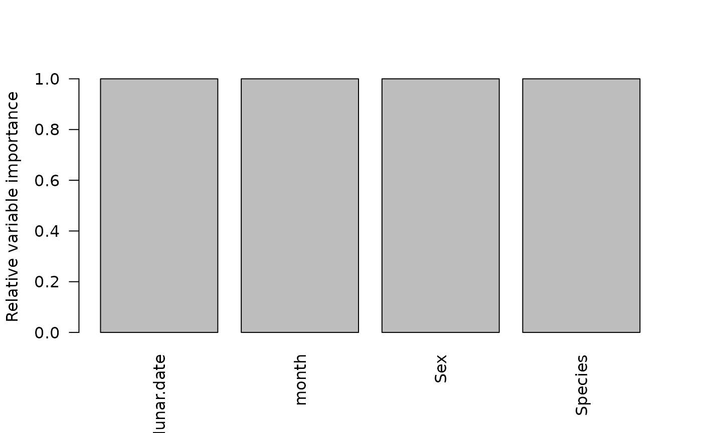
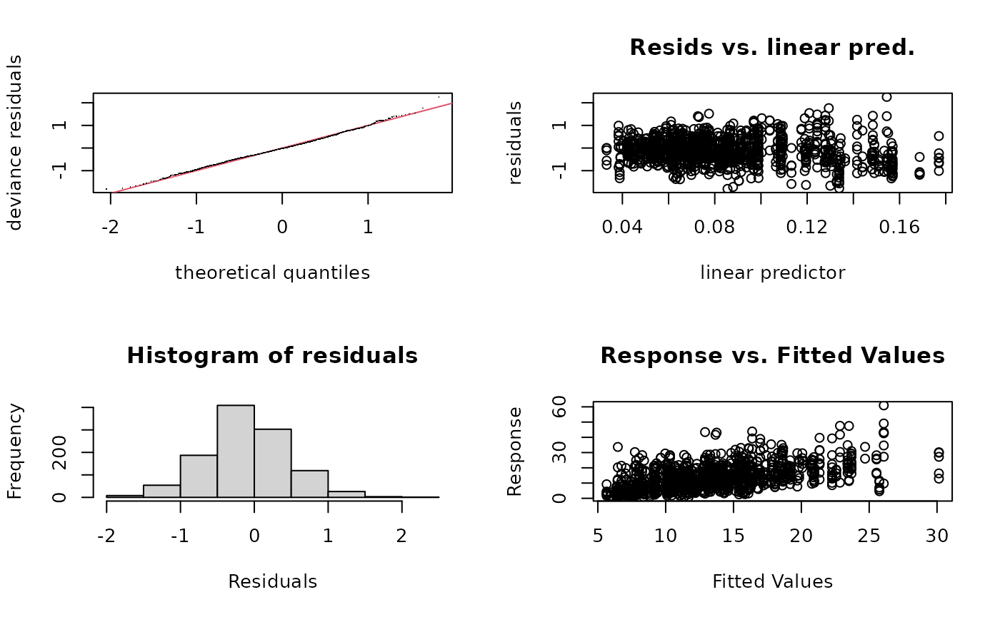
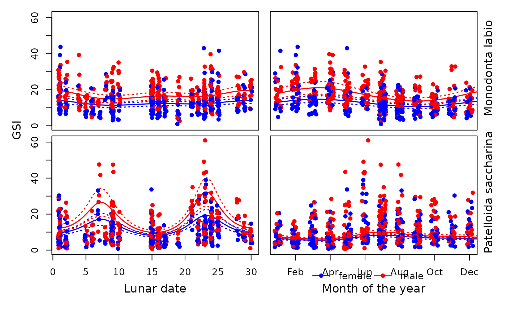

# Case Study 3

## Overview

This case study examines reproductive patterns over multiple temporal
scales in two tropical intertidal gastropods using **full subsets
Generalised Additive Models (GAMs)**. The response variable is
gonadosomatic index (GSI), modelled using a Gamma distribution.

The example demonstrates how cyclic smoothers and factor interactions
can be combined within the `FSSgam` framework to analyse lunar,
semi‑lunar and seasonal reproductive patterns.

## Background

Many marine invertebrates exhibit reproductive cycles across multiple
temporal scales, including seasonal, lunar and semi‑lunar rhythms. These
cycles are difficult to analyse using traditional categorical approaches
because both seasonality and lunarity are inherently cyclic processes.

Generalised Additive Models (GAMs) provide a flexible framework for
examining non‑linear, cyclic patterns and their interactions with
biological factors such as sex and species. Here, GAMs with full subsets
selection are used to disentangle monthly and lunar drivers of
reproductive output in two common intertidal gastropods: *Patelloida
saccharina* and *Monodonta labio*.

## R packages

``` r

library(mgcv)
library(MuMIn)
library(FSSgam)
library(tidyverse)
```

## Data preparation

Load the case study data and ensure year is treated as a factor.

``` r

dat <- case_study3 |> 
  mutate(year = factor(year))
```

### Response variable distribution

``` r

hist(dat$GSI)
```



``` r

range(dat$GSI)
```

    ## [1]  0.6125574 60.9473024

GSI is a continuous, slightly right‑skewed variable without zeros,
supporting the use of a **Gamma distribution**.

## Predictor specification

Both lunar.date and month are entered into the model as continous cyclic
smooths. This ensures that that end tails of the smooths meet smoothly.
For example, this means that the estimate for Dec smoothly links to
estimates from January, in the case of month.

Sex and Species are included as factors.

``` r

cyclic.vars <- c("lunar.date", "month")
cont.vars   <- c("lunar.date", "month")
factor.vars <- c("Sex", "Species")
```

Both month and lunar date are treated as **cyclic continuous
predictors**, allowing smooth transitions at their boundaries.

## Full subsets GAM analysis

GSI is modelled as a Gamma distribution.

Sex and Species are included as interaction terms with each other (via
factor.factor.interactions = TRUE), and as interaction terms between the
two smoothers (this is default behaviour for FSSgam, see
?generate.model.set).

## Model assessment

Examine predictor correlations. This looks as would be expected. Note
the function does estimate correlations between factors as well as
continuous predictors. See ?generate.model.set for more details on how
this is done.

``` r

model.set$predictor.correlations
```

    ##                lunar.date      month         Sex    Species Sex.I.Species
    ## lunar.date    1.000000000 0.03997010 0.002458829 0.03577236    0.03618006
    ## month         0.039970104 1.00000000 0.010673718 0.04418362    0.05979362
    ## Sex           0.002458829 0.01067372 1.000000000 0.04597970    0.99999995
    ## Species       0.035772358 0.04418362 0.045980185 1.00000000    0.99999995
    ## Sex.I.Species 0.036180060 0.05979362 0.707483898 0.70747167    1.00000000

Examine the model table. Note that the bet model includes all of the
predictors, with interactions between lunar date and species, month and
species, and an additive effect of Sex.

``` r

mod.table <- out.list$mod.data.out
mod.table <- mod.table[order(mod.table$AICc), ]

tab <- mod.table |>
  as_tibble() |> 
  select(modname, AICc, r2.vals, edf, delta.AICc, wi.AICc)

knitr::kable(
  tab,
  digits = 3,
  caption = "Model comparison summary based on AICc"
)
```

| modname | AICc | r2.vals | edf | delta.AICc | wi.AICc |
|:---|---:|---:|---:|---:|---:|
| lunar.date.by.Species+month.by.Species+Sex+Species | 7233.999 | 0.276 | 13.96 | 0.000 | 0.998 |
| lunar.date.by.Sex.I.Species+month.by.Sex.I.Species+Sex.I.Species | 7246.967 | 0.273 | 23.26 | 12.968 | 0.002 |
| lunar.date.by.Species+month.by.Species+Species | 7296.470 | 0.228 | 12.88 | 62.471 | 0.000 |
| lunar.date.by.Species+month+Sex+Species | 7339.484 | 0.208 | 11.21 | 105.484 | 0.000 |
| lunar.date+month.by.Species+Sex+Species | 7342.382 | 0.224 | 11.25 | 108.383 | 0.000 |
| lunar.date.by.Sex+month.by.Species+Sex+Species | 7343.588 | 0.223 | 14.02 | 109.589 | 0.000 |
| lunar.date.by.Species+month.by.Sex+Sex+Species | 7344.032 | 0.207 | 13.50 | 110.033 | 0.000 |
| lunar.date.by.Sex.I.Species+month+Sex.I.Species | 7344.862 | 0.205 | 16.10 | 110.863 | 0.000 |
| lunar.date+month.by.Sex.I.Species+Sex.I.Species | 7348.601 | 0.222 | 16.58 | 114.602 | 0.000 |
| lunar.date.by.Species+Sex+Species | 7348.865 | 0.198 | 8.70 | 114.866 | 0.000 |
| lunar.date.by.Sex.I.Species+Sex.I.Species | 7354.790 | 0.194 | 13.49 | 120.791 | 0.000 |
| month.by.Species+Sex+Species | 7378.703 | 0.189 | 8.11 | 144.704 | 0.000 |
| month.by.Sex.I.Species+Sex.I.Species | 7384.738 | 0.189 | 13.38 | 150.739 | 0.000 |
| lunar.date.te.month+Sex.I.Species | 7384.896 | 0.206 | 17.18 | 150.897 | 0.000 |
| lunar.date.te.month+Sex+Species | 7386.138 | 0.212 | 16.21 | 152.139 | 0.000 |
| lunar.date+month.by.Species+Species | 7401.838 | 0.173 | 10.11 | 167.839 | 0.000 |
| lunar.date.by.Species+month+Species | 7408.180 | 0.152 | 10.09 | 174.181 | 0.000 |
| lunar.date.by.Species+Species | 7419.826 | 0.140 | 7.67 | 185.827 | 0.000 |
| lunar.date+month+Sex.I.Species | 7425.448 | 0.163 | 9.75 | 191.448 | 0.000 |
| lunar.date+month+Sex+Species | 7426.179 | 0.168 | 8.76 | 192.180 | 0.000 |
| lunar.date.by.Sex+month+Sex+Species | 7428.421 | 0.166 | 11.46 | 194.422 | 0.000 |
| lunar.date+month.by.Sex+Sex+Species | 7430.460 | 0.168 | 11.16 | 196.460 | 0.000 |
| lunar.date.by.Sex+month.by.Sex+Sex+Species | 7432.573 | 0.167 | 13.85 | 198.574 | 0.000 |
| lunar.date+Sex.I.Species | 7436.578 | 0.149 | 6.90 | 202.578 | 0.000 |
| lunar.date+Sex+Species | 7437.742 | 0.154 | 5.90 | 203.743 | 0.000 |
| month.by.Species+Species | 7438.992 | 0.137 | 7.05 | 204.993 | 0.000 |
| lunar.date.by.Sex+Sex+Species | 7440.063 | 0.152 | 8.50 | 206.064 | 0.000 |
| lunar.date.te.month+Sex | 7446.902 | 0.158 | 15.11 | 212.902 | 0.000 |
| lunar.date.te.month+Species | 7454.611 | 0.150 | 14.98 | 220.611 | 0.000 |
| month+Sex.I.Species | 7460.792 | 0.128 | 6.72 | 226.793 | 0.000 |
| month+Sex+Species | 7461.154 | 0.133 | 5.74 | 227.154 | 0.000 |
| month.by.Sex+Sex+Species | 7464.742 | 0.131 | 7.05 | 230.742 | 0.000 |
| Sex.I.Species | 7467.887 | 0.118 | 4.00 | 233.888 | 0.000 |
| Sex+Species | 7468.607 | 0.123 | 3.00 | 234.607 | 0.000 |
| lunar.date+month+Sex | 7485.644 | 0.116 | 7.76 | 251.645 | 0.000 |
| lunar.date.by.Sex+month+Sex | 7489.178 | 0.115 | 10.46 | 255.179 | 0.000 |
| lunar.date+month.by.Sex+Sex | 7490.153 | 0.116 | 10.17 | 256.153 | 0.000 |
| lunar.date+month+Species | 7490.714 | 0.110 | 7.71 | 256.715 | 0.000 |
| lunar.date.by.Sex+month.by.Sex+Sex | 7493.776 | 0.115 | 12.86 | 259.776 | 0.000 |
| lunar.date+Sex | 7495.473 | 0.102 | 4.90 | 261.474 | 0.000 |
| lunar.date.by.Sex+Sex | 7499.000 | 0.101 | 7.49 | 265.001 | 0.000 |
| lunar.date+Species | 7504.163 | 0.093 | 4.90 | 270.164 | 0.000 |
| lunar.date.te.month | 7521.973 | 0.089 | 13.87 | 287.974 | 0.000 |
| month+Sex | 7522.975 | 0.079 | 4.76 | 288.976 | 0.000 |
| month+Species | 7525.747 | 0.074 | 4.64 | 291.747 | 0.000 |
| month.by.Sex+Sex | 7526.348 | 0.076 | 5.88 | 292.349 | 0.000 |
| Sex | 7527.908 | 0.068 | 2.00 | 293.909 | 0.000 |
| Species | 7535.403 | 0.061 | 2.00 | 301.404 | 0.000 |
| lunar.date+month | 7556.756 | 0.052 | 6.73 | 322.757 | 0.000 |
| lunar.date | 7568.113 | 0.035 | 3.90 | 334.114 | 0.000 |
| month | 7594.033 | 0.013 | 3.71 | 360.034 | 0.000 |
| null | 7600.418 | 0.000 | 1.00 | 366.419 | 0.000 |

Model comparison summary based on AICc {.table}

Examine the variable importance scores. In this case study, variable
importance is not particularly interesting because all predictors are in
the top model, and they are therefore all 1.

``` r

barplot(
  out.list$variable.importance$bic$variable.weights.raw,
  las = 2,
  ylab = "Relative variable importance"
)
```



Predictor correlations were minimal, and all candidate models were
retained in the model set.

## Best‑supported model

We can extract and view the default gam plot of the “best” model using:

``` r

best.model <- out.list$success.models[[as.character(mod.table$modname[1])]]

plot(best.model, all.terms = TRUE, pages = 1)
```


Model checks can also be done using the mgcv gam methods:

``` r

gam.check(best.model)
```



    ## 
    ## Method: GCV   Optimizer: outer newton
    ## full convergence after 8 iterations.
    ## Gradient range [6.886353e-11,6.377734e-07]
    ## (score 0.3332369 & scale 0.3350731).
    ## Hessian positive definite, eigenvalue range [7.71641e-06,0.0001997042].
    ## Model rank =  15 / 15 
    ## 
    ## Basis dimension (k) checking results. Low p-value (k-index<1) may
    ## indicate that k is too low, especially if edf is close to k'.
    ## 
    ##                              k'  edf k-index p-value    
    ## s(lunar.date):Speciesmono  3.00 2.79    0.72  <2e-16 ***
    ## s(lunar.date):Speciespsac5 3.00 2.99    0.72  <2e-16 ***
    ## s(month):Speciesmono       3.00 2.26    0.72  <2e-16 ***
    ## s(month):Speciespsac5      3.00 2.93    0.72  <2e-16 ***
    ## ---
    ## Signif. codes:  0 '***' 0.001 '**' 0.01 '*' 0.05 '.' 0.1 ' ' 1

And finally a summary of the best model using:

``` r

summary(best.model)
```

    ## 
    ## Family: Gamma 
    ## Link function: inverse 
    ## 
    ## Formula:
    ## GSI ~ s(lunar.date, by = Species, k = 5, bs = "cc") + s(month, 
    ##     by = Species, k = 5, bs = "cc") + Sex + Species
    ## 
    ## Parametric coefficients:
    ##               Estimate Std. Error t value Pr(>|t|)    
    ## (Intercept)   0.078944   0.002427  32.527  < 2e-16 ***
    ## Sexmale      -0.020572   0.002652  -7.757 1.98e-14 ***
    ## Speciespsac5  0.031402   0.002996  10.482  < 2e-16 ***
    ## ---
    ## Signif. codes:  0 '***' 0.001 '**' 0.01 '*' 0.05 '.' 0.1 ' ' 1
    ## 
    ## Approximate significance of smooth terms:
    ##                              edf Ref.df      F p-value    
    ## s(lunar.date):Speciesmono  2.787      3  3.702 0.00783 ** 
    ## s(lunar.date):Speciespsac5 2.988      3 42.745 < 2e-16 ***
    ## s(month):Speciesmono       2.263      3 10.552 < 2e-16 ***
    ## s(month):Speciespsac5      2.926      3 28.425 < 2e-16 ***
    ## ---
    ## Signif. codes:  0 '***' 0.001 '**' 0.01 '*' 0.05 '.' 0.1 ' ' 1
    ## 
    ## R-sq.(adj) =  0.296   Deviance explained = 28.4%
    ## GCV = 0.33324  Scale est. = 0.33507   n = 1110

Note all predictors are highly significant in this model, which we would
typically expect given it was selected by AICc.

We can make a prettier plot to visualise the best model using some
custom base R code.

``` r

model.dat=model.set$used.data
head(model.dat)
```

    ##         GSI Species    Sex year month.label month act.date       date
    ## 1  7.690040    mono female    3         Jul     7        8 2003-07-08
    ## 2  7.019802    mono female    3         Jul     7        8 2003-07-08
    ## 3 18.355220    mono female    3         Jul     7        8 2003-07-08
    ## 4  9.303880    mono female    3         Jul     7        8 2003-07-08
    ## 5 16.057208    mono female    3         Jul     7        8 2003-07-08
    ## 6  7.636143    mono female    3         Jul     7        8 2003-07-08
    ##   lunar.date   gwt    swt rep.id Sex.I.Species
    ## 1          9 18.26 237.45     28   female mono
    ## 2          9 35.45 505.00     30   female mono
    ## 3          9 50.04 272.62     37   female mono
    ## 4          9 27.84 299.23     41   female mono
    ## 5          9 50.41 313.94     44   female mono
    ## 6          9 42.88 561.54     46   female mono

``` r

str(model.dat)
```

    ## 'data.frame':    1110 obs. of  13 variables:
    ##  $ GSI          : num  7.69 7.02 18.36 9.3 16.06 ...
    ##  $ Species      : Factor w/ 2 levels "mono","psac5": 1 1 1 1 1 1 1 1 1 1 ...
    ##  $ Sex          : Factor w/ 2 levels "female","male": 1 1 1 1 1 1 1 2 1 2 ...
    ##  $ year         : Factor w/ 2 levels "3","4": 1 1 1 1 1 1 1 1 1 1 ...
    ##  $ month.label  : chr  "Jul" "Jul" "Jul" "Jul" ...
    ##  $ month        : int  7 7 7 7 7 7 7 7 7 7 ...
    ##  $ act.date     : int  8 8 8 8 8 8 8 8 8 8 ...
    ##  $ date         : chr  "2003-07-08" "2003-07-08" "2003-07-08" "2003-07-08" ...
    ##  $ lunar.date   : int  9 9 9 9 9 9 9 9 9 9 ...
    ##  $ gwt          : num  18.3 35.5 50 27.8 50.4 ...
    ##  $ swt          : num  237 505 273 299 314 ...
    ##  $ rep.id       : int  28 30 37 41 44 46 47 50 51 53 ...
    ##  $ Sex.I.Species: Factor w/ 4 levels "female mono",..: 1 1 1 1 1 1 1 3 1 3 ...

``` r

x.seq=seq(from=1,to=30,length=100)

best.mod.fact.vars=c("Sex","Species")
fact.grid=unique(model.dat[,best.mod.fact.vars])
sex.ltys=c(1,2)
sex.pchs=c(19,21)
sex.lvls=levels(model.dat$Sex)
spp.lvls=levels(model.dat$Species)
sex.cols=c("blue","red")

# create some symbology and colour schemes for plotting
model.dat$pchs=16
for(a in 1:length(sex.lvls)){
    model.dat$cols[which(model.dat$Sex==sex.lvls[a])]=sex.cols[a]}

y.lim=c(0,ceiling(max(model.dat$GSI)))
lunar.lim=range(model.dat$lunar.date)
lunar.seq=seq(from=1,to=30,length=100)
month.lim=range(model.dat$month)
month.seq=seq(from=1,to=30,length=100)

month.labels=c("Jan","Feb","Mar","Apr","May","Jun","Jul","Aug","Sep","Oct","Nov","Dec")

spp.labels=c("Monodonta labio", "Patelloida saccharina")

par(mfcol=c(2,2),mar=c(0,0.5,0.5,0.5),oma=c(5,4,0.5,2))
for(x in 1:length(spp.lvls)){
# lunar
spp=spp.lvls[x]
fact.grid.plot=fact.grid[grep(spp,fact.grid$Species),]
plot.dat=model.dat[grep(spp,model.dat$Species),]
plot(NA,ylim=y.lim,xlim=lunar.lim,ylab="",xlab="",main="",xpd=NA,yaxt="n",xaxt="n")
axis(side=2)
if(x==2){axis(side=1)}
for(r in 1:nrow(fact.grid.plot)){
 pred.vals=predict(best.model,newdata=data.frame(
                                      lunar.date=lunar.seq,
                                      month=mean(model.dat$month),
                                      Species=spp,
                                      Sex=fact.grid.plot[r,"Sex"]),
                                      type="response",se=T)
 lines(x.seq,pred.vals$fit,lwd=1.5,
       col=sex.cols[which(fact.grid.plot[r,"Sex"]==sex.lvls)])
 lines(x.seq,pred.vals$fit+1.96*pred.vals$se,lty=3,lwd=1.5,
       col=sex.cols[which(fact.grid.plot[r,"Sex"]==sex.lvls)])
 lines(x.seq,pred.vals$fit-1.96*pred.vals$se, lty=3,lwd=1.5,
       col=sex.cols[which(fact.grid.plot[r,"Sex"]==sex.lvls)])}
points(jitter(plot.dat$lunar.date),plot.dat$GSI,pch=16,col=plot.dat$cols)}
# month
for(x in 1:length(spp.lvls)){
spp=spp.lvls[x]
fact.grid.plot=fact.grid[grep(spp,fact.grid$Species),]
plot.dat=model.dat[grep(spp,model.dat$Species),]
plot(NA,ylim=y.lim,xlim=month.lim,ylab="",xlab="",main="",xpd=NA,yaxt="n",xaxt="n")
#if(x==1){axis(side=2)}
if(x==2){axis(side=1,at=c(2,4,6,8,10,12),labels=month.labels[c(2,4,6,8,10,12)])}
for(r in 1:nrow(fact.grid.plot)){
 pred.vals=predict(best.model,newdata=data.frame(
                                      lunar.date=mean(model.dat$lunar.date),
                                      month=month.seq,
                                      Species=spp,
                                      Sex=fact.grid.plot[r,"Sex"]),
                                      type="response",se=T)
 lines(x.seq,pred.vals$fit,lwd=1.5,
       col=sex.cols[which(fact.grid.plot[r,"Sex"]==sex.lvls)])
 lines(x.seq,pred.vals$fit+1.96*pred.vals$se,lty=3,lwd=1.5,
       col=sex.cols[which(fact.grid.plot[r,"Sex"]==sex.lvls)])
 lines(x.seq,pred.vals$fit-1.96*pred.vals$se, lty=3,lwd=1.5,
       col=sex.cols[which(fact.grid.plot[r,"Sex"]==sex.lvls)])}
points(jitter(plot.dat$month),plot.dat$GSI,pch=16,col=plot.dat$cols)}

mtext(side=1,text=c("Lunar date","Month of the year"),at=c(0.25,0.75),outer=T,line=2.5)
mtext(side=2,text="GSI",outer=T,line=2)
mtext(side=4,text=spp.labels,at=c(0.75,0.25),outer=T)
legend.dat=unique(model.dat[,c("Sex","cols")])
legend.dat=legend.dat[order(legend.dat$Sex),]

legend("bottom",legend=paste(legend.dat$Sex),bty="n",cex=1,
       inset=-0.275,ncol=2,lty=1,col=legend.dat$cols,pch=16,xpd=NA)
```



## Results and discussion

The most strongly supported model included cyclic smooths of both lunar
date and month interacting with species, combined with a main effect of
sex. This model explained approximately 28% of the variance in GSI.

Strong semi‑lunar patterns were observed for *Patelloida saccharina*,
with peaks occurring approximately twice per lunar cycle. In contrast,
*Monodonta labio* exhibited weaker and phase‑shifted lunar responses.
Seasonal patterns also differed between species, with peak reproductive
output occurring at different times of the year.

Overall, this case study demonstrates the value of GAMs with cyclic
splines and interaction structures for dissecting complex reproductive
rhythms across multiple temporal scales.
