# Case Study 2

## Overview

This case study reanalyses data from Langlois et al. (2005) to examine
whether large reef-associated predators (rock lobster and snapper)
structure adjacent soft‑sediment communities. The analysis demonstrates
the use of **full subsets GAMMs** in the `FSSgam` package, accounting
for nested random effects and zero‑inflated abundance data.

## Background

In ecology, ‘haloes’ have been described in many contexts (Suchanek
1978; Fairweather 1988) and generally are thought to result from a
predator or herbivore foraging given distances from a ‘shelter habitat’
out into a ‘food habitat’. Studies in temperate marine ecosystems have
found ‘infaunal haloes’, areas of decreased density of soft-sediment
fauna adjacent to reefs, at a variety of scales (0-30 m, (Davis et al.
1982); 0-70 m, (Posey and Ambrose 1994)). The model suggesting
reef-associated predators are responsible for haloes is supported by
studies of gut contents of fish on temperate reefs (Lindquist et al.
1994). However, convincing demonstrations of predators causing haloes of
prey in these systems have been hampered due to limited replication of
caging studies (Posey and Ambrose 1994) and the lack of large-scale
manipulations (Thrush et al. 2000).

The most conspicuous predators associated with reefs in northeastern New
Zealand are the sparid fish *Pagrus auratus* (snapper) and the rock
lobster *Jasus edwardsii*. They are highly targeted by local fisheries
and occur at higher densities inside no‑take marine reserves (NTR,
Babcock et al. 1999). In this region the influence of predators on rocky
reefs has been examined using the existing large-scale experimental
framework provided by marine reserves (Babcock et al. 1999; Shears and
Babcock 2002). Using this approach, Langlois et al. (2005) examined the
potential role of large reef-associated predators in structuring
adjacent soft-sediment communities, by contrasting the densities of
predators and prey found inside versus outside three NTR.

Unlike a Before-After-Control-Impact (Underwood 1993) designed study, a
potential problem with studies of established NTR is that evidence of a
negative relationship between predator densities and densities of prey
does not eliminate other potential models (Hurlbert 1984; Underwood et
al. 2000). Results might be confounded by other factors that may
structure the soft-sediment community (e.g. wave action, sediment
grain-size distributions, organic matter, infaunal interactions). In the
original study, Langlois et al. (2005) hypothesised that predation by
large reef-associated predators would result in lower densities of large
(\> 4 mm) soft-sediment macrofauna inside reserves compared to outside
reserves (Predator model). A further hypothesis was that predation would
decrease with increasing distances from the reef, resulting in a ‘halo’
pattern in the community (Posey and Ambrose 1994), i.e., an increase in
prey densities with increasing distances from the reef edge (Distance
model).

In the original study, Langlois et al. (2005) investigated the influence
of measured environmental variables (see the variable table in Methods,
below) on the abundance composition of the assemblage inside and outside
multiple NTR using multivariate multiple regression, which found no
evidence that any of the measured environmental variables were
confounding the comparison of the soft-sediment assemblages inside and
outside the multiple NTR. To estimate effects on individual taxa inside
and outside the NTR across the multiple random sites and multiple NTR
locations, the original analysis used a mixed-model ANOVA, where
P-values were obtained using permutations (Anderson and Braak 2003), to
account for the great many zeros contained in the data. Any influence of
the multiple environmental variables measured could not be accounted for
in the original analysis of individual taxa due to the limited error
families available in GLMM routines at that time. As a consequence it
was impossible to tease apart the relative importance of NTR status and
distance from the reef edge from variation in snapper or rock lobster
density or the influence of measured environmental variables on the
individual infaunal taxa. The revised analyses here based on a full
subsets multiple regression approach allows the influence of
environmental and predator density variables to be assessed
independently, whilst accounting for the nesting of random sites inside
and outside multiple random NTR and samples collected along a transect
of fixed distance from the reef edge.

## Methods

In 2002 New Zealand’s northeastern bioregion contained eight reserves,
three of which were considered broadly comparable biotype replicates
(Shears and Babcock 2003; Willis et al. 2003). This study was carried
out between January and March of 2002, using these three locations as a
random factor to explicitly test the generality of any potential
differences in the effects of marine reserve status (as in Beck 1997).
The Cape Rodney to Okakari Point (Leigh) Marine Reserve (36°16’S,
174°48’E) was gazetted in 1975, the Tawharanui Marine Park (36°22’S,
174°50’E) was declared a no-take area in 1981 and the Te Whanganui a Hei
(Hahei) Marine Reserve (36°50’S, 175°49’E) was gazetted in 1993. At each
location eight sites of similar wave exposure and reef/soft-sediment
interfaces were chosen, four inside and four outside each marine
reserve, with non-reserve sites interspersed both north and south of the
reserve to mitigate the potential confounding influence of other
environmental variables (such as recruitment or food supply).

Within each site, sampling was done at each of four distances from the
reef edge: 2, 5, 15 and 30 m. These distance strata were comparable to
previous studies of infaunal haloes (Posey and Ambrose 1994) and within
the likely foraging ranges of snapper (Parsons et al. 2003) and rock
lobster (Kelly et al. 1999). At each distance, six replicate samples
were obtained using box quadrats measuring 0.5 m² (1 m x 0.5 m) x 13 cm
deep (0.065 m³). Sediment was excavated by hand with a metal scoop and
sieved in the field using a sieve with a 4 mm mesh. Other studies from
different systems (Ambrose 1991; Lindquist et al. 1994; Posey and
Ambrose 1994; Dahlgren et al. 1999) have focused on smaller infauna (\>
0.5 mm) where the corresponding reef-associated predators were also
smaller. In the present study, we focused on larger infauna (\> 4 mm),
corresponding to the larger reef-associated predators found within
reserves (snapper are ~316 mm mean total length and rock lobster are
~109.9 mm mean carapace length inside reserves, (Babcock et al. 1999)).
Organisms retained on the sieve were preserved in 5% formalin and later
transferred to 70% ethanol, and identified to the lowest taxonomic
resolution possible.

Physical environmental variables measured at each distance stratum at
each site included replicate measurements of grain size by dry sieving,
organic content by ignition at 550°C, and bed form measurements. Wave
exposure was estimated using an index of potential fetch (Thomas 1986).
Estimates of the density of snapper at the reef edge were obtained using
baited underwater video (BUV, Willis and Babcock 2000). Estimates of the
density of lobster at the reef edge were obtained by underwater visual
census (UVC, MacDiarmid 1991). A list and brief description of the
environmental variables measured and subsequently included in analyses
are given below.

| Variable | Description |
|----|----|
| Snapper | Density of legal-sized snapper (*Pagrus auratus*) estimated by BUV |
| Rock Lobster | Density of legal-sized rock lobster (*Jasus edwardsii*) estimated by UVC |
| Predatory Infauna | Infauna considered to be predators (Langlois et al. 2005) |
| Bioturbating Infauna | Infauna considered to be bioturbators (Langlois et al. 2005) |
| Grain size fractions | Percentage of grain sizes of ambient sediments (by weight), from 125 um up to 4 mm |
| Organics | Sediment organic matter (%) |
| Bed Stress | Estimated using bed form ripple measurements and depth |
| Exposure | Estimation of fetch (km) |
| Depth | Water depth (m) |

Environmental variables used as predictors in the full subsets analyses.
{.table}

### Analysis

A generalised additive mixed model with full subsets analyses was used
to determine if NTR status, distance from the reef edge, variation in
snapper or rock lobster density or the influence of any measured
environmental variables or interactions between these predictors best
explained variance in abundance of the three most abundant and
ubiquitous infaunal taxa. Abundance data were modelled using a tweedie
distribution, implemented via a call to `gam` (mgcv, (Wood 2017)) with
the random effect of site included using the `bs='re'` specification.
Smoothers to the random factors of NTR location and nested sites
(`bs='re'`) were included in all models (and as part of the null model)
via the `null.terms` argument of the full subsets gam function. Given
the complexity of the null model, the total number of predictors was
limited to only an additional three terms (`max.predictors=3`) and `k`
was limited to 3. As the density of legal-sized lobster and snapper and
NTR status were all relevant to the primary hypothesis, the most
parsimonious models within 2 AIC units of the top model that contained
any of these variables in addition to any habitat variables were
considered as the most parsimonious. The R language for statistical
computing (R Core Team 2017) was used for all data manipulation (dplyr,
Wickham and Francois 2016; tidyr, Wickham 2017), analysis (mgcv, Wood
2011) and graphing (ggplot2, Wickham 2009; gridExtra, Auguie 2016).

\*\* note \*\* This example was updated on the 11th Oct 2018 to
demonstrate usage of the replacement functions generate_model_set and
fit_model_set that have now superseded full.subsets.gam in package
FSSgam Between them these functions carry out the same analysis, take
the same arguments and return the same outputs as full.subsets.gam with
the only difference being that the model set generation and model
fitting procedures are separated into two steps. This was done to make
the function easier to use, because the model set can be interrogated,
along with the correlation matrix of the predictors before model fitting
is even attempted.

It has since been updated with minimal changes on the 29th April 2026 to
ensure reproducibility and to convert it to a .Rmd file for the vignette
format for githubio.

It was updated again on the dev branch to call generate_model_set and
fit_model_set, the snake_case names that generate.model.set and
fit.model.set were themselves renamed to. The old dot-case names still
work (they now just emit a deprecation warning and forward to the new
names), but new code should call generate_model_set/fit_model_set
directly.

## Script information

### Part 1-FSS modeling

This script is designed to work with long format data - where response
variables are stacked one upon each other (see
<http://tidyr.tidyverse.org/>)

There are two random factors, Site and NTR location We have used a
Tweedie error distribution to account for the high occurence of zero
values in the dataset. We have implemented the ramdom effects and
Tweedie error distribution using the mgcv() package

### Part 2 - custom plot of importance scores

Using ggplot2()

### Part 3 - plots of the most parsimonious models

Here we use plots of the raw response variables and fitted
relationships - to allow for the plotting of interactions between
continous predictor variables and factors with levels again using
ggplot2()

## R packages

``` r

library(tidyr)
library(dplyr)
library(mgcv)
library(MuMIn)
library(car)
library(doBy)
library(gplots)
library(ggplot2)
library(RColorBrewer)
library(gamm4)
library(FSSgam)
library(gridExtra)
library(grid)
```

## Part 1-FSS modeling

### Data preparation

``` r

dat <-case_study2 %>%
  rename(response=Abundance)%>%
  #   Transform variables
  mutate(sqrt.X4mm=sqrt(X4mm))%>%
  mutate(sqrt.X2mm=sqrt(X2mm))%>%
  mutate(sqrt.X1mm=sqrt(X1mm))%>%
  mutate(sqrt.X500um=sqrt(X500um))%>%
  na.omit()%>%
  mutate(Location=factor(Location)) |> 
  mutate(Site=factor(Site)) |> 
  mutate(Status=factor(Status)) |> 
  glimpse()
```

    ## Rows: 285
    ## Columns: 25
    ## $ sediment    <dbl> -3.2625005, -3.4838280, -4.6855602, -3.2486536, -3.4328005…
    ## $ Location    <fct> Hahei, Hahei, Hahei, Hahei, Hahei, Hahei, Hahei, Hahei, Ha…
    ## $ Status      <fct> Fished, Fished, Fished, Fished, Fished, Fished, Fished, Fi…
    ## $ Site        <fct> Cooks Beach Inner, Cooks Beach Inner, Cooks Beach Inner, C…
    ## $ Distance    <int> 2, 5, 15, 30, 2, 5, 30, 2, 5, 15, 30, 2, 5, 15, 30, 2, 5, …
    ## $ depth       <int> 12, 12, 12, 12, 9, 9, 9, 10, 10, 12, 12, 10, 10, 11, 11, 1…
    ## $ X4mm        <dbl> 3.16462, 1.69129, 1.67228, 0.79670, 0.03768, 0.23887, 0.05…
    ## $ X2mm        <dbl> 1.41119, 1.62811, 1.01193, 0.77126, 0.25556, 0.57024, 0.41…
    ## $ X1mm        <dbl> 3.88962, 4.86726, 3.97180, 1.82919, 2.09768, 3.42348, 2.96…
    ## $ X500um      <dbl> 8.69694, 9.92831, 21.37884, 7.81927, 15.76419, 18.22572, 1…
    ## $ X250um      <dbl> 70.31984, 69.18594, 64.74207, 78.20548, 67.41767, 62.77750…
    ## $ X125um      <dbl> 6.19663, 5.70317, 2.75041, 5.26789, 7.21756, 7.48086, 2.31…
    ## $ X63um       <dbl> 6.25038, 6.92941, 4.42267, 5.27693, 7.08857, 7.17101, 3.47…
    ## $ fetch       <dbl> 2232582.5, 2232582.5, 2232582.5, 2232582.5, 1027166.9, 102…
    ## $ org         <dbl> 3.45785, 3.19104, 2.80046, 2.78881, 2.47510, 2.52552, 2.30…
    ## $ snapper     <dbl> 0.0, 0.0, 0.0, 0.0, 0.0, 0.0, 0.0, 0.0, 0.0, 0.0, 0.0, 0.0…
    ## $ lobster     <dbl> 0.0, 0.0, 0.0, 0.0, 0.2, 0.2, 0.2, 0.0, 0.0, 0.0, 0.0, 0.0…
    ## $ InPreds     <dbl> 0.0000000, 0.0000000, 0.0000000, 0.3333333, 0.0000000, 1.0…
    ## $ BioTurb     <dbl> 0.1666667, 0.1666667, 0.8333333, 0.3333333, 0.3333333, 0.1…
    ## $ Taxa        <chr> "BDS", "BDS", "BDS", "BDS", "BDS", "BDS", "BDS", "BDS", "B…
    ## $ response    <int> 0, 1, 0, 1, 6, 5, 1, 0, 0, 0, 0, 0, 0, 1, 3, 0, 4, 0, 2, 0…
    ## $ sqrt.X4mm   <dbl> 1.7789379, 1.3004961, 1.2931667, 0.8925805, 0.1941134, 0.4…
    ## $ sqrt.X2mm   <dbl> 1.1879352, 1.2759741, 1.0059473, 0.8782141, 0.5055294, 0.7…
    ## $ sqrt.X1mm   <dbl> 1.9722120, 2.2061868, 1.9929375, 1.3524755, 1.4483370, 1.8…
    ## $ sqrt.X500um <dbl> 2.9490575, 3.1509221, 4.6237258, 2.7962958, 3.9704143, 4.2…

### Predictor selection

``` r

pred.vars=c("depth","X4mm","X2mm","X1mm","X500um","X250um","X125um","X63um",
            "fetch","org","snapper","lobster") 

factor.vars <- c("Status")
```

Predictor variables Removed at first pass included: broad.Sponges and
broad.Octocoral.Black and broad.Consolidated , “InPreds”,“BioTurb” are
too rare

Check for correalation of predictor variables- remove anything highly
correlated (\>0.95)—

``` r

round(cor(dat[,pred.vars]),2)
```

    ##         depth  X4mm  X2mm  X1mm X500um X250um X125um X63um fetch   org snapper
    ## depth    1.00  0.24  0.05 -0.01   0.02   0.10  -0.08  0.03  0.21  0.05   -0.16
    ## X4mm     0.24  1.00  0.52  0.21   0.03   0.13  -0.20  0.48  0.03  0.23   -0.11
    ## X2mm     0.05  0.52  1.00  0.91   0.58   0.10  -0.51  0.01  0.28  0.13    0.08
    ## X1mm    -0.01  0.21  0.91  1.00   0.80   0.09  -0.60 -0.17  0.38  0.06    0.14
    ## X500um   0.02  0.03  0.58  0.80   1.00   0.21  -0.74 -0.13  0.46  0.00    0.07
    ## X250um   0.10  0.13  0.10  0.09   0.21   1.00  -0.80  0.07  0.16  0.10   -0.22
    ## X125um  -0.08 -0.20 -0.51 -0.60  -0.74  -0.80   1.00 -0.05 -0.37 -0.09    0.10
    ## X63um    0.03  0.48  0.01 -0.17  -0.13   0.07  -0.05  1.00 -0.23  0.11   -0.11
    ## fetch    0.21  0.03  0.28  0.38   0.46   0.16  -0.37 -0.23  1.00  0.15    0.16
    ## org      0.05  0.23  0.13  0.06   0.00   0.10  -0.09  0.11  0.15  1.00    0.16
    ## snapper -0.16 -0.11  0.08  0.14   0.07  -0.22   0.10 -0.11  0.16  0.16    1.00
    ## lobster  0.09 -0.10  0.03  0.11   0.12  -0.24   0.10 -0.04  0.11  0.14    0.54
    ##         lobster
    ## depth      0.09
    ## X4mm      -0.10
    ## X2mm       0.03
    ## X1mm       0.11
    ## X500um     0.12
    ## X250um    -0.24
    ## X125um     0.10
    ## X63um     -0.04
    ## fetch      0.11
    ## org        0.14
    ## snapper    0.54
    ## lobster    1.00

Note that nothing is highly correlated

Plot of likely transformations - thanks to Anna Cresswell for this loop!

``` r

par(mfrow=c(3,2))
for (i in pred.vars) {
  x<-dat[ ,i]
  x = as.numeric(unlist(x))
  hist((x))#Looks best
  plot((x),main = paste(i))
  hist(sqrt(x))
  plot(sqrt(x))
  hist(log(x+1))
  plot(log(x+1))
}
```

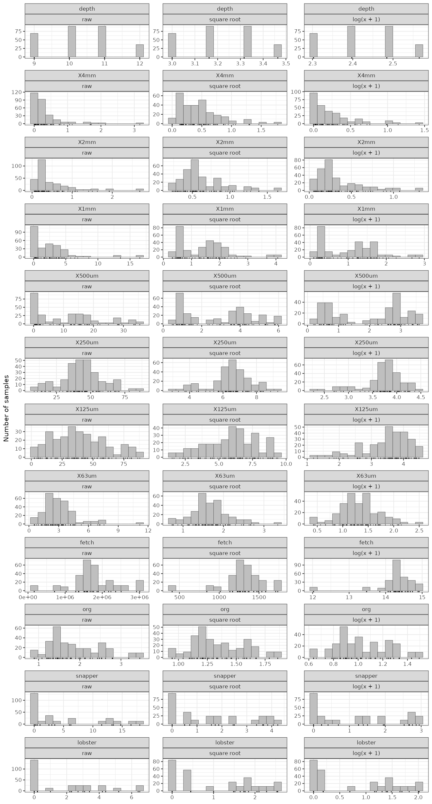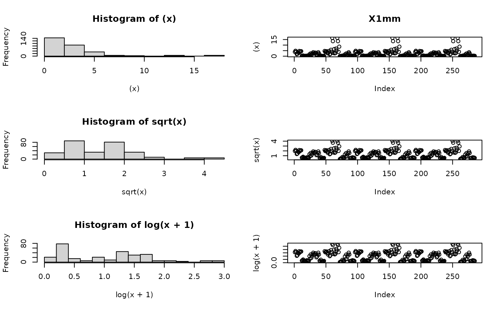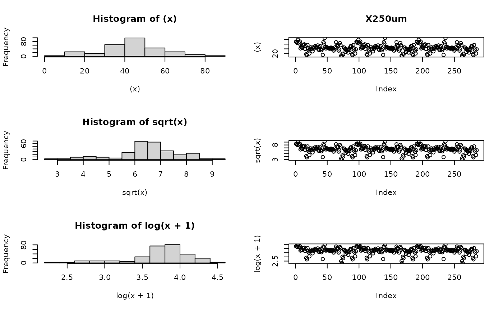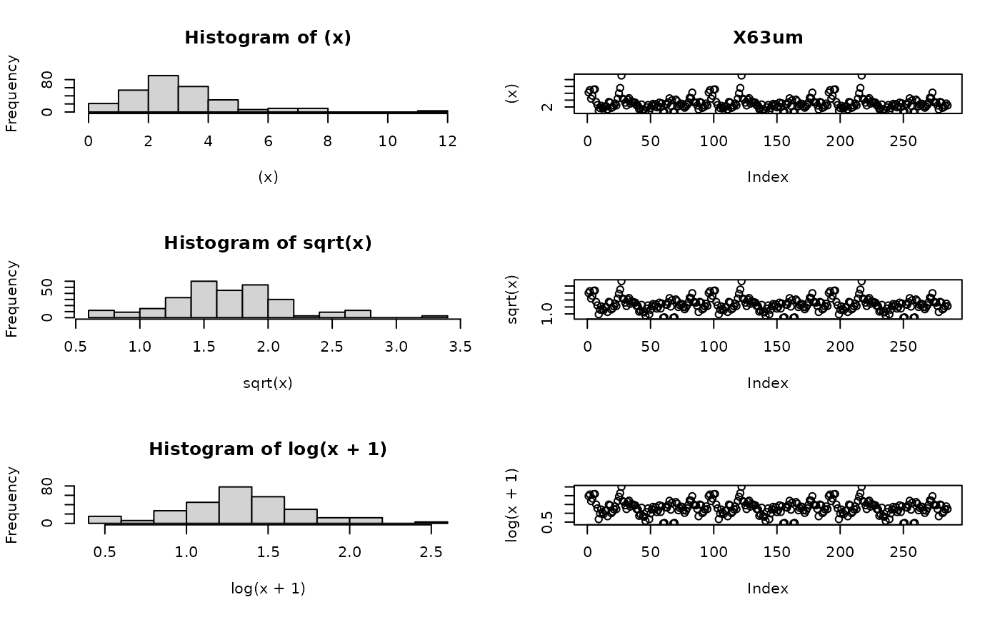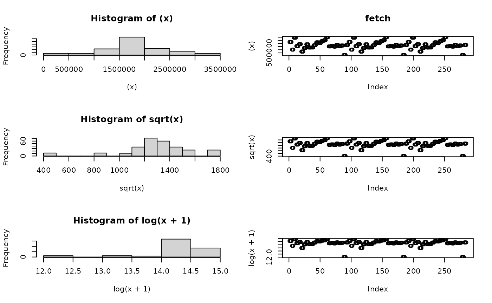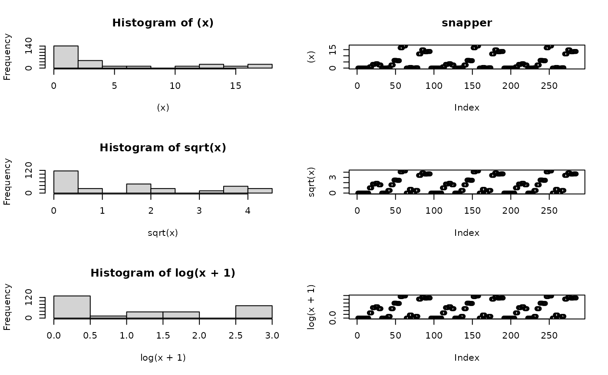

Review of individual predictors - we have to make sure they have an even
distribution.

If the data are squewed to low numbers try sqrt\>log or if skewed to
high numbers try ^2 of ^3 Decided that X4mm, X2mm, X1mm and X500um
needed a sqrt transformation

Decided Depth, x63um, InPreds and BioTurb were not informative
variables.

Re-set the predictors for modeling.

``` r

pred.vars=c("sqrt.X4mm","sqrt.X2mm","sqrt.X1mm","sqrt.X500um",
            "fetch","org","snapper","lobster") 
```

### Screening taxa

Check to make sure Response vector has not more than 80% zeros

``` r

unique.vars=unique(as.character(dat$Taxa))
unique.vars.use=character()
for(i in 1:length(unique.vars)){
  temp.dat=dat[which(dat$Taxa==unique.vars[i]),]
  if(length(which(temp.dat$response==0))/nrow(temp.dat)<0.8){
    unique.vars.use=c(unique.vars.use,unique.vars[i])}
}
unique.vars.use  
```

    ## [1] "BDS" "BMS" "CPN"

“BDS” bivalve Dosina subrosea

“BMS” bivalve Myadora striata

“CPN” crustacean Pagrus novaezelandiae

### Full subsets GAMM analysis

### Extract Model fits and importance

``` r

names(out.all)=resp.vars
names(var.imp)=resp.vars
all.mod.fits=do.call("rbind",out.all)
all.var.imp=do.call("rbind",var.imp)
```

``` r

knitr::kable(
  all.mod.fits,
  digits = 3,
  caption = "Summary of all fitted FSSgam models"
)
```

|  | modname | formula | AICc | BIC | r2.vals | r2.vals.unique | edf | edf.less.1 | delta.AICc | delta.BIC | wi.AICc | wi.BIC | sqrt.X4mm | sqrt.X2mm | sqrt.X1mm | sqrt.X500um | fetch | org | snapper | lobster | Status | Distance | cumsum.wi |
|:---|:---|:---|---:|---:|---:|---:|---:|---:|---:|---:|---:|---:|---:|---:|---:|---:|---:|---:|---:|---:|---:|---:|---:|
| BDS.Distance+fetch+sqrt.X4mm | Distance+fetch+sqrt.X4mm | s(fetch, k = 3, bs = “cr”) + s(sqrt.X4mm, k = 3, bs = “cr”) + Distance + s(Location, Site, bs = “re”) | 271.445 | 316.294 | 0.450 | NA | 22.36 | 0 | 0.000 | 0.000 | 0.468 | 0.548 | 1 | 0 | 0 | 0 | 1 | 0 | 0 | 0 | 0 | 1 | 0.468 |
| BDS.Distance+sqrt.X4mm+sqrt.X500um | Distance+sqrt.X4mm+sqrt.X500um | s(sqrt.X4mm, k = 3, bs = “cr”) + s(sqrt.X500um, k = 3, bs = “cr”) + Distance + s(Location, Site, bs = “re”) | 272.957 | 318.426 | 0.531 | NA | 23.13 | 0 | 1.512 | 2.131 | 0.220 | 0.189 | 1 | 0 | 0 | 1 | 0 | 0 | 0 | 0 | 0 | 1 | 0.688 |
| BMS.Distance+fetch.by.Status+Status | Distance+fetch.by.Status+Status | s(fetch, by = Status, k = 3, bs = “cr”) + Status + Distance + s(Location, Site, bs = “re”) | 152.755 | 191.090 | 0.115 | NA | 15.89 | 0 | 0.000 | 0.000 | 0.298 | 0.443 | 0 | 0 | 0 | 0 | 1 | 0 | 0 | 0 | 1 | 1 | 0.298 |
| BMS.fetch.by.Status+org.by.Status+Status | fetch.by.Status+org.by.Status+Status | s(fetch, by = Status, k = 3, bs = “cr”) + s(org, by = Status, k = 3, bs = “cr”) + Status + s(Location, Site, bs = “re”) | 152.953 | 193.987 | 0.116 | NA | 17.39 | 0 | 0.198 | 2.896 | 0.270 | 0.104 | 0 | 0 | 0 | 0 | 1 | 1 | 0 | 0 | 1 | 0 | 0.568 |
| BMS.Distance.t.Status+fetch.by.Status+Status | Distance.t.Status+fetch.by.Status+Status | s(fetch, by = Status, k = 3, bs = “cr”) + Distance + Status + s(Location, Site, bs = “re”) + Distance:Status | 153.709 | 193.381 | 0.115 | NA | 16.89 | 0 | 0.954 | 2.291 | 0.185 | 0.141 | 0 | 0 | 0 | 0 | 1 | 0 | 0 | 0 | 1 | 1 | 0.753 |
| CPN.Distance+sqrt.X4mm | Distance+sqrt.X4mm | s(sqrt.X4mm, k = 3, bs = “cr”) + Distance + s(Location, Site, bs = “re”) | 476.210 | 520.074 | 0.493 | NA | 20.90 | 0 | 0.000 | 1.735 | 0.059 | 0.029 | 1 | 0 | 0 | 0 | 0 | 0 | 0 | 0 | 0 | 1 | 0.059 |
| CPN.Distance+lobster+sqrt.X1mm | Distance+lobster+sqrt.X1mm | s(lobster, k = 3, bs = “cr”) + s(sqrt.X1mm, k = 3, bs = “cr”) + Distance + s(Location, Site, bs = “re”) | 476.377 | 518.340 | 0.444 | NA | 19.05 | 0 | 0.167 | 0.000 | 0.054 | 0.069 | 0 | 0 | 1 | 0 | 0 | 0 | 0 | 1 | 0 | 1 | 0.113 |
| CPN.Distance+fetch+sqrt.X4mm | Distance+fetch+sqrt.X4mm | s(fetch, k = 3, bs = “cr”) + s(sqrt.X4mm, k = 3, bs = “cr”) + Distance + s(Location, Site, bs = “re”) | 476.515 | 520.509 | 0.489 | NA | 21.06 | 0 | 0.306 | 2.169 | 0.051 | 0.023 | 1 | 0 | 0 | 0 | 1 | 0 | 0 | 0 | 0 | 1 | 0.164 |
| CPN.Distance+sqrt.X1mm | Distance+sqrt.X1mm | s(sqrt.X1mm, k = 3, bs = “cr”) + Distance + s(Location, Site, bs = “re”) | 476.800 | 518.816 | 0.454 | NA | 19.11 | 0 | 0.590 | 0.476 | 0.044 | 0.055 | 0 | 0 | 1 | 0 | 0 | 0 | 0 | 0 | 0 | 1 | 0.208 |
| CPN.Distance+snapper+sqrt.X1mm | Distance+snapper+sqrt.X1mm | s(snapper, k = 3, bs = “cr”) + s(sqrt.X1mm, k = 3, bs = “cr”) + Distance + s(Location, Site, bs = “re”) | 477.047 | 519.148 | 0.447 | NA | 19.14 | 0 | 0.837 | 0.809 | 0.039 | 0.046 | 0 | 0 | 1 | 0 | 0 | 0 | 1 | 0 | 0 | 1 | 0.247 |
| CPN.Distance+sqrt.X1mm+Status | Distance+sqrt.X1mm+Status | s(sqrt.X1mm, k = 3, bs = “cr”) + Status + Distance + s(Location, Site, bs = “re”) | 477.137 | 519.339 | 0.453 | NA | 19.28 | 0 | 0.927 | 0.999 | 0.037 | 0.042 | 0 | 0 | 1 | 0 | 0 | 0 | 0 | 0 | 1 | 1 | 0.284 |
| CPN.lobster+sqrt.X4mm | lobster+sqrt.X4mm | s(lobster, k = 3, bs = “cr”) + s(sqrt.X4mm, k = 3, bs = “cr”) + s(Location, Site, bs = “re”) | 477.723 | 520.201 | 0.467 | NA | 19.54 | 0 | 1.513 | 1.861 | 0.028 | 0.027 | 1 | 0 | 0 | 0 | 0 | 0 | 0 | 1 | 0 | 0 | 0.312 |
| CPN.lobster+sqrt.X4mm+sqrt.X500um | lobster+sqrt.X4mm+sqrt.X500um | s(lobster, k = 3, bs = “cr”) + s(sqrt.X4mm, k = 3, bs = “cr”) + s(sqrt.X500um, k = 3, bs = “cr”) + s(Location, Site, bs = “re”) | 477.817 | 520.638 | 0.462 | NA | 19.84 | 0 | 1.607 | 2.298 | 0.026 | 0.022 | 1 | 0 | 0 | 1 | 0 | 0 | 0 | 1 | 0 | 0 | 0.338 |
| CPN.sqrt.X4mm+sqrt.X500um | sqrt.X4mm+sqrt.X500um | s(sqrt.X4mm, k = 3, bs = “cr”) + s(sqrt.X500um, k = 3, bs = “cr”) + s(Location, Site, bs = “re”) | 478.086 | 520.941 | 0.474 | NA | 19.90 | 0 | 1.876 | 2.602 | 0.023 | 0.019 | 1 | 0 | 0 | 1 | 0 | 0 | 0 | 0 | 0 | 0 | 0.361 |
| CPN.sqrt.X4mm | sqrt.X4mm | s(sqrt.X4mm, k = 3, bs = “cr”) + s(Location, Site, bs = “re”) | 478.102 | 520.668 | 0.481 | NA | 19.66 | 0 | 1.892 | 2.328 | 0.023 | 0.022 | 1 | 0 | 0 | 0 | 0 | 0 | 0 | 0 | 0 | 0 | 0.384 |
| CPN.snapper+sqrt.X4mm | snapper+sqrt.X4mm | s(snapper, k = 3, bs = “cr”) + s(sqrt.X4mm, k = 3, bs = “cr”) + s(Location, Site, bs = “re”) | 478.114 | 520.688 | 0.471 | NA | 19.62 | 0 | 1.905 | 2.349 | 0.023 | 0.021 | 1 | 0 | 0 | 0 | 0 | 0 | 1 | 0 | 0 | 0 | 0.407 |
| CPN.snapper+sqrt.X4mm+sqrt.X500um | snapper+sqrt.X4mm+sqrt.X500um | s(snapper, k = 3, bs = “cr”) + s(sqrt.X4mm, k = 3, bs = “cr”) + s(sqrt.X500um, k = 3, bs = “cr”) + s(Location, Site, bs = “re”) | 478.130 | 521.011 | 0.464 | NA | 19.87 | 0 | 1.920 | 2.671 | 0.023 | 0.018 | 1 | 0 | 0 | 1 | 0 | 0 | 1 | 0 | 0 | 0 | 0.430 |
| CPN.fetch+lobster+sqrt.X4mm | fetch+lobster+sqrt.X4mm | s(fetch, k = 3, bs = “cr”) + s(lobster, k = 3, bs = “cr”) + s(sqrt.X4mm, k = 3, bs = “cr”) + s(Location, Site, bs = “re”) | 478.408 | 521.096 | 0.458 | NA | 19.68 | 0 | 2.198 | 2.757 | 0.020 | 0.017 | 1 | 0 | 0 | 0 | 1 | 0 | 0 | 1 | 0 | 0 | 0.450 |
| CPN.sqrt.X4mm+sqrt.X500um+Status | sqrt.X4mm+sqrt.X500um+Status | s(sqrt.X4mm, k = 3, bs = “cr”) + s(sqrt.X500um, k = 3, bs = “cr”) + Status + s(Location, Site, bs = “re”) | 478.458 | 521.494 | 0.472 | NA | 20.07 | 0 | 2.249 | 3.155 | 0.019 | 0.014 | 1 | 0 | 0 | 1 | 0 | 0 | 0 | 0 | 1 | 0 | 0.469 |
| CPN.sqrt.X4mm+Status | sqrt.X4mm+Status | s(sqrt.X4mm, k = 3, bs = “cr”) + Status + s(Location, Site, bs = “re”) | 478.476 | 521.218 | 0.478 | NA | 19.82 | 0 | 2.266 | 2.878 | 0.019 | 0.016 | 1 | 0 | 0 | 0 | 0 | 0 | 0 | 0 | 1 | 0 | 0.488 |
| CPN.Distance+sqrt.X1mm.by.Status+Status | Distance+sqrt.X1mm.by.Status+Status | s(sqrt.X1mm, by = Status, k = 3, bs = “cr”) + Status + Distance + s(Location, Site, bs = “re”) | 478.527 | 521.671 | 0.459 | NA | 20.19 | 0 | 2.317 | 3.331 | 0.018 | 0.013 | 0 | 0 | 1 | 0 | 0 | 0 | 0 | 0 | 1 | 1 | 0.506 |
| CPN.fetch+sqrt.X4mm | fetch+sqrt.X4mm | s(fetch, k = 3, bs = “cr”) + s(sqrt.X4mm, k = 3, bs = “cr”) + s(Location, Site, bs = “re”) | 478.561 | 521.328 | 0.476 | NA | 19.81 | 0 | 2.351 | 2.989 | 0.018 | 0.016 | 1 | 0 | 0 | 0 | 1 | 0 | 0 | 0 | 0 | 0 | 0.524 |
| CPN.Distance+sqrt.X500um | Distance+sqrt.X500um | s(sqrt.X500um, k = 3, bs = “cr”) + Distance + s(Location, Site, bs = “re”) | 478.635 | 520.898 | 0.476 | NA | 19.31 | 0 | 2.425 | 2.558 | 0.018 | 0.019 | 0 | 0 | 0 | 1 | 0 | 0 | 0 | 0 | 0 | 1 | 0.542 |
| CPN.Distance+lobster+sqrt.X2mm | Distance+lobster+sqrt.X2mm | s(lobster, k = 3, bs = “cr”) + s(sqrt.X2mm, k = 3, bs = “cr”) + Distance + s(Location, Site, bs = “re”) | 478.756 | 521.203 | 0.453 | NA | 19.53 | 0 | 2.546 | 2.864 | 0.016 | 0.017 | 0 | 1 | 0 | 0 | 0 | 0 | 0 | 1 | 0 | 1 | 0.558 |
| CPN.fetch+snapper+sqrt.X4mm | fetch+snapper+sqrt.X4mm | s(fetch, k = 3, bs = “cr”) + s(snapper, k = 3, bs = “cr”) + s(sqrt.X4mm, k = 3, bs = “cr”) + s(Location, Site, bs = “re”) | 478.776 | 521.622 | 0.465 | NA | 19.84 | 0 | 2.566 | 3.282 | 0.016 | 0.013 | 1 | 0 | 0 | 0 | 1 | 0 | 1 | 0 | 0 | 0 | 0.574 |
| CPN.Distance+snapper+sqrt.X500um | Distance+snapper+sqrt.X500um | s(snapper, k = 3, bs = “cr”) + s(sqrt.X500um, k = 3, bs = “cr”) + Distance + s(Location, Site, bs = “re”) | 478.801 | 521.110 | 0.466 | NA | 19.29 | 0 | 2.591 | 2.770 | 0.016 | 0.017 | 0 | 0 | 0 | 1 | 0 | 0 | 1 | 0 | 0 | 1 | 0.590 |
| CPN.fetch+sqrt.X4mm+Status | fetch+sqrt.X4mm+Status | s(fetch, k = 3, bs = “cr”) + s(sqrt.X4mm, k = 3, bs = “cr”) + Status + s(Location, Site, bs = “re”) | 478.978 | 521.900 | 0.471 | NA | 19.93 | 0 | 2.768 | 3.560 | 0.015 | 0.012 | 1 | 0 | 0 | 0 | 1 | 0 | 0 | 0 | 1 | 0 | 0.605 |
| CPN.lobster+sqrt.X1mm | lobster+sqrt.X1mm | s(lobster, k = 3, bs = “cr”) + s(sqrt.X1mm, k = 3, bs = “cr”) + s(Location, Site, bs = “re”) | 479.069 | 519.525 | 0.420 | NA | 17.72 | 0 | 2.859 | 1.185 | 0.014 | 0.038 | 0 | 0 | 1 | 0 | 0 | 0 | 0 | 1 | 0 | 0 | 0.619 |
| CPN.Distance | Distance | Distance + s(Location, Site, bs = “re”) | 479.081 | 521.261 | 0.483 | NA | 19.27 | 0 | 2.871 | 2.921 | 0.014 | 0.016 | 0 | 0 | 0 | 0 | 0 | 0 | 0 | 0 | 0 | 1 | 0.633 |
| CPN.Distance+sqrt.X500um+Status | Distance+sqrt.X500um+Status | s(sqrt.X500um, k = 3, bs = “cr”) + Status + Distance + s(Location, Site, bs = “re”) | 479.123 | 521.614 | 0.474 | NA | 19.51 | 0 | 2.913 | 3.275 | 0.014 | 0.013 | 0 | 0 | 0 | 1 | 0 | 0 | 0 | 0 | 1 | 1 | 0.647 |
| CPN.Distance+snapper | Distance+snapper | s(snapper, k = 3, bs = “cr”) + Distance + s(Location, Site, bs = “re”) | 479.210 | 521.419 | 0.474 | NA | 19.23 | 0 | 3.000 | 3.080 | 0.013 | 0.015 | 0 | 0 | 0 | 0 | 0 | 0 | 1 | 0 | 0 | 1 | 0.660 |

Summary of all fitted FSSgam models {.table}

``` r

knitr::kable(
  all.var.imp,
  digits = 3,
  caption = "Variable importance scores across response variables"
)
```

|  | sqrt.X4mm | sqrt.X2mm | sqrt.X1mm | sqrt.X500um | fetch | org | snapper | lobster | Status | Distance |
|:---|---:|---:|---:|---:|---:|---:|---:|---:|---:|---:|
| BDS | 0.958 | 0.000 | 0.000 | 0.220 | 0.468 | 0.043 | 0.049 | 0.061 | 0.164 | 1.001 |
| BMS | 0.056 | 0.000 | 0.001 | 0.003 | 0.967 | 0.340 | 0.001 | 0.035 | 0.924 | 0.573 |
| CPN | 0.410 | 0.074 | 0.260 | 0.183 | 0.210 | 0.061 | 0.194 | 0.193 | 0.223 | 0.472 |

Variable importance scores across response variables {.table
style="width:100%;"}

### Variable importance

``` r

heatmap.2(
  all.var.imp,
  dendrogram = "none",
  col = colorRampPalette(c("white", "yellow", "red"))(10),
  trace = "none",
  key = TRUE,
  notecol = "black",
  sepcolor = "black",
  margins = c(6, 4),
  Rowv = FALSE,
  Colv = FALSE
)
```

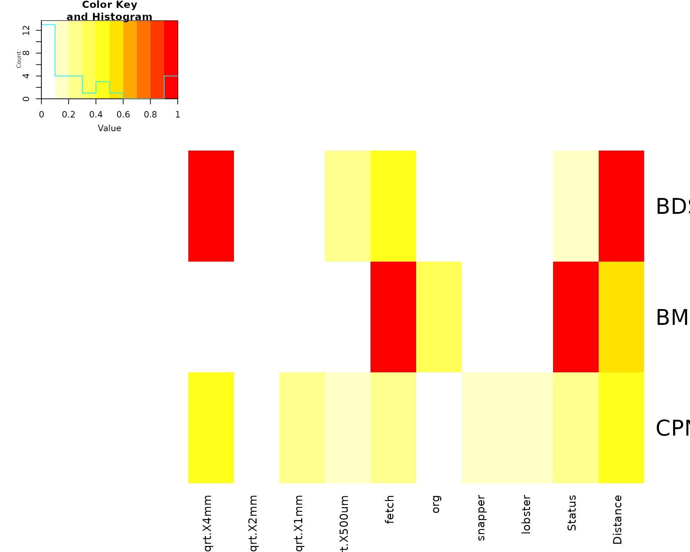

## Part 2 - custom plot of importance scores

``` r

dat.taxa <- all.var.imp |>
  as.data.frame() |>
  tibble::rownames_to_column("resp.var") |>
  pivot_longer(
    cols = -resp.var,
    names_to = "predictor",
    values_to = "importance"
  ) |>
  glimpse()
```

    ## Rows: 30
    ## Columns: 3
    ## $ resp.var   <chr> "BDS", "BDS", "BDS", "BDS", "BDS", "BDS", "BDS", "BDS", "BD…
    ## $ predictor  <chr> "sqrt.X4mm", "sqrt.X2mm", "sqrt.X1mm", "sqrt.X500um", "fetc…
    ## $ importance <dbl> 0.958, 0.000, 0.000, 0.220, 0.468, 0.043, 0.049, 0.061, 0.1…

``` r

gg.importance.scores
```


## Part 3 - plots of the most parsimonious models

Make an suitable theme

``` r

Theme1 <- theme(
  panel.grid.major = element_blank(),
  panel.grid.minor = element_blank(),
  legend.background = element_blank(),
  legend.key = element_blank(),
  legend.text = element_text(size = 15),
  legend.title = element_blank(),
  legend.position = c(0.2, 0.8),
  text = element_text(size = 15),
  strip.text.y = element_text(size = 15, angle = 0),
  axis.title.x = element_text(vjust = 0.3, size = 15),
  axis.title.y = element_text(vjust = 0.6, angle = 90, size = 15),
  axis.text.x = element_text(size = 15),
  axis.text.y = element_text(size = 15),
  axis.line.x = element_line(colour = "black", linewidth = 0.5, linetype = "solid"),
  axis.line.y = element_line(colour = "black", linewidth = 0.5, linetype = "solid"),
  strip.background = element_blank()
)
name<-"clams"
```

Manually make the most parsimonious GAM models for each taxa

### MODEL Bivalve.Dosina.subrosea 500um + Distance x Status

``` r

dat.bds<-dat%>%filter(Taxa=="BDS")
gamm=gam(response~s(sqrt.X500um,k=3,bs='cr')+s(Distance,k=1,bs='cr', by=Status)+ s(Location,Site,bs="re")+ Status, family=tw(),data=dat.bds)
```

Predict - status from MODEL Bivalve.Dosina.subrosea—-

``` r

mod<-gamm
testdata <- expand.grid(Distance=mean(mod$model$Distance),
                        sqrt.X500um=mean(mod$model$sqrt.X500um),
                        Location=(mod$model$Location),
                        Site=(mod$model$Site),
                        Status = c("Fished","No-take"))%>%
  distinct()%>%
  glimpse()
```

    ## Rows: 144
    ## Columns: 5
    ## $ Distance    <dbl> 12.97895, 12.97895, 12.97895, 12.97895, 12.97895, 12.97895…
    ## $ sqrt.X500um <dbl> 2.855525, 2.855525, 2.855525, 2.855525, 2.855525, 2.855525…
    ## $ Location    <fct> Hahei, Leigh, Tawharanui, Hahei, Leigh, Tawharanui, Hahei,…
    ## $ Site        <fct> Cooks Beach Inner, Cooks Beach Inner, Cooks Beach Inner, C…
    ## $ Status      <fct> Fished, Fished, Fished, Fished, Fished, Fished, Fished, Fi…

``` r

fits <- predict.gam(mod, newdata=testdata, type='response', se.fit=T)

predicts.bds.status = testdata%>%data.frame(fits)%>%
  group_by(Status)%>% #only change here
  summarise(response=mean(fit),se.fit=mean(se.fit))%>%
  ungroup()

predicts.bds.status %>%
  glimpse()
```

    ## Rows: 2
    ## Columns: 3
    ## $ Status   <fct> Fished, No-take
    ## $ response <dbl> 2.8646047, 0.7276123
    ## $ se.fit   <dbl> 2.390011, 0.619802

predict - Distance.x.status from MODEL Bivalve.Dosina.subrosea—-

``` r

mod<-gamm
testdata <- expand.grid(Distance=seq(min(dat$Distance),max(dat$Distance),length.out = 20),
                        sqrt.X500um=mean(mod$model$sqrt.X500um),
                        Location=(mod$model$Location),
                        Site=(mod$model$Site),
                        Status = c("Fished","No-take"))%>%
  distinct()%>%
  glimpse()
```

    ## Rows: 2,880
    ## Columns: 5
    ## $ Distance    <dbl> 2.000000, 3.473684, 4.947368, 6.421053, 7.894737, 9.368421…
    ## $ sqrt.X500um <dbl> 2.855525, 2.855525, 2.855525, 2.855525, 2.855525, 2.855525…
    ## $ Location    <fct> Hahei, Hahei, Hahei, Hahei, Hahei, Hahei, Hahei, Hahei, Ha…
    ## $ Site        <fct> Cooks Beach Inner, Cooks Beach Inner, Cooks Beach Inner, C…
    ## $ Status      <fct> Fished, Fished, Fished, Fished, Fished, Fished, Fished, Fi…

``` r

fits <- predict.gam(mod, newdata=testdata, type='response', se.fit=T)

predicts.bds.Distance.x.status = testdata%>%data.frame(fits)%>%
  group_by(Distance,Status)%>% 
  summarise(response=mean(fit),se.fit=mean(se.fit))%>%
  ungroup()
predicts.bds.Distance.x.status |> 
  glimpse()
```

    ## Rows: 40
    ## Columns: 4
    ## $ Distance <dbl> 2.000000, 2.000000, 3.473684, 3.473684, 4.947368, 4.947368, 6…
    ## $ Status   <fct> Fished, No-take, Fished, No-take, Fished, No-take, Fished, No…
    ## $ response <dbl> 2.0505723, 0.4356395, 2.1446873, 0.4666912, 2.2431218, 0.4999…
    ## $ se.fit   <dbl> 1.7306685, 0.3823930, 1.8058795, 0.4073529, 1.8848049, 0.4341…

Predict 500um from MODEL Bivalve.Dosina.subrosea—-

``` r

mod<-gamm
testdata <- expand.grid(sqrt.X500um=seq(min(dat$sqrt.X500um),max(dat$sqrt.X500um),length.out = 20),
                        Distance=mean(mod$model$Distance),
                        Location=(mod$model$Location),
                        Site=(mod$model$Site),
                        Status = c("Fished","No-take"))%>%
  distinct()%>%
  glimpse()
```

    ## Rows: 2,880
    ## Columns: 5
    ## $ sqrt.X500um <dbl> 0.4630875, 0.7521858, 1.0412841, 1.3303825, 1.6194808, 1.9…
    ## $ Distance    <dbl> 12.97895, 12.97895, 12.97895, 12.97895, 12.97895, 12.97895…
    ## $ Location    <fct> Hahei, Hahei, Hahei, Hahei, Hahei, Hahei, Hahei, Hahei, Ha…
    ## $ Site        <fct> Cooks Beach Inner, Cooks Beach Inner, Cooks Beach Inner, C…
    ## $ Status      <fct> Fished, Fished, Fished, Fished, Fished, Fished, Fished, Fi…

``` r

fits <- predict.gam(mod, newdata=testdata, type='response', se.fit=T)

predicts.bds.500um = testdata%>%data.frame(fits)%>%
  group_by(sqrt.X500um)%>% 
  summarise(response=mean(fit),se.fit=mean(se.fit))%>%
  ungroup()
predicts.bds.500um %>%
  glimpse()
```

    ## Rows: 20
    ## Columns: 3
    ## $ sqrt.X500um <dbl> 0.4630875, 0.7521858, 1.0412841, 1.3303825, 1.6194808, 1.9…
    ## $ response    <dbl> 4.6448757, 4.1410544, 3.6918819, 3.2914306, 2.9344158, 2.6…
    ## $ se.fit      <dbl> 4.0647102, 3.5813495, 3.1606276, 2.7942131, 2.4748134, 2.1…

### MODEL Bivalve.Myadora.striata Lobster

``` r

dat.bms<-dat%>%filter(Taxa=="BMS")
head(dat.bms,2)
```

    ##    sediment Location Status              Site Distance depth    X4mm    X2mm
    ## 1 -3.262500    Hahei Fished Cooks Beach Inner        2    12 3.16462 1.41119
    ## 2 -3.483828    Hahei Fished Cooks Beach Inner        5    12 1.69129 1.62811
    ##      X1mm  X500um   X250um  X125um   X63um   fetch     org snapper lobster
    ## 1 3.88962 8.69694 70.31984 6.19663 6.25038 2232582 3.45785       0       0
    ## 2 4.86726 9.92831 69.18594 5.70317 6.92941 2232582 3.19104       0       0
    ##   InPreds   BioTurb Taxa response sqrt.X4mm sqrt.X2mm sqrt.X1mm sqrt.X500um
    ## 1       0 0.1666667  BMS        6  1.778938  1.187935  1.972212    2.949057
    ## 2       0 0.1666667  BMS        4  1.300496  1.275974  2.206187    3.150922

``` r

gamm=gam(response~s(lobster,k=3,bs='cr')+ s(Location,Site,bs="re"), family=tw(),data=dat.bms)

# predict - lobster from model for Bivalve.Myadora.striata ----
mod<-gamm
testdata <- expand.grid(lobster=seq(min(dat$lobster),max(dat$lobster),length.out = 20),
                        Location=(mod$model$Location),
                        Site=(mod$model$Site),
                        Status = c("Fished","No-take"))%>%
  distinct()%>%
  glimpse()
```

    ## Rows: 2,880
    ## Columns: 4
    ## $ lobster  <dbl> 0.0000000, 0.3421053, 0.6842105, 1.0263158, 1.3684211, 1.7105…
    ## $ Location <fct> Hahei, Hahei, Hahei, Hahei, Hahei, Hahei, Hahei, Hahei, Hahei…
    ## $ Site     <fct> Cooks Beach Inner, Cooks Beach Inner, Cooks Beach Inner, Cook…
    ## $ Status   <fct> Fished, Fished, Fished, Fished, Fished, Fished, Fished, Fishe…

``` r

fits <- predict.gam(mod, newdata=testdata, type='response', se.fit=T)
predicts.bms.lobster = testdata%>%data.frame(fits)%>%
  group_by(lobster)%>% 
  summarise(response=mean(fit),se.fit=mean(se.fit))%>%
  ungroup()

predicts.bms.lobster %>%
  glimpse()
```

    ## Rows: 20
    ## Columns: 3
    ## $ lobster  <dbl> 0.0000000, 0.3421053, 0.6842105, 1.0263158, 1.3684211, 1.7105…
    ## $ response <dbl> 1.93534254, 1.56507086, 1.26563993, 1.02349643, 0.82768005, 0…
    ## $ se.fit   <dbl> 1.73352921, 1.38496562, 1.11267638, 0.89887748, 0.72994634, 0…

### MODEL Decapod.P.novazelandiae 4mm + Lobster

``` r

dat.cpn<-dat%>%filter(Taxa=="CPN")
head(dat.cpn,2)
```

    ##    sediment Location Status              Site Distance depth    X4mm    X2mm
    ## 1 -3.262500    Hahei Fished Cooks Beach Inner        2    12 3.16462 1.41119
    ## 2 -3.483828    Hahei Fished Cooks Beach Inner        5    12 1.69129 1.62811
    ##      X1mm  X500um   X250um  X125um   X63um   fetch     org snapper lobster
    ## 1 3.88962 8.69694 70.31984 6.19663 6.25038 2232582 3.45785       0       0
    ## 2 4.86726 9.92831 69.18594 5.70317 6.92941 2232582 3.19104       0       0
    ##   InPreds   BioTurb Taxa response sqrt.X4mm sqrt.X2mm sqrt.X1mm sqrt.X500um
    ## 1       0 0.1666667  CPN        3  1.778938  1.187935  1.972212    2.949057
    ## 2       0 0.1666667  CPN       11  1.300496  1.275974  2.206187    3.150922

``` r

gamm=gam(response~s(sqrt.X4mm,k=3,bs='cr')+s(lobster,k=3,bs='cr')+ s(Location,Site,bs="re"), family=tw(),data=dat.cpn)
```

Predict - sqrt.X4mm from model for Decapod.P.novazelandiae —-

``` r

mod<-gamm
testdata <- expand.grid(sqrt.X4mm=seq(min(dat$sqrt.X4mm),max(dat$sqrt.X4mm),length.out = 20),
                        lobster=mean(mod$model$lobster),
                        Location=(mod$model$Location),
                        Site=(mod$model$Site),
                        Status = c("Fished","No-take"))%>%
  distinct()%>%
  glimpse()
```

    ## Rows: 2,880
    ## Columns: 5
    ## $ sqrt.X4mm <dbl> 0.00000000, 0.09362831, 0.18725662, 0.28088493, 0.37451324, …
    ## $ lobster   <dbl> 1.909474, 1.909474, 1.909474, 1.909474, 1.909474, 1.909474, …
    ## $ Location  <fct> Hahei, Hahei, Hahei, Hahei, Hahei, Hahei, Hahei, Hahei, Hahe…
    ## $ Site      <fct> Cooks Beach Inner, Cooks Beach Inner, Cooks Beach Inner, Coo…
    ## $ Status    <fct> Fished, Fished, Fished, Fished, Fished, Fished, Fished, Fish…

``` r

fits <- predict.gam(mod, newdata=testdata, type='response', se.fit=T)
predicts.cpn.4mm = testdata%>%data.frame(fits)%>%
  group_by(sqrt.X4mm)%>% #only change here
  summarise(response=mean(fit),se.fit=mean(se.fit))%>%
  ungroup()
predicts.cpn.4mm %>%
  glimpse()
```

    ## Rows: 20
    ## Columns: 3
    ## $ sqrt.X4mm <dbl> 0.00000000, 0.09362831, 0.18725662, 0.28088493, 0.37451324, …
    ## $ response  <dbl> 4.822420, 4.499149, 4.197548, 3.916164, 3.653641, 3.408715, …
    ## $ se.fit    <dbl> 3.235051, 2.979428, 2.751207, 2.547690, 2.366325, 2.204703, …

Predict - lobster from model for Decapod.P.novazelandiae —-

``` r

mod<-gamm
testdata <- expand.grid(lobster=seq(min(dat$lobster),max(dat$lobster),length.out = 20),
                        sqrt.X4mm=mean(mod$model$sqrt.X4mm),
                        Location=(mod$model$Location),
                        Site=(mod$model$Site),
                        Status = c("Fished","No-take"))%>%
  distinct()%>%
  glimpse()
```

    ## Rows: 2,880
    ## Columns: 5
    ## $ lobster   <dbl> 0.0000000, 0.3421053, 0.6842105, 1.0263158, 1.3684211, 1.710…
    ## $ sqrt.X4mm <dbl> 0.4572685, 0.4572685, 0.4572685, 0.4572685, 0.4572685, 0.457…
    ## $ Location  <fct> Hahei, Hahei, Hahei, Hahei, Hahei, Hahei, Hahei, Hahei, Hahe…
    ## $ Site      <fct> Cooks Beach Inner, Cooks Beach Inner, Cooks Beach Inner, Coo…
    ## $ Status    <fct> Fished, Fished, Fished, Fished, Fished, Fished, Fished, Fish…

``` r

fits <- predict.gam(mod, newdata=testdata, type='response', se.fit=T)
predicts.cpn.lobster = testdata%>%data.frame(fits)%>%
  group_by(lobster)%>% 
  summarise(response=mean(fit),se.fit=mean(se.fit))%>%
  ungroup()
predicts.cpn.lobster %>%
  glimpse()
```

    ## Rows: 20
    ## Columns: 3
    ## $ lobster  <dbl> 0.0000000, 0.3421053, 0.6842105, 1.0263158, 1.3684211, 1.7105…
    ## $ response <dbl> 4.560408, 4.334946, 4.120627, 3.916900, 3.723238, 3.539142, 3…
    ## $ se.fit   <dbl> 3.038395, 2.857564, 2.693471, 2.544742, 2.410040, 2.288081, 2…

### PLOTS for Bivalve.Dosina.subrosea 500um + Distance x Status

``` r

ggmod.bds.status<- ggplot(aes(x=Status,y=response,fill=Status,colour=Status), data=predicts.bds.status) +
  ylab(" ")+
  xlab('Status')+
  scale_fill_manual(labels = c("Fished", "No-take"),values=c("red", "black"))+
  scale_colour_manual(labels = c("Fished", "No-take"),values=c("red", "black"))+
  scale_x_discrete(limits = rev(levels(predicts.bds.status$Status)))+
  geom_bar(stat = "identity")+
  geom_errorbar(aes(ymin = response-se.fit,ymax = response+se.fit),width = 0.5) +
  theme_classic()+
  Theme1+
  annotate("text", x = -Inf, y=Inf, label = "(a)",vjust = 1, hjust = -.1,size=5)+
  annotate("text", x = -Inf, y=Inf, label = "   Dosinia subrosea",vjust = 1, hjust = -.1,size=5,fontface="italic")
ggmod.bds.status
```

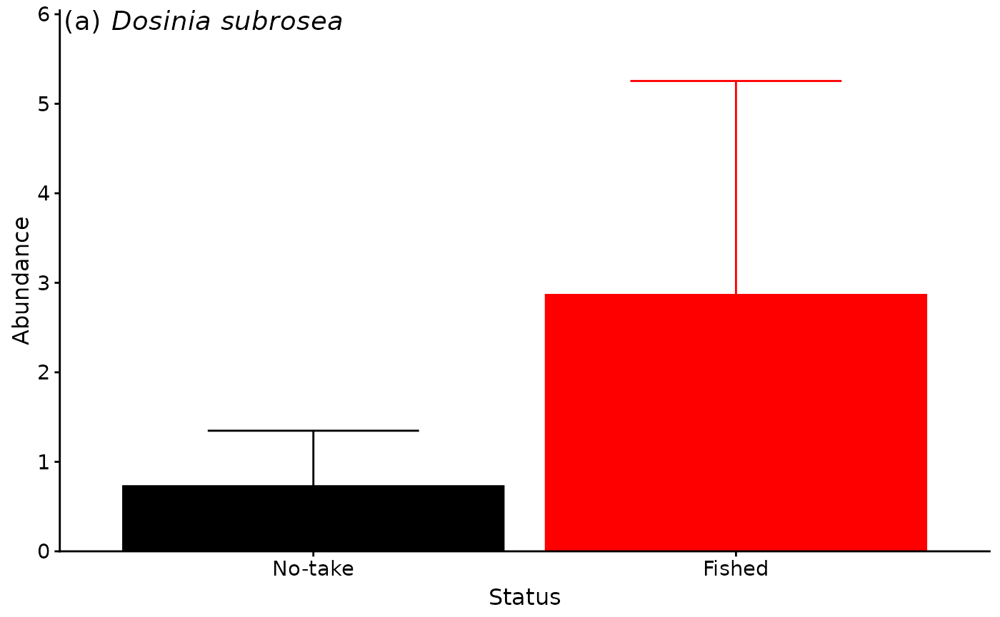

``` r

ggmod.bds.Distance.x.status<- ggplot(aes(x=Distance,y=response,colour=Status), data=dat.bds) +
  ylab(" ")+
  xlab('Distance (m)')+
  scale_color_manual(labels = c("Fished", "No-take"),values=c("red", "black"))+
  geom_jitter(width = 0.25,height = 0,alpha=0.75, size=2,show.legend=FALSE)+
  # geom_point(alpha=0.75, size=2)+
  geom_line(data=predicts.bds.Distance.x.status,show.legend=FALSE)+
  geom_line(data=predicts.bds.Distance.x.status,aes(y=response - se.fit),linetype="dashed",show.legend=FALSE)+
  geom_line(data=predicts.bds.Distance.x.status,aes(y=response + se.fit),linetype="dashed",show.legend=FALSE)+
  theme_classic()+
  Theme1+
  annotate("text", x = -Inf, y=Inf, label = "(b)",vjust = 1, hjust = -.1,size=5)
ggmod.bds.Distance.x.status
```

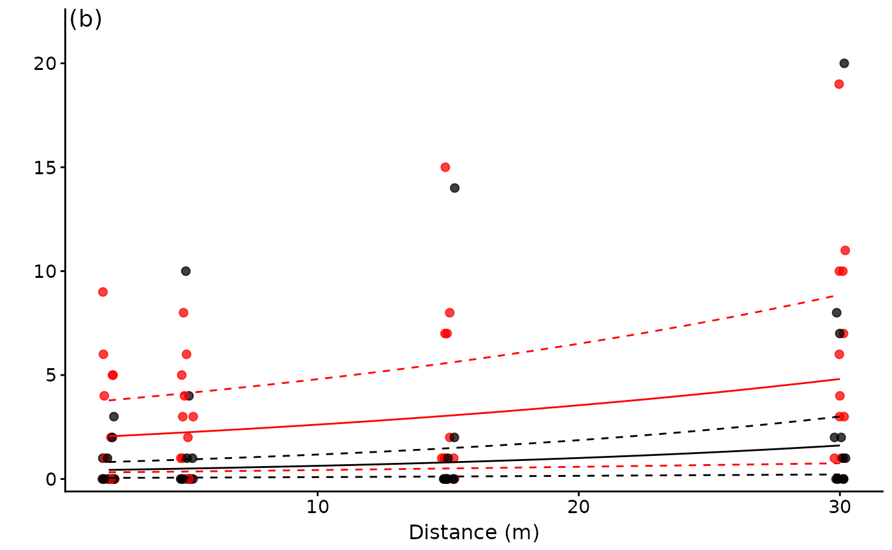

``` r

ggmod.bds.500um<- ggplot() +
  ylab(" ")+
  xlab('Grain size: 500 um (sqrt)')+
  scale_color_manual(labels = c("Fished", "No-take"),values=c("red", "black"))+
  geom_point(data=dat.bds,aes(x=sqrt.X500um,y=response,colour=Status),  alpha=0.75, size=2,show.legend=FALSE)+
  geom_line(data=predicts.bds.500um,aes(x=sqrt.X500um,y=response),alpha=0.5)+
  geom_line(data=predicts.bds.500um,aes(x=sqrt.X500um,y=response - se.fit),linetype="dashed",alpha=0.5)+
  geom_line(data=predicts.bds.500um,aes(x=sqrt.X500um,y=response + se.fit),linetype="dashed",alpha=0.5)+
  theme_classic()+
  Theme1+
  annotate("text", x = -Inf, y=Inf, label = "(c)",vjust = 1, hjust = -.1,size=5)
ggmod.bds.500um
```

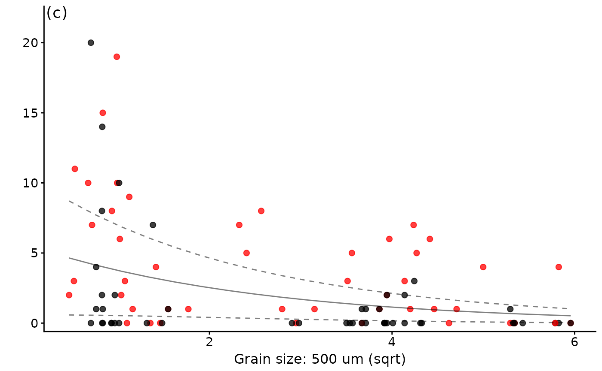

### PLOTS Bivalve M.striata lobster

``` r

ggmod.bms.lobster<- ggplot() +
  ylab("Abundance")+
  xlab(bquote('Density of legal lobster (no./25' *m^-2*')'))+
  scale_color_manual(labels = c("Fished", "SZ"),values=c("red", "black"))+
  geom_point(data=dat.bms,aes(x=lobster,y=response,colour=Status),  alpha=0.75, size=2,show.legend=FALSE)+
  geom_line(data=predicts.bms.lobster,aes(x=lobster,y=response),alpha=0.5)+
  geom_line(data=predicts.bms.lobster,aes(x=lobster,y=response - se.fit),linetype="dashed",alpha=0.5)+
  geom_line(data=predicts.bms.lobster,aes(x=lobster,y=response + se.fit),linetype="dashed",alpha=0.5)+
  theme_classic()+
  Theme1+
  annotate("text", x = -Inf, y=Inf, label = "(d)",vjust = 1, hjust = -.1,size=5)+
  annotate("text", x = -Inf, y=Inf, label = "   Myadora striata",vjust = 1, hjust = -.1,size=5,fontface="italic")+
  geom_blank(data=dat.bms,aes(x=lobster,y=response*1.05))#to nudge data off annotations
ggmod.bms.lobster
```


### PLOTS Decapod.P.novazelandiae 4mm + lobster

``` r

ggmod.cpn.lobster<- ggplot() +
  ylab(" ")+
  xlab(bquote('Density of legal lobster (no./25' *m^-2*')'))+
  scale_color_manual(labels = c("Fished", "SZ"),values=c("red", "black"))+
  geom_point(data=dat.cpn,aes(x=lobster,y=response,colour=Status),  alpha=0.75, size=2,show.legend=FALSE)+
  geom_line(data=predicts.cpn.lobster,aes(x=lobster,y=response),alpha=0.5)+
  geom_line(data=predicts.cpn.lobster,aes(x=lobster,y=response - se.fit),linetype="dashed",alpha=0.5)+
  geom_line(data=predicts.cpn.lobster,aes(x=lobster,y=response + se.fit),linetype="dashed",alpha=0.5)+
  theme_classic()+
  Theme1+
  annotate("text", x = -Inf, y=Inf, label = "(e)",vjust = 1, hjust = -.1,size=5)+
  annotate("text", x = -Inf, y=Inf, label = "  Pagurus novizelandiae",vjust = 1, hjust = -.1,size=5,fontface="italic")+
  geom_blank(data=dat.cpn,aes(x=lobster,y=response*1.05))#to nudge data off annotations
ggmod.cpn.lobster
```

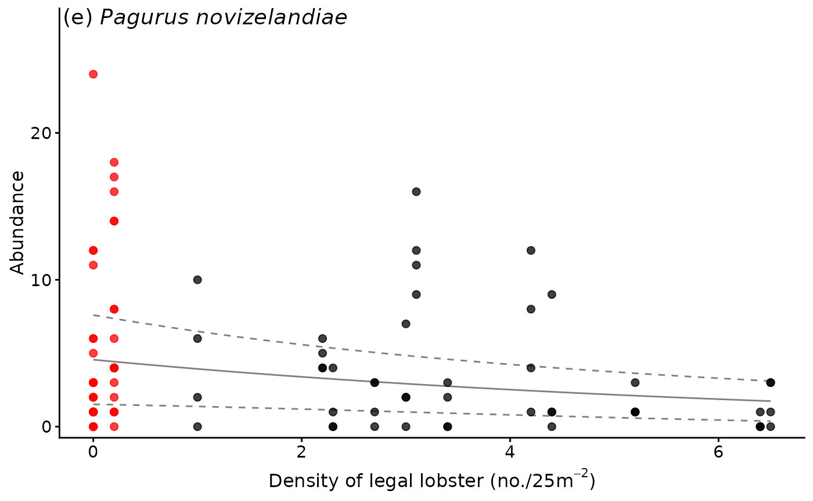

``` r

ggmod.cpn.4mm<- ggplot() +
  ylab(" ")+
  xlab('Grain size: 4 mm (sqrt)')+
  scale_color_manual(labels = c("Fished", "No-take"),values=c("red", "black"))+
  geom_point(data=dat.cpn,aes(x=sqrt.X4mm,y=response,colour=Status),  alpha=0.75, size=2,show.legend=FALSE)+
  geom_line(data=predicts.cpn.4mm,aes(x=sqrt.X4mm,y=response),alpha=0.5)+
  geom_line(data=predicts.cpn.4mm,aes(x=sqrt.X4mm,y=response - se.fit),linetype="dashed",alpha=0.5)+
  geom_line(data=predicts.cpn.4mm,aes(x=sqrt.X4mm,y=response + se.fit),linetype="dashed",alpha=0.5)+
  theme_classic()+
  Theme1+
  annotate("text", x = -Inf, y=Inf, label = "(f)",vjust = 1, hjust = -.1,size=5)+
  annotate("text", x = -Inf, y=Inf, label = " ",vjust = 1, hjust = -.1,size=5,fontface="italic")
ggmod.cpn.4mm
```


Combined.plot using grid() and gridExtra()

To see what they will look like use grid.arrange() - make sure Plot
window is large enough! - or will error!

``` r

blank <- grid.rect(gp=gpar(col="white"))
```

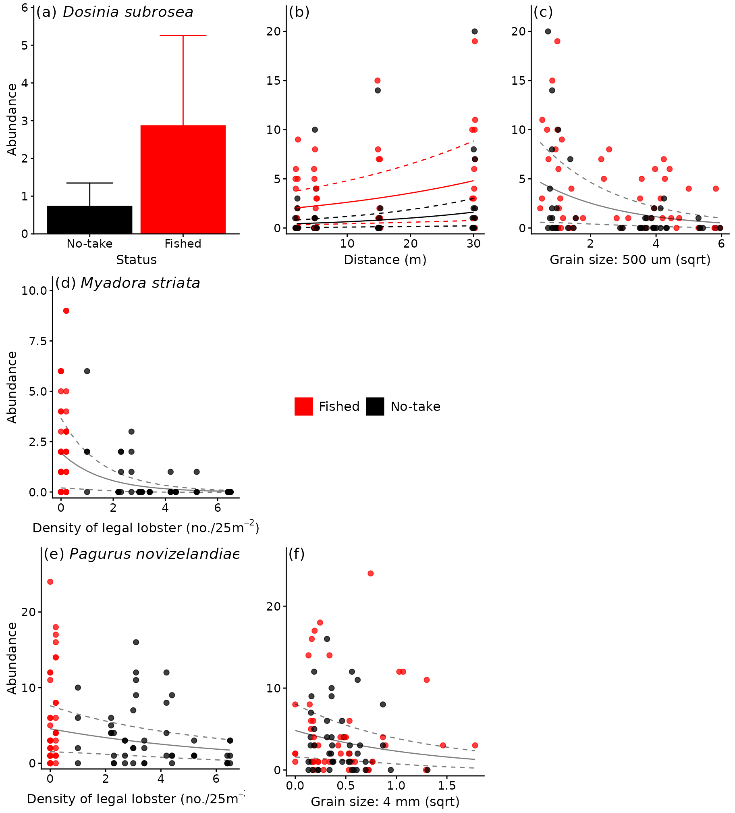

``` r

grid.arrange(ggmod.bds.status,ggmod.bds.Distance.x.status,ggmod.bds.500um,
             ggmod.bms.lobster,blank,blank,
             ggmod.cpn.lobster,ggmod.cpn.4mm,blank,nrow=3,ncol=3)
```

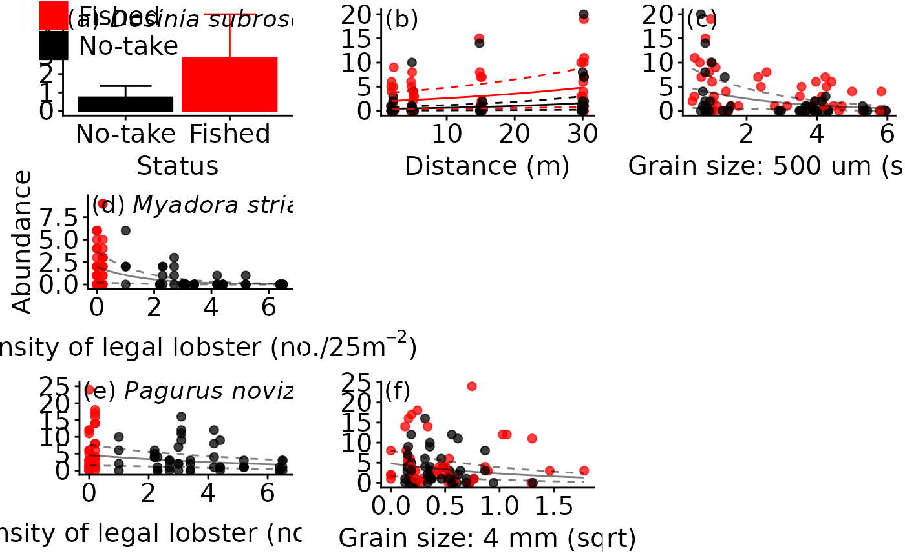

Use arrangeGrob ONLY - as we can pass this to ggsave! Note use of raw
ggplot’s

``` r

combine.plot<-arrangeGrob(ggmod.bds.status,ggmod.bds.Distance.x.status,ggmod.bds.500um,
                          ggmod.bms.lobster,blank,blank,
                          ggmod.cpn.lobster,ggmod.cpn.4mm,blank,nrow=3,ncol=3)


combine.plot
```

    ## TableGrob (3 x 3) "arrange": 9 grobs
    ##   z     cells    name                grob
    ## 1 1 (1-1,1-1) arrange      gtable[layout]
    ## 2 2 (1-1,2-2) arrange      gtable[layout]
    ## 3 3 (1-1,3-3) arrange      gtable[layout]
    ## 4 4 (2-2,1-1) arrange      gtable[layout]
    ## 5 5 (2-2,2-2) arrange rect[GRID.rect.299]
    ## 6 6 (2-2,3-3) arrange rect[GRID.rect.299]
    ## 7 7 (3-3,1-1) arrange      gtable[layout]
    ## 8 8 (3-3,2-2) arrange      gtable[layout]
    ## 9 9 (3-3,3-3) arrange rect[GRID.rect.299]

## Results and discussion

The most parsimonious model for the bivalve *Dosinia subrosea* included
the interaction of distance from reef with NTR status and the 500 um
sediment grain size fraction, which (along with random site effects)
explained 52% of its distribution (see the model summary table above).
While fetch occurred in the second top model, importance scores
indicated that it was relatively unimportant compared to distance and
NTR status (see the variable importance heatmap above). The abundance of
*D. subrosea* was negatively correlated with increasing proportion of
the 500 um sediment grain size fraction and positively correlated with
increasing distance from the reef edge (see the plots above). Subsequent
manipulative studies have found that *D. subrosea* are readily preyed
upon by the large-bodied rock lobster in the field (Langlois, Anderson,
Babcock, et al. 2006) and laboratory (Langlois, Anderson, Brock, et al.
2006), supporting the results of this analysis.

NTR status, distance and organic content were found to be important
across all possible models explaining the abundance of *Myadora
striata*, and had strong model support according to AICc. However a
simpler model of decreasing abundance of *M. striata* with increasing
density of legal-sized rock lobster was the most parsimonious model
within 2 AICc, and had relatively high model support based on BIC. A
direct relationship with the density of legal-sized rock lobster is
consistent with the observation that greater than legal-size rock
lobster can readily prey upon bivalves (Langlois, Anderson, Brock, et
al. 2006).

There was a high level of model uncertainty in the full subsets analysis
of the ubiquitous hermit crab *Pagurus novizelandiae*, with very low
model weights and low, relatively evenly distributed variable importance
scores. This is consistent with the original study that found no effect
of NTR status on the abundance of *Pagurus novizelandiae*. The best
model included the 4 mm sediment grain size fraction and the density of
legal-sized rock lobster, explaining 48% of the distribution of *P.
novizelandiae*. The abundance of *P. novizelandiae* was negatively
correlated with increasing proportion of the 4 mm sediment grain size
fraction and negatively correlated with the density of rock lobster on
the reef edge. The direct relationship between the density of
legal-sized rock lobster and the hermit crab *P. novizelandiae* is
consistent with feeding studies of rock lobster, which indicated that
they can exhibit a strong preference for decapod prey (Dumas et al.
2013).

Overall the general results of the revised analysis are comparable to
those from the original study. However, by allowing environmental
information to be included in the new analysis, whilst accounting for
the nesting and random allocation of sites and NTR locations, a more
informed comparison of the abundance of ubiquitous infaunal taxa has
been made possible. In particular, it is useful that instead of relying
on a simple comparison of NTR status to test hypotheses regarding
predation of infauna, the role of the large carnivorous species
protected within the NTR (e.g. rock lobster) can be more clearly
indicated once it is included as a predictor variable in the models.

## References

Ambrose, W. G. 1991. “Are Infaunal Predators Important in Structuring
Marine Soft-Bottom Communities?” *American Zoologist* 31: 849–60.

Anderson, M. J., and C. J. F. ter Braak. 2003. “Permutation Tests for
Multi-Factorial Analysis of Variance.” *Journal of Statistical
Computation and Simulation* 73: 85–113.

Auguie, B. 2016. *gridExtra: Miscellaneous Functions for ’Grid’
Graphics*.

Babcock, R. C., S. Kelly, N. T. Shears, J. W. Walker, and T. J. Willis.
1999. “Changes in Community Structure in Temperate Marine Reserves.”
*Marine Ecology Progress Series* 189: 125–34.

Beck, M. W. 1997. “Inference and Generality in Ecology - Current
Problems and an Experimental Solution.” *Oikos* 78: 265–73.

Dahlgren, C. P., M. H. Posey, and A. W. Hulbert. 1999. “The Effects of
Bioturbation on the Infaunal Community Adjacent to an Offshore
Hardbottom Reef.” *Bulletin of Marine Science* 64: 21–34.

Davis, N., G. R. Vanblaricom, and P. K. Dayton. 1982. “Man-Made
Structures on Marine Sediments: Effects on Adjacent Benthic
Communities.” *Marine Biology* 70: 295–304.

Dumas, J.-P., T. J. Langlois, K. R. Clarke, and K. I. Waddington. 2013.
“Strong Preference for Decapod Prey by the Western Rock Lobster
Panulirus Cygnus.” *Journal of Experimental Marine Biology and Ecology*
439: 25–34.

Fairweather, P. G. 1988. “Predation Creates Haloes of Bare Space Among
Prey on Rocky Seashores in New South Wales.” *Journal of Experimental
Marine Biology and Ecology* 114: 261–73.

Hurlbert, S. H. 1984. “Pseudoreplication and the Design of Ecological
Field Experiments.” *Ecological Monographs* 54: 187–212.

Kelly, S., A. B. MacDiarmid, and R. C. Babcock. 1999. “Characteristics
of Spiny Lobster, Jasus Edwardsii, Aggregations in Exposed Reef and
Sandy Areas.” *Marine and Freshwater Research* 50: 409–16.

Langlois, T. J., M. J. Anderson, and R. C. Babcock. 2005.
“Reef-Associated Predators Influence Adjacent Soft-Sediment
Communities.” *Ecology* 86: 1508–19.

Langlois, T. J., M. J. Anderson, R. C. Babcock, and S. Kato. 2006.
“Marine Reserves Demonstrate Trophic Interactions Across Habitats.”
*Oecologia* 147: 134–40.

Langlois, T. J., M. J. Anderson, M. Brock, and G. Murman. 2006.
“Importance of Rock Lobster Size-Structure for Trophic Interactions:
Choice of Soft-Sediment Bivalve Prey.” *Marine Biology* 149: 447–54.

Lindquist, D. G., L. B. Cahoon, I. E. Clavijo, et al. 1994. “Reef Fish
Stomach Contents and Prey Abundance on Reef and Sand Substrata
Associated with Adjacent Artificial and Natural Reefs in Onslow Bay,
North Carolina.” *Bulletin of Marine Science* 55: 1994.

MacDiarmid, A. B. 1991. “Seasonal Changes in Depth Distribution Sex
Ratio and Size Frequency of Spiny Lobster (Jasus Edwardsii) on a Coastal
Reef in Northern New Zealand.” *Marine Ecology Progress Series* 70:
129–41.

Parsons, D. M., R. C. Babcock, R. K. S. Hankin, et al. 2003. “Snapper
Pagrus Auratus (Sparidae) Home Range Dynamics: Acoustic Tagging Studies
in a Marine Reserve.” *Marine Ecology Progress Series* 262: 253–65.

Posey, M. H., and W. G. Ambrose. 1994. “Effects of Proximity to an
Offshore Hard-Bottom Reef on Infaunal Abundances.” *Marine Biology* 118:
745–53.

R Core Team. 2017. *R: A Language and Environment for Statistical
Computing*. R Foundation for Statistical Computing.

Shears, N. T., and R. C. Babcock. 2002. “Marine Reserves Demonstrate
Top-down Control of Community Structure on Temperate Reefs.” *Oecologia*
132: 131–42.

Shears, N. T., and R. C. Babcock. 2003. *Quantitative Classification of
New Zealand Rocky Coastal Community Types*. Department of Conservation.

Suchanek, T. H. 1978. “The Ecology of Mytilus Edulis in Exposed Rocky
Inter Tidal Communities.” *Journal of Experimental Marine Biology and
Ecology* 31: 105–20.

Thomas, M. L. H. 1986. “A Physically Derived Exposure Index for Marine
Shorelines.” *Ophelia* 25: 1–13.

Thrush, S. F., J. E. Hewitt, V. J. Cummings, M. O. Green, G. A. Funnell,
and M. R. Wilkinson. 2000. “The Generality of Field Experiments:
Interactions Between Local and Broad-Scale Processes.” *Ecology* 81:
399–415.

Underwood, A. J. 1993. “The Mechanics of Spatially Replicated Sampling
Programmes to Detect Environmental Impacts in a Variable World.”
*Austral Ecology* 18: 99–116.

Underwood, A. J., M. G. Chapman, and S. D. Connell. 2000. “Observations
in Ecology: You Can’t Make Progress on Processes Without Understanding
the Patterns.” *Journal of Experimental Marine Biology and Ecology* 250:
97–115.

Wickham, H. 2009. *Ggplot2: Elegant Graphics for Data Analysis*.
Springer-Verlag.

Wickham, H. 2017. *Tidyr: Easily Tidy Data with ’Spread()’ and
’Gather()’ Functions*.

Wickham, H., and R. Francois. 2016. *Dplyr: A Grammar of Data
Manipulation*.

Willis, T. J., and R. C. Babcock. 2000. “A Baited Underwater Video
System for the Determination of Relative Density of Carnivorous Reef
Fish.” *Marine & Freshwater Research* 51: 755–63.

Willis, T. J., R. B. Millar, and R. C. Babcock. 2003. “Protection of
Exploited Fish in Temperate Regions: High Density and Biomass of Snapper
Pagrus Auratus (Sparidae) in Northern New Zealand Marine Reserves.” *The
Journal of Applied Ecology* 40: 214–27.

Wood, S. N. 2011. “Fast Stable Restricted Maximum Likelihood and
Marginal Likelihood Estimation of Semiparametric Generalized Linear
Models.” *Journal of the Royal Statistical Society. Series B,
Statistical Methodology* 73: 3–36.

Wood, S. N. 2017. *Generalized Additive Models: An Introduction with r*.
2nd ed. CRC Press.
