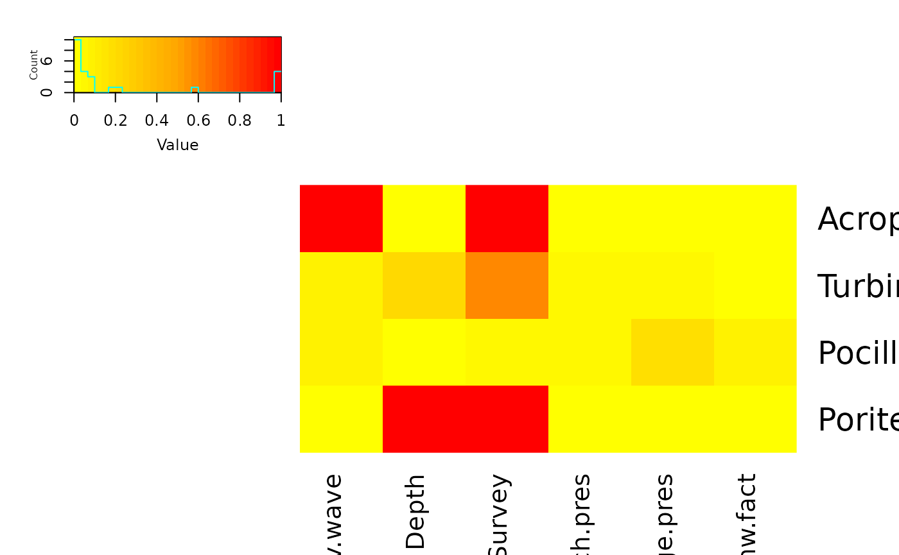

# Extra Examples

## Overview

He we show some simpler examples of using FSSgam for different response
distributions and particularly show the use with binomial data, which
none of the original case studies were able to do.

## R packages and data

The dataset used here is for a large range of coral species identified
as points scores on individual images, with a small number of potential
predictors.

``` r

library(FSSgam)
library(mgcv)
library(MuMIn)
require(car)
require(doBy)
require(gplots)
require(RColorBrewer)
library(tibble)
library(dplyr)
library(tidyr)

dat <- coral_data
str(dat)
```

    ## 'data.frame':    350 obs. of  73 variables:
    ##  $ Ident              : chr  "5_2009_11_T1" "5_2009_11_T2" "5_2009_11_T3" "8_2009_11_T1" ...
    ##  $ Site               : int  5 5 5 8 8 8 8 11 11 11 ...
    ##  $ Year               : int  2009 2009 2009 2009 2009 2009 2009 2009 2009 2009 ...
    ##  $ Month              : int  11 11 11 11 11 11 11 11 11 11 ...
    ##  $ Replicate          : chr  "T1" "T2" "T3" "T1" ...
    ##  $ Survey             : int  1 1 1 1 1 1 1 1 1 1 ...
    ##  $ Acropora.spp.      : int  25 25 13 65 26 22 23 1 0 0 ...
    ##  $ Alcyoniidae        : int  0 0 0 0 0 0 0 0 0 0 ...
    ##  $ Alveopora.spp.     : int  0 0 0 0 0 0 0 0 0 0 ...
    ##  $ Astreopora.spp.    : int  1 1 0 0 0 0 0 0 0 0 ...
    ##  $ Caulastrea.spp.    : int  0 0 0 0 0 0 0 0 0 0 ...
    ##  $ Coscinarea.spp.    : int  0 0 0 0 0 0 0 0 0 0 ...
    ##  $ Cyphastrea.spp.    : int  2 2 1 3 9 1 2 0 2 0 ...
    ##  $ Dendronephthya.spp.: int  0 0 0 0 0 0 0 0 0 0 ...
    ##  $ Diploastrea.spp.   : int  0 0 0 0 0 0 0 0 0 0 ...
    ##  $ Echinophyllia.spp. : int  0 0 0 0 2 0 0 0 0 0 ...
    ##  $ Echinopora.spp.    : int  0 0 0 7 2 0 0 0 0 0 ...
    ##  $ Euphyllia.spp.     : int  0 0 0 0 0 0 0 0 0 0 ...
    ##  $ Favia.spp.         : int  1 2 0 0 0 0 0 0 0 0 ...
    ##  $ Faviidae           : int  0 0 0 0 0 0 0 0 0 0 ...
    ##  $ Favites.spp.       : int  6 3 3 0 0 0 1 0 0 3 ...
    ##  $ Fungia.spp.        : int  0 0 0 0 0 0 0 0 0 0 ...
    ##  $ Fungiidae          : int  3 1 1 0 0 0 1 0 0 0 ...
    ##  $ Galaxea.spp.       : int  2 1 0 0 1 0 0 4 9 18 ...
    ##  $ Gardineroseris.spp.: int  0 0 0 0 0 0 0 0 0 0 ...
    ##  $ Goniastrea.spp.    : int  5 3 3 7 1 17 8 4 1 0 ...
    ##  $ Goniopora.spp.     : int  0 0 0 0 0 0 0 2 0 0 ...
    ##  $ Hard.coral         : int  0 0 0 0 0 0 0 0 0 0 ...
    ##  $ Hydnophora.spp.    : int  0 0 0 0 0 0 0 4 1 4 ...
    ##  $ Isopora.spp.       : int  0 0 0 0 0 0 0 4 0 0 ...
    ##  $ Leptastrea.spp.    : int  0 0 0 0 0 0 0 0 0 0 ...
    ##  $ Leptoria.spp.      : int  0 0 0 0 0 0 0 0 0 0 ...
    ##  $ Leptoseris.spp.    : int  0 0 0 0 0 0 0 0 0 0 ...
    ##  $ Lithophyllon.spp.  : int  0 0 0 0 0 0 0 0 0 0 ...
    ##  $ Lobophyllia.spp.   : int  4 7 2 0 1 2 0 0 0 0 ...
    ##  $ Lobophytum.spp.    : int  0 0 0 0 0 0 0 3 2 9 ...
    ##  $ Merulina.spp.      : int  1 3 1 4 20 1 1 0 0 0 ...
    ##  $ Millepora.spp.     : int  0 13 0 0 0 0 0 2 0 2 ...
    ##  $ Montastrea.spp.    : int  1 0 0 0 1 1 0 0 0 0 ...
    ##  $ Montipora.spp.     : int  1 4 0 7 1 2 2 0 0 0 ...
    ##  $ Mycedium.spp.      : int  0 0 0 0 0 0 0 0 0 0 ...
    ##  $ Octocorals...Soft  : int  36 32 26 0 0 0 0 0 0 0 ...
    ##  $ Oulophyllia.spp.   : int  0 0 0 0 0 0 0 0 0 0 ...
    ##  $ Oxypora.spp.       : int  1 1 1 0 0 0 0 0 0 0 ...
    ##  $ Pachyseris.spp.    : int  0 0 0 0 0 0 0 0 0 0 ...
    ##  $ Pavona.spp.        : int  0 2 3 0 0 5 0 0 0 0 ...
    ##  $ Pectinia.spp.      : int  0 0 0 3 2 0 0 0 0 0 ...
    ##  $ Platygyra.spp.     : int  0 1 0 0 3 0 0 0 1 0 ...
    ##  $ Plerogyra.spp.     : int  0 0 0 0 0 0 0 0 0 0 ...
    ##  $ Plesiastrea.spp.   : int  0 0 0 0 0 0 0 0 0 0 ...
    ##  $ Pocillopora.spp.   : int  0 0 0 0 4 0 0 1 0 0 ...
    ##  $ Podabacia.spp.     : int  0 0 0 0 0 0 0 0 0 0 ...
    ##  $ Porites.spp.       : int  30 22 20 14 15 24 99 120 137 97 ...
    ##  $ Psammocora.spp.    : int  0 0 0 0 0 0 0 0 0 0 ...
    ##  $ Sarcophyton.spp.   : int  0 0 0 0 0 0 0 3 4 0 ...
    ##  $ Scolymia.spp.      : int  0 0 0 0 0 0 0 0 0 0 ...
    ##  $ Seriatopora.spp.   : int  0 0 0 0 0 0 0 1 0 0 ...
    ##  $ Sinularia.spp.     : int  0 0 0 0 0 0 0 0 3 7 ...
    ##  $ Stylophora.spp.    : int  0 0 0 0 0 0 0 0 0 0 ...
    ##  $ Symphyllia.spp.    : int  0 0 0 0 0 0 0 0 0 0 ...
    ##  $ Tubipora.spp.      : int  0 0 0 0 0 0 0 0 0 0 ...
    ##  $ Turbinaria.spp.    : int  0 0 2 0 0 0 0 1 1 0 ...
    ##  $ allcoral           : int  119 123 76 110 88 75 137 150 161 140 ...
    ##  $ totalpoints        : int  294 300 300 276 276 306 306 300 300 300 ...
    ##  $ av.wave            : num  0 0 0 0 0 ...
    ##  $ max.wave           : num  0 0 0 0 0 ...
    ##  $ dredge.days        : num  0 0 0 0 0 0 0 0 0 0 ...
    ##  $ dredge.pres        : int  0 0 0 0 0 0 0 0 0 0 ...
    ##  $ bleach.ind         : num  0 0 0 0 0 0 0 0 0 0 ...
    ##  $ bleach.pres        : int  0 0 0 0 0 0 0 0 0 0 ...
    ##  $ DHW                : num  0 0 0 0 0 0 0 0 0 0 ...
    ##  $ dhw.fact           : int  0 0 0 0 0 0 0 0 0 0 ...
    ##  $ Depth              : num  3 3 3 4 4 4 4 9 9 9 ...

## Example showing use of uGamm to allow fitting with gamm4

We set up the necessaru predictor vectors

``` r

cat.preds=c("Survey","bleach.pres","dredge.pres","dhw.fact")
null.vars=c("Site")
cont.preds=c("av.wave","Depth")
```

Now do some basic data manipulation to get rid of NA’s and unused
columns

``` r

use.dat=na.omit(dat[,c(null.vars,cat.preds,cont.preds,"allcoral","totalpoints")])
use.dat$successes=use.dat$allcoral
use.dat$failures=use.dat$totalpoints-use.dat$allcoral
use.dat$trials=use.dat$totalpoints
```

Now we fit the test.fit model for all coral, with total points as
trials, and run the FSSgam approach.

We can examine the output with:

``` r

names(out.list)
```

    ## [1] "mod.data.out"        "failed.models"       "success.models"     
    ## [4] "variable.importance"

``` r

out.list$failed.models
```

    ## named list()

``` r

length(out.list$success.models)
```

    ## [1] 26

``` r

mod.table=out.list$mod.data.out
```

And examine the full model table.

``` r

mod.table=mod.table[order(mod.table$AICc),]
tab <- mod.table |>
  as_tibble() |> 
  select(modname, AICc, r2.vals, edf, delta.AICc, wi.AICc)

knitr::kable(
  tab,
  digits = 3,
  caption = "Model comparison summary based on AICc"
)
```

| modname | AICc | r2.vals | edf | delta.AICc | wi.AICc |
|:---|---:|---:|---:|---:|---:|
| av.wave.by.Survey+Survey | 5726.072 | 0.002 | 30.43 | 0.000 | 1 |
| Depth.by.Survey+Survey | 5804.053 | 0.121 | 30.00 | 77.981 | 0 |
| av.wave+Survey | 5872.776 | 0.001 | 10.00 | 146.704 | 0 |
| Survey | 5901.816 | 0.021 | 6.00 | 175.744 | 0 |
| Depth+Survey | 5904.288 | 0.103 | 10.00 | 178.216 | 0 |
| av.wave.by.bleach.pres+bleach.pres+dredge.pres | 5937.926 | 0.002 | 11.02 | 211.854 | 0 |
| av.wave.by.dredge.pres+bleach.pres+dredge.pres | 5940.948 | 0.001 | 11.28 | 214.877 | 0 |
| bleach.pres+Depth.by.dredge.pres+dredge.pres | 5943.791 | 0.098 | 11.04 | 217.719 | 0 |
| av.wave.by.bleach.pres+bleach.pres | 5951.533 | 0.004 | 10.03 | 225.461 | 0 |
| av.wave+bleach.pres+dredge.pres | 5952.134 | 0.000 | 7.00 | 226.062 | 0 |
| av.wave+bleach.pres | 5967.230 | 0.001 | 6.00 | 241.158 | 0 |
| bleach.pres+dredge.pres | 5967.610 | 0.024 | 3.00 | 241.538 | 0 |
| bleach.pres+Depth+dredge.pres | 5969.965 | 0.104 | 7.00 | 243.893 | 0 |
| bleach.pres+Depth.by.bleach.pres+dredge.pres | 5972.946 | 0.107 | 11.00 | 246.874 | 0 |
| bleach.pres | 5979.667 | 0.011 | 2.00 | 253.595 | 0 |
| bleach.pres+Depth | 5982.157 | 0.091 | 6.00 | 256.085 | 0 |
| bleach.pres+Depth.by.bleach.pres | 5985.270 | 0.093 | 10.00 | 259.198 | 0 |
| dhw.fact | 5990.095 | 0.000 | 4.00 | 264.023 | 0 |
| av.wave.by.dredge.pres+dredge.pres | 6003.459 | 0.007 | 10.40 | 277.387 | 0 |
| Depth.by.dredge.pres+dredge.pres | 6020.712 | 0.089 | 10.04 | 294.640 | 0 |
| av.wave+dredge.pres | 6022.518 | 0.007 | 6.25 | 296.447 | 0 |
| av.wave | 6023.987 | 0.008 | 5.25 | 297.916 | 0 |
| dredge.pres | 6038.349 | 0.010 | 2.00 | 312.278 | 0 |
| null | 6039.649 | 0.000 | 1.00 | 313.577 | 0 |
| Depth+dredge.pres | 6040.683 | 0.090 | 6.00 | 314.612 | 0 |
| Depth | 6042.038 | 0.084 | 5.00 | 315.966 | 0 |

Model comparison summary based on AICc {.table style="width:100%;"}

It is always good to check the predictor correlation matrix:

``` r

model.set$predictor.correlations
```

    ##                 av.wave      Depth    Survey bleach.pres dredge.pres  dhw.fact
    ## av.wave     1.000000000 0.66692956 0.1050576  0.03546485 0.003477723 0.4510273
    ## Depth       0.666929559 1.00000000 0.1280074  0.08540189 0.085632622 0.4483424
    ## Survey      0.105057639 0.12800735 0.9999999  0.42179124 0.302465738 0.4460807
    ## bleach.pres 0.035464850 0.08540189 0.9445830  1.00000000 0.275014427 0.2937127
    ## dredge.pres 0.003477723 0.08563262 0.5198438  0.21105312 1.000000000 0.3239795
    ## dhw.fact    0.451027270 0.44834237 0.5850417  0.17197695 0.247240075 0.9999999

We can run the same thing using the non.linear correlation matrix, which
can be useful if you think there might be strong non-linear dependencies
between predictors.

``` r

model.set=generate_model_set(use.dat=use.dat,
                          test.fit=Model1,
                          pred.vars.cont=cont.preds,
                          pred.vars.fact=cat.preds,
                          non.linear.correlations=TRUE)
model.set$predictor.correlations
```

    ##                 av.wave      Depth    Survey bleach.pres dredge.pres  dhw.fact
    ## av.wave     1.000000000 0.69886256 0.1050576  0.03546485 0.003477723 0.4510273
    ## Depth       0.749133379 1.00000000 0.1280074  0.08540189 0.085632622 0.4483424
    ## Survey      0.055891213 0.06828347 1.0000000  0.42179124 0.302465738 0.4460807
    ## bleach.pres 0.042181807 0.10361989 0.9445830  1.00000000 0.275014427 0.2937127
    ## dredge.pres 0.003165949 0.07859835 0.5198438  0.21105312 1.000000000 0.3239795
    ## dhw.fact    0.383415381 0.34328105 0.5850417  0.17197695 0.247240075 1.0000000

``` r

out.list=fit_model_set(model.set)
```

    ##   |                                                                              |                                                                      |   0%  |                                                                              |===                                                                   |   4%  |                                                                              |=====                                                                 |   8%  |                                                                              |========                                                              |  12%  |                                                                              |===========                                                           |  15%  |                                                                              |=============                                                         |  19%  |                                                                              |================                                                      |  23%  |                                                                              |===================                                                   |  27%  |                                                                              |======================                                                |  31%  |                                                                              |========================                                              |  35%  |                                                                              |===========================                                           |  38%  |                                                                              |==============================                                        |  42%  |                                                                              |================================                                      |  46%  |                                                                              |===================================                                   |  50%  |                                                                              |======================================                                |  54%  |                                                                              |========================================                              |  58%  |                                                                              |===========================================                           |  62%  |                                                                              |==============================================                        |  65%  |                                                                              |================================================                      |  69%  |                                                                              |===================================================                   |  73%  |                                                                              |======================================================                |  77%  |                                                                              |=========================================================             |  81%  |                                                                              |===========================================================           |  85%  |                                                                              |==============================================================        |  88%  |                                                                              |=================================================================     |  92%  |                                                                              |===================================================================   |  96%  |                                                                              |======================================================================| 100%

``` r

mod.table=out.list$mod.data.out
mod.table=mod.table[order(mod.table$AICc),]
tab <- mod.table |>
  as_tibble() |> 
  select(modname, AICc, r2.vals, edf, delta.AICc, wi.AICc)

knitr::kable(
  tab,
  digits = 3,
  caption = "Model comparison summary based on AICc"
)
```

| modname | AICc | r2.vals | edf | delta.AICc | wi.AICc |
|:---|---:|---:|---:|---:|---:|
| av.wave.by.Survey+Survey | 5726.072 | 0.002 | 30.43 | 0.000 | 1 |
| Depth.by.Survey+Survey | 5804.053 | 0.121 | 30.00 | 77.981 | 0 |
| av.wave+Survey | 5872.776 | 0.001 | 10.00 | 146.704 | 0 |
| Survey | 5901.816 | 0.021 | 6.00 | 175.744 | 0 |
| Depth+Survey | 5904.288 | 0.103 | 10.00 | 178.216 | 0 |
| av.wave.by.bleach.pres+bleach.pres+dredge.pres | 5937.926 | 0.002 | 11.02 | 211.854 | 0 |
| av.wave.by.dredge.pres+bleach.pres+dredge.pres | 5940.948 | 0.001 | 11.28 | 214.877 | 0 |
| bleach.pres+Depth.by.dredge.pres+dredge.pres | 5943.791 | 0.098 | 11.04 | 217.719 | 0 |
| av.wave.by.bleach.pres+bleach.pres | 5951.533 | 0.004 | 10.03 | 225.461 | 0 |
| av.wave+bleach.pres+dredge.pres | 5952.134 | 0.000 | 7.00 | 226.062 | 0 |
| av.wave+bleach.pres | 5967.230 | 0.001 | 6.00 | 241.158 | 0 |
| bleach.pres+dredge.pres | 5967.610 | 0.024 | 3.00 | 241.538 | 0 |
| bleach.pres+Depth+dredge.pres | 5969.965 | 0.104 | 7.00 | 243.893 | 0 |
| bleach.pres+Depth.by.bleach.pres+dredge.pres | 5972.946 | 0.107 | 11.00 | 246.874 | 0 |
| bleach.pres | 5979.667 | 0.011 | 2.00 | 253.595 | 0 |
| bleach.pres+Depth | 5982.157 | 0.091 | 6.00 | 256.085 | 0 |
| bleach.pres+Depth.by.bleach.pres | 5985.270 | 0.093 | 10.00 | 259.198 | 0 |
| dhw.fact | 5990.095 | 0.000 | 4.00 | 264.023 | 0 |
| av.wave.by.dredge.pres+dredge.pres | 6003.459 | 0.007 | 10.40 | 277.387 | 0 |
| Depth.by.dredge.pres+dredge.pres | 6020.712 | 0.089 | 10.04 | 294.640 | 0 |
| av.wave+dredge.pres | 6022.518 | 0.007 | 6.25 | 296.447 | 0 |
| av.wave | 6023.987 | 0.008 | 5.25 | 297.916 | 0 |
| dredge.pres | 6038.349 | 0.010 | 2.00 | 312.278 | 0 |
| null | 6039.649 | 0.000 | 1.00 | 313.577 | 0 |
| Depth+dredge.pres | 6040.683 | 0.090 | 6.00 | 314.612 | 0 |
| Depth | 6042.038 | 0.084 | 5.00 | 315.966 | 0 |

Model comparison summary based on AICc {.table style="width:100%;"}

## Example running across a range of response variables

Set up a vector of response variables

``` r

resp.vars=c("Acropora.spp.","Turbinaria.spp.","Pocillopora.spp.","Porites.spp.")
```

Get rid of NA’s and unused columns

``` r

use.dat=na.omit(dat[,c(null.vars,cat.preds,cont.preds,resp.vars,"totalpoints")])
```

Now set up some objects to store the results and run the analysis
looping through the response variables.

Make a heatmap plot of the variable importance scores.

``` r

heatmap.2(all.var.imp,notecex=0.4,  dendrogram ="none",
                     col=colorRampPalette(c("yellow","orange","red"))(30),
                     trace="none",key.title = "",keysize=2,
                     notecol="black",key=T,
                     sepcolor = "black", 
                     Rowv=FALSE,Colv=FALSE)
```



And present all the models, and all the top model tables.

``` r

tab <- all.mod.fits |>
  rownames_to_column("row_id") |>
  separate(
    row_id,
    into = c("taxon", "model_id"),
    sep = "\\.spp\\.\\."
  ) |> 
  arrange(AICc) |> 
  as_tibble() |> 
  select(taxon, modname, AICc, r2.vals, edf, delta.AICc, wi.AICc)  

knitr::kable(
  tab,
  digits = 3,
  caption = "Model comparison summary based on AICc"
)
```

| taxon | modname | AICc | r2.vals | edf | delta.AICc | wi.AICc |
|:---|:---|---:|---:|---:|---:|---:|
| Turbinaria | Survey | 559.824 | 0.017 | 6.00 | 0.000 | 0.569 |
| Turbinaria | Depth+Survey | 561.895 | 0.013 | 10.00 | 2.071 | 0.202 |
| Turbinaria | av.wave+Survey | 563.911 | 0.013 | 10.00 | 4.087 | 0.074 |
| Turbinaria | bleach.pres+dredge.pres | 564.723 | 0.017 | 3.00 | 4.899 | 0.049 |
| Turbinaria | bleach.pres+Depth+dredge.pres | 565.142 | 0.010 | 7.00 | 5.318 | 0.040 |
| Turbinaria | bleach.pres | 565.903 | 0.010 | 2.00 | 6.078 | 0.027 |
| Turbinaria | bleach.pres+Depth | 567.612 | 0.009 | 6.00 | 7.788 | 0.012 |
| Turbinaria | av.wave+bleach.pres+dredge.pres | 568.610 | 0.019 | 7.00 | 8.786 | 0.007 |
| Turbinaria | bleach.pres+Depth.by.dredge.pres+dredge.pres | 569.565 | 0.015 | 11.00 | 9.741 | 0.004 |
| Turbinaria | av.wave+bleach.pres | 569.940 | 0.013 | 6.00 | 10.115 | 0.004 |
| Turbinaria | av.wave.by.dredge.pres+bleach.pres+dredge.pres | 570.617 | 0.015 | 11.00 | 10.792 | 0.003 |
| Turbinaria | bleach.pres+Depth.by.bleach.pres+dredge.pres | 570.814 | 0.010 | 11.00 | 10.990 | 0.002 |
| Turbinaria | bleach.pres+Depth.by.bleach.pres | 571.536 | 0.010 | 10.00 | 11.712 | 0.002 |
| Turbinaria | Depth.by.Survey+Survey | 571.688 | 0.025 | 30.00 | 11.864 | 0.002 |
| Turbinaria | av.wave.by.bleach.pres+bleach.pres+dredge.pres | 572.788 | 0.019 | 11.00 | 12.964 | 0.001 |
| Turbinaria | null | 573.482 | 0.000 | 1.00 | 13.658 | 0.001 |
| Turbinaria | av.wave.by.bleach.pres+bleach.pres | 574.085 | 0.012 | 10.00 | 14.261 | 0.000 |
| Turbinaria | av.wave.by.Survey+Survey | 574.418 | 0.024 | 30.00 | 14.593 | 0.000 |
| Turbinaria | dredge.pres | 574.514 | 0.003 | 2.00 | 14.690 | 0.000 |
| Turbinaria | Depth | 574.896 | 0.005 | 5.00 | 15.072 | 0.000 |
| Turbinaria | Depth+dredge.pres | 575.128 | 0.006 | 6.00 | 15.304 | 0.000 |
| Turbinaria | av.wave | 577.559 | 0.004 | 5.00 | 17.735 | 0.000 |
| Turbinaria | dhw.fact | 577.829 | 0.000 | 4.00 | 18.005 | 0.000 |
| Turbinaria | av.wave+dredge.pres | 578.619 | 0.003 | 6.00 | 18.795 | 0.000 |
| Turbinaria | Depth.by.dredge.pres+dredge.pres | 579.606 | 0.006 | 10.00 | 19.781 | 0.000 |
| Turbinaria | av.wave.by.dredge.pres+dredge.pres | 580.239 | 0.017 | 10.00 | 20.415 | 0.000 |
| Pocillopora | dredge.pres | 822.830 | 0.006 | 2.00 | 0.000 | 0.177 |
| Pocillopora | null | 823.039 | 0.000 | 1.00 | 0.209 | 0.160 |
| Pocillopora | dhw.fact | 824.019 | 0.000 | 4.00 | 1.190 | 0.098 |
| Pocillopora | av.wave | 824.301 | 0.036 | 5.00 | 1.472 | 0.085 |
| Pocillopora | av.wave+dredge.pres | 824.438 | 0.001 | 6.00 | 1.608 | 0.079 |
| Pocillopora | bleach.pres+dredge.pres | 824.799 | 0.008 | 3.00 | 1.969 | 0.066 |
| Pocillopora | bleach.pres | 824.990 | 0.002 | 2.00 | 2.160 | 0.060 |
| Pocillopora | Survey | 825.188 | 0.001 | 6.00 | 2.358 | 0.055 |
| Pocillopora | av.wave+bleach.pres | 826.312 | 0.034 | 6.00 | 3.482 | 0.031 |
| Pocillopora | Depth+dredge.pres | 826.443 | 0.002 | 6.00 | 3.614 | 0.029 |
| Pocillopora | av.wave+bleach.pres+dredge.pres | 826.462 | 0.001 | 7.00 | 3.632 | 0.029 |
| Pocillopora | Depth | 826.524 | 0.007 | 5.00 | 3.694 | 0.028 |
| Pocillopora | av.wave+Survey | 827.629 | 0.000 | 10.00 | 4.800 | 0.016 |
| Pocillopora | bleach.pres+Depth.by.bleach.pres | 827.650 | 0.002 | 10.00 | 4.820 | 0.016 |
| Pocillopora | bleach.pres+Depth.by.bleach.pres+dredge.pres | 827.878 | 0.001 | 11.00 | 5.048 | 0.014 |
| Pocillopora | bleach.pres+Depth+dredge.pres | 828.429 | 0.001 | 7.00 | 5.599 | 0.011 |
| Pocillopora | bleach.pres+Depth | 828.489 | 0.007 | 6.00 | 5.660 | 0.010 |
| Pocillopora | av.wave.by.dredge.pres+dredge.pres | 828.597 | 0.008 | 10.00 | 5.768 | 0.010 |
| Pocillopora | Depth+Survey | 828.883 | 0.002 | 10.00 | 6.054 | 0.009 |
| Pocillopora | Depth.by.dredge.pres+dredge.pres | 830.277 | 0.002 | 10.00 | 7.447 | 0.004 |
| Pocillopora | av.wave.by.bleach.pres+bleach.pres | 830.522 | 0.001 | 10.00 | 7.693 | 0.004 |
| Pocillopora | av.wave.by.dredge.pres+bleach.pres+dredge.pres | 830.564 | 0.010 | 11.00 | 7.734 | 0.004 |
| Pocillopora | av.wave.by.bleach.pres+bleach.pres+dredge.pres | 831.352 | 0.006 | 11.00 | 8.522 | 0.003 |
| Pocillopora | bleach.pres+Depth.by.dredge.pres+dredge.pres | 832.313 | 0.002 | 11.00 | 9.483 | 0.002 |
| Pocillopora | Depth.by.Survey+Survey | 836.556 | 0.002 | 30.00 | 13.727 | 0.000 |
| Pocillopora | av.wave.by.Survey+Survey | 842.665 | 0.026 | 30.00 | 19.835 | 0.000 |
| Acropora | av.wave.by.Survey+Survey | 3216.484 | 0.142 | 30.11 | 0.000 | 1.000 |
| Acropora | Depth.by.Survey+Survey | 3234.482 | 0.176 | 30.00 | 17.997 | 0.000 |
| Acropora | Survey | 3273.224 | 0.009 | 6.00 | 56.740 | 0.000 |
| Acropora | Depth+Survey | 3276.126 | 0.251 | 10.00 | 59.642 | 0.000 |
| Acropora | av.wave+Survey | 3277.110 | 0.046 | 10.20 | 60.626 | 0.000 |
| Acropora | av.wave.by.bleach.pres+bleach.pres | 3297.990 | 0.099 | 10.08 | 81.505 | 0.000 |
| Acropora | av.wave.by.bleach.pres+bleach.pres+dredge.pres | 3300.081 | 0.100 | 11.09 | 83.597 | 0.000 |
| Acropora | bleach.pres | 3309.545 | 0.006 | 2.00 | 93.061 | 0.000 |
| Acropora | bleach.pres+dredge.pres | 3310.819 | 0.007 | 3.00 | 94.335 | 0.000 |
| Acropora | bleach.pres+Depth | 3312.365 | 0.245 | 6.00 | 95.881 | 0.000 |
| Acropora | av.wave+bleach.pres | 3312.997 | 0.081 | 6.06 | 96.513 | 0.000 |
| Acropora | bleach.pres+Depth+dredge.pres | 3313.685 | 0.244 | 7.00 | 97.201 | 0.000 |
| Acropora | av.wave+bleach.pres+dredge.pres | 3313.942 | 0.044 | 7.02 | 97.458 | 0.000 |
| Acropora | av.wave.by.dredge.pres+bleach.pres+dredge.pres | 3316.647 | 0.093 | 11.01 | 100.163 | 0.000 |
| Acropora | bleach.pres+Depth.by.bleach.pres | 3317.370 | 0.190 | 10.00 | 100.885 | 0.000 |
| Acropora | bleach.pres+Depth.by.bleach.pres+dredge.pres | 3318.651 | 0.188 | 11.00 | 102.167 | 0.000 |
| Acropora | bleach.pres+Depth.by.dredge.pres+dredge.pres | 3318.979 | 0.182 | 11.00 | 102.495 | 0.000 |
| Acropora | dhw.fact | 3334.531 | 0.005 | 4.00 | 118.047 | 0.000 |
| Acropora | av.wave+dredge.pres | 3341.902 | 0.100 | 6.02 | 125.418 | 0.000 |
| Acropora | dredge.pres | 3341.995 | 0.003 | 2.00 | 125.510 | 0.000 |
| Acropora | Depth+dredge.pres | 3344.778 | 0.246 | 6.00 | 128.293 | 0.000 |
| Acropora | null | 3344.805 | 0.000 | 1.00 | 128.321 | 0.000 |
| Acropora | av.wave | 3346.314 | 0.146 | 5.02 | 129.829 | 0.000 |
| Acropora | Depth | 3347.500 | 0.247 | 5.00 | 131.016 | 0.000 |
| Acropora | av.wave.by.dredge.pres+dredge.pres | 3349.062 | 0.135 | 10.00 | 132.578 | 0.000 |
| Acropora | Depth.by.dredge.pres+dredge.pres | 3350.130 | 0.205 | 10.00 | 133.645 | 0.000 |
| Porites | Depth.by.Survey+Survey | 4746.245 | 0.387 | 30.00 | 0.000 | 0.999 |
| Porites | av.wave.by.Survey+Survey | 4759.394 | 0.355 | 30.23 | 13.150 | 0.001 |
| Porites | Depth+Survey | 4768.854 | 0.380 | 10.00 | 22.609 | 0.000 |
| Porites | av.wave+Survey | 4776.205 | 0.276 | 10.98 | 29.960 | 0.000 |
| Porites | Survey | 4779.562 | 0.000 | 6.00 | 33.318 | 0.000 |
| Porites | bleach.pres+Depth.by.dredge.pres+dredge.pres | 4779.670 | 0.384 | 11.00 | 33.425 | 0.000 |
| Porites | bleach.pres+Depth.by.bleach.pres+dredge.pres | 4782.469 | 0.384 | 11.00 | 36.225 | 0.000 |
| Porites | bleach.pres+Depth+dredge.pres | 4783.759 | 0.383 | 7.00 | 37.514 | 0.000 |
| Porites | bleach.pres+Depth | 4785.050 | 0.382 | 6.00 | 38.805 | 0.000 |
| Porites | bleach.pres+Depth.by.bleach.pres | 4785.144 | 0.383 | 10.00 | 38.899 | 0.000 |
| Porites | av.wave+bleach.pres | 4786.290 | 0.291 | 7.03 | 40.046 | 0.000 |
| Porites | av.wave+bleach.pres+dredge.pres | 4786.730 | 0.293 | 8.05 | 40.486 | 0.000 |
| Porites | av.wave.by.dredge.pres+bleach.pres+dredge.pres | 4787.680 | 0.313 | 11.36 | 41.436 | 0.000 |
| Porites | av.wave | 4788.046 | 0.328 | 5.25 | 41.802 | 0.000 |
| Porites | av.wave.by.bleach.pres+bleach.pres | 4788.993 | 0.314 | 10.50 | 42.749 | 0.000 |
| Porites | av.wave+dredge.pres | 4789.557 | 0.331 | 6.23 | 43.312 | 0.000 |
| Porites | av.wave.by.bleach.pres+bleach.pres+dredge.pres | 4790.172 | 0.286 | 12.12 | 43.927 | 0.000 |
| Porites | av.wave.by.dredge.pres+dredge.pres | 4790.216 | 0.326 | 10.39 | 43.971 | 0.000 |
| Porites | Depth.by.dredge.pres+dredge.pres | 4792.761 | 0.386 | 10.00 | 46.516 | 0.000 |
| Porites | Depth | 4793.113 | 0.383 | 5.00 | 46.869 | 0.000 |
| Porites | Depth+dredge.pres | 4794.107 | 0.383 | 6.00 | 47.863 | 0.000 |
| Porites | bleach.pres+dredge.pres | 4794.599 | 0.001 | 3.00 | 48.354 | 0.000 |
| Porites | bleach.pres | 4795.960 | 0.008 | 2.00 | 49.715 | 0.000 |
| Porites | null | 4804.087 | 0.000 | 1.00 | 57.843 | 0.000 |
| Porites | dhw.fact | 4804.345 | 0.055 | 4.00 | 58.100 | 0.000 |
| Porites | dredge.pres | 4805.036 | 0.014 | 2.00 | 58.791 | 0.000 |

Model comparison summary based on AICc {.table}
